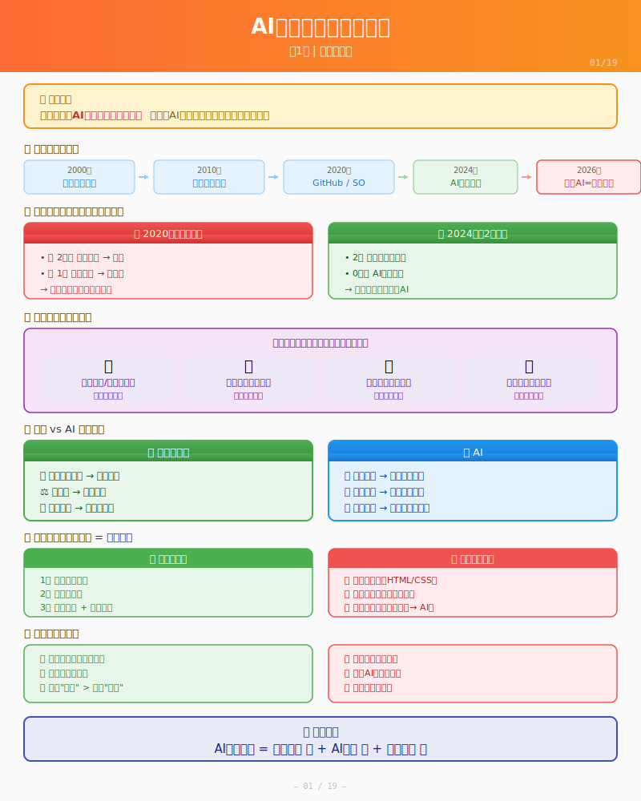

# 第1课：AI时代，你的角色变了



> 📍 **学习进度**：第1阶段 - 认知与方法（1/3）

## 📋 学习目标

学完这一课，你将能够：

- [ ] 说清楚为什么"会用AI"是未来职场必备技能
- [ ] 解释你作为"指挥官"的新角色
- [ ] 理解AI能做什么、不能做什么
- [ ] 判断自己是否适合学习AI协作开发

---

## 场景引入

**先说一个重要的事实**

**未来不会用AI的人，不该被雇佣。**

这不是危言耸听，看看现在发生的事：

| 年份 | 程序员的标配 |
|------|-------------|
| 2000年 | 会写代码就行 |
| 2010年 | 会用搜索引擎 |
| 2020年 | 会用GitHub、Stack Overflow |
| 2024年 | 会用AI编程工具 |
| 2026年 | **不会用AI = 不会用电脑** |

就像现在你不会因为"会打字"而被雇佣，
未来你也不会因为"会写代码"而被雇佣。

**真正值钱的是：**
- 能把想法变成产品
- 能做正确的决策
- 能高效地交付
- 能快速学习新东西

这些能力，AI可以帮助你放大10倍。

**所以，学会与AI协作，不是选修课，是必修课。**

---

## 你是不是也有这种感觉？

"我想做个网站，但不会写代码。"

"我有个点子，但不知道怎么实现。"

"程序员太贵了，我自己又学不会。"

这些话，在2024年之前，基本等于"放弃吧"。但现在，情况完全不同了。

---

## 一个真实的故事

小明是个大学生，想做一个校园二手交易平台。他不会写代码，预算是0。

**在2020年**，他有两个选择：
- 花2万块找人开发
- 花1年自学编程

他都做不到，所以项目死了。

**在2024年**，他用了AI协作：
- 2周，做出了能用的产品
- 0成本，全程AI帮他写代码
- 学会了一套新技能：如何指挥AI

这不是科幻，这是正在发生的事。

---

## 过去 vs 现在

### 过去的程序员

想象你在装修房子。传统模式下：

```
你：我要一面墙
工人：好的（开始砌砖）
你：能不能再加个窗户？
工人：墙已经砌好了，要砸掉重来
你：...
```

这就是以前的软件开发。你想改点什么，程序员要改很多代码，时间成本很高。

所以你会听到程序员说：
- "这个需求要两周"
- "改不了，架构不支持"
- "你早点说啊，现在改很麻烦"

不是他们不想帮你，是改代码真的很贵。

### 现在的AI时代

现在不一样了：

```
你：我要一面墙，带窗户，朝南
AI：好的（生成代码）
你：窗户改大一点
AI：好的（修改代码，30秒）
你：再加个书架
AI：好的（添加功能，1分钟）
```

改代码的成本，从"几小时"变成了"几秒钟"。

这意味着什么？**你可以大胆试错了。**

---

## 你的新角色：指挥官

以前，程序员是"工人"，你告诉他做什么，他执行。

现在，AI是工人，**你是指挥官**。

指挥官不需要会开坦克，但需要知道：
- 坦克能做什么、不能做什么
- 什么时候该用坦克
- 如何给坦克下指令
- 如何判断任务是否完成

同样的，你不需要精通编程语法，但需要知道：
- 这个功能技术能不能实现
- 大概该怎么做
- 如何描述清楚你的需求
- 如何判断AI做得对不对

**这就是"AI协作开发"的核心能力。**

---

## 装修房子的类比

你现在就是业主，要装修一套房子（开发一个软件）。

### 你需要做的：

1. **想清楚要什么** - "我要一个两室一厅，主卧要大窗户"
2. **找到靠谱的工人** - 选一个AI工具
3. **说清楚需求** - 详细描述你想要的效果
4. **验收结果** - 看看做出来的对不对
5. **提出修改** - 不满意就改

### 你不需要做的：

1. ❌ 学会砌墙
2. ❌ 学会走水电
3. ❌ 学会刷漆

AI会帮你做这些。

---

## 但是...这不意味着你什么都不用学

"既然AI能写代码，我躺平就行？"

不是的。

想象你在餐厅点菜：
- 如果你只知道说"我要吃的"，厨师不知道做什么
- 如果你说"我要一份番茄炒蛋，少油少盐"，厨师就知道怎么做了

**你需要学会"说清楚需求"**。

这就是本教程要教你的：
- 如何把模糊的想法变成清晰的需求
- 如何跟AI沟通，让它理解你的意图
- 如何判断AI做得对不对
- 遇到问题怎么解决

---

## 什么人适合学这个？

✅ 有想法，但不会写代码的人
✅ 想快速做出产品的人
✅ 愿意学习新工具的人
✅ 不追求代码"完美"，追求"能用"的人

❌ 想成为专业程序员的人（你应该去学计算机基础）
❌ 认为AI能解决一切的人（AI需要人指挥）
❌ 不愿意验证结果的人（AI会犯错，需要你判断）

---

## 这门课怎么安排？

我们通过一个真实项目来学习：**校园二手交易平台**

为什么要选这个项目？
- 你熟悉场景（都是学生）
- 功能不复杂（适合入门）
- 真的有用（做出来可以用）

整个课程分为4个阶段：

1. **认知与方法**（现在这个阶段）- 理解AI协作是什么
2. **从想法到需求** - 把模糊想法变成清晰方案
3. **动手实现** - AI帮你写代码，你负责验收
4. **遇到问题怎么办** - Bug、报错、AI理解错误...怎么处理

---

## 思考过程

### 你是不是也有这种感觉？

"我想做个网站，但不会写代码。"

"我有个点子，但不知道怎么实现。"

"程序员太贵了，我自己又学不会。"

这些话，在2024年之前，基本等于"放弃吧"。但现在，情况完全不同了。

### 过去 vs 现在的对比

**过去的程序员**：想改点什么，程序员要改很多代码，时间成本很高。

**现在的AI时代**：改代码的成本，从"几小时"变成了"几秒钟"。这意味着你可以大胆试错了。

### 人类和AI的角色分工

| 人类（你） | AI |
|-----------|-----|
| 想清楚要什么 | 理解需求 |
| 做决策 | 给出方案 |
| 验收结果 | 执行实现 |
| 提出修改 | 修复问题 |

**记住：AI是工具，不是万能的。你才是做决策的人。**

---

## 实操对话

这一课主要是认知转变，没有代码实操。但你可以试着和AI聊聊：

```
你：你好，我想了解一下AI协作开发是什么
AI：AI协作开发是指...
你：那我能做什么，AI能做什么？
AI：你负责决策和验收，AI负责执行...
```

---

## 知识提炼

### 什么是"AI协作开发"？

**AI协作开发 = 人类指挥 + AI执行 + 人类验收**

就像装修房子：
- 你负责说"我要什么样的房子"
- 工人（AI）负责施工
- 你负责验收"做得对不对"

### 什么人适合学？

✅ 有想法，但不会写代码的人
✅ 想快速做出产品的人
✅ 愿意学习新工具的人
✅ 不追求代码"完美"，追求"能用"的人

❌ 想成为专业程序员的人（你应该去学计算机基础）
❌ 认为AI能解决一切的人（AI需要人指挥）
❌ 不愿意验证结果的人（AI会犯错，需要你判断）

---

## 练习任务

1. **想想你的"想做但不会做"的想法**

   有没有一个你一直想做但不会做的产品或功能？

2. **写下你的期望**

   - 你期望的"AI协作"是什么样子的？
   - 你愿意花多少时间学习这套技能？

3. **和AI聊聊**

   打开 opencode，试着说"你好，我想了解一下AI协作开发"

---

## 下一课

[第2课：工具准备](./L02-tooling.md) - 工欲善其事，必先利其器。我们来安装和熟悉opencode这个工具。

---

## ✅ 理解检查

学完这一章，你能回答这些问题吗？

**基础问题**（所有人要会）：
- 为什么说"未来不会用AI的人不该被雇佣"？
- AI能做什么？不能做什么？
- 你在AI协作中的角色是什么？

**进阶问题**（想提升的同学思考）：
- "指挥官"需要具备哪些能力？
- 传统开发和AI协作开发有什么本质区别？
- 为什么说"AI需要人指挥"？

**挑战问题**（试着不问AI）：
- 如果让你向一个不懂技术的人解释AI协作开发，你会怎么说？
- 你觉得AI协作开发有什么局限性？

---

## 🎯 费曼学习法检验

### 你能解释这些概念吗？

试着用**自己的话**解释给不懂的人听（不要背定义）：

**1. 什么是"AI协作开发"？**
> 提示：想想装修房子的类比...

<details>
<summary>参考答案</summary>

AI协作开发就像装修房子：你告诉工人（AI）你想要什么样的房子，工人负责施工，你负责验收。你不需要会砌墙、走水电，但你需要知道想要什么、判断做得对不对。
</details>

**2. 为什么说你是"指挥官"？**
> 提示：想想你的职责是什么...

<details>
<summary>参考答案</summary>

因为在AI协作中，你负责：
- 决策（做什么、不做什么）
- 验收（做得对不对）
- 把方向（最终目标是什么）

AI只是执行者，你才是掌舵的人。
</details>

### 你能教给别人吗？

**教学检验**：找一个同学（或对着空气），尝试讲清楚：

1. AI能做什么？不能做什么？
2. 为什么说"未来不会用AI的人不该被雇佣"？
3. 你学这套课程的目标是什么？

如果你能讲清楚，说明你真的懂了！

### 自测题

**第1题**：在AI协作开发中，人类的角色是什么？

A. 负责写代码
B. 负责做决策和验收
C. 负责调试程序
D. 负责设计算法

<details>
<summary>答案</summary>

**B** - 人类负责做决策（做什么、选哪个方案）和验收（做得对不对）。AI负责执行具体工作。
</details>

**第2题**：以下哪种人适合学习AI协作开发？

A. 追求代码"完美"的人
B. 不愿意验证结果的人
C. 有想法但不会写代码的人
D. 认为AI能解决一切的人

<details>
<summary>答案</summary>

**C** - AI协作开发适合有想法但不会写代码、想快速做出产品的人。追求完美、不验证、迷信AI的人都不太适合。
</details>

**第3题**：AI不能做什么？

A. 创建文件
B. 写代码
C. 做产品决策
D. 执行命令

<details>
<summary>答案</summary>

**C** - AI不能替你做产品决策（功能要不要做、选哪个方案）。这是人类的核心职责。
</details>

---

## 📚 扩展资源

### 官方文档
- [GitHub Copilot 文档](https://docs.github.com/copilot) - 关键词：AI编程、代码补全
- [Cursor 官方文档](https://cursor.sh/docs) - 关键词：AI编辑器、智能编程

### 推荐阅读
- [AI辅助编程的未来](https://github.blog/2023-05-09-how-generative-ai-is-changing-the-way-developers-work/) - 了解AI如何改变开发者的工作方式
- [Prompt Engineering Guide](https://www.promptingguide.ai/zh) - 学习如何更好地与AI沟通

### 视频资源
- B站搜索"AI编程入门" - 很多实操演示
- YouTube: "AI Coding Assistant Comparison" - 对比各种AI编程工具

### 本课关键词
`AI协作` `AI编程` `效率提升` `指挥官思维` `人机分工`
