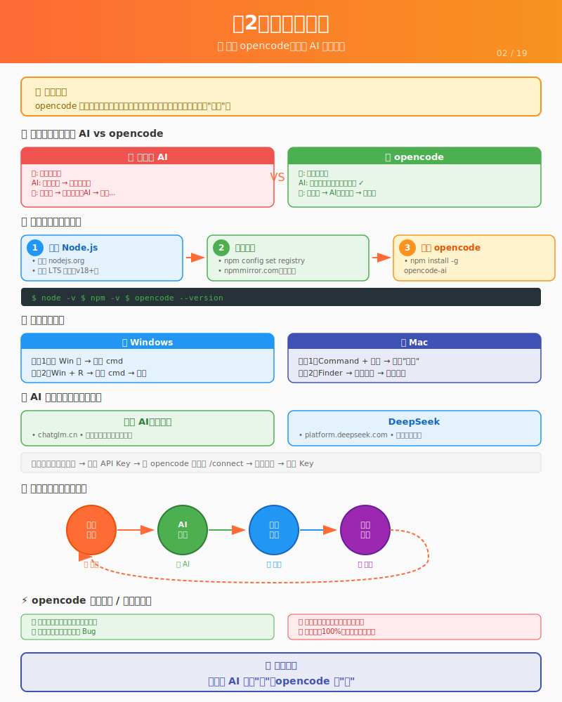

# 第2课：工具准备



> 📍 **学习进度**：第1阶段 - 认知与方法（2/3）
> 
> 前置课程：[第1课：AI时代，你的角色变了](./L01-ai-era.md)

## 📋 学习目标

学完这一课，你将能够：

- [ ] 成功安装 Node.js 和 npm
- [ ] 成功安装 opencode
- [ ] 完成 AI 服务的配置
- [ ] 使用 opencode 完成第一次对话

---

## 场景引入

你想装修房子，得先有工具。
你想AI协作开发，得先有个能跟AI对话的工具。

这个工具叫 **opencode**。

---

## opencode 是什么？

一句话介绍：**opencode 是一个在终端里运行的AI编程助手**。

它能做什么？
- 读写文件
- 执行命令
- 搜索代码
- ...几乎所有程序员能做的事

它不能做什么？
- 直接看到你的屏幕（你得描述给它）
- 帮你做产品决策（你来决定）
- 保证100%正确（你需要验收）

---

## 为什么要用命令行工具？

你可能会问：网页版AI（如智谱、DeepSeek、ChatGPT）不是也能写代码吗？为什么要用这个？

好问题。让我们对比一下：

### 用网页版AI

```
你：帮我写一个登录页面
AI：好的，这是代码...（给你一堆代码）
你：（复制代码，粘贴到文件，保存，测试）
你：有个bug，报错了
AI：哦，你把错误信息发我
你：（复制错误，粘贴给AI）
AI：这是修复后的代码...
你：（复制，粘贴，保存，测试）
...无限循环
```

### 用opencode

```
你：帮我做一个登录页面
opencode：（直接创建文件，写入代码）
你：测试一下
opencode：（运行测试，发现报错，自动修复）
你：好了
```

看出来区别了吗？

**网页版AI只能"说"，opencode能"做"。**

opencode可以直接操作你的项目文件，不需要你复制粘贴。这才是真正的"协作"。

---

## 安装 opencode

### 前提条件

你需要先安装：
- **Node.js** - 一个运行环境（版本 18 或以上）

---

## ⚠️ 重要：如何打开终端

接下来的操作需要在"终端"里进行。很多同学可能不知道终端是什么、怎么打开，这里详细说一下。

### 什么是终端？

终端就是**用文字命令控制电脑**的工具。

平时你用鼠标点击图标、打开文件夹，那叫"图形界面"。
终端是另一种方式：你输入文字命令，电脑执行。

类比：
- 图形界面 = 在餐厅看菜单点菜（直观，但要一个个找）
- 终端 = 直接告诉服务员你要什么（需要知道怎么说，但更快）

### 打开终端的方法

#### Windows 用户

**方法1：使用搜索（推荐）**
1. 按 `Win` 键（键盘左下角那个Windows图标键）
2. 直接输入 `cmd` 或 `powershell`
3. 看到"命令提示符"或"Windows PowerShell"，点击打开

**方法2：快捷键**
1. 按 `Win + R`
2. 输入 `cmd`
3. 按回车

📸 **终端打开后是这样的**：
```
C:\Users\你的用户名>
```
光标在 `>` 后面闪烁，等待你输入命令。

#### Mac 用户

**方法1：使用搜索（推荐）**
1. 同时按 `Command + 空格`
2. 输入 `终端` 或 `Terminal`
3. 按回车打开

**方法2：在Finder里找**
1. 打开 Finder（笑脸图标）
2. 点击"应用程序"
3. 找到"实用工具"文件夹
4. 双击"终端"

📸 **终端打开后是这样的**：
```
你的用户名@你的电脑名 ~ %
```
光标在 `%` 后面闪烁，等待你输入命令。

### 终端基本操作

| 操作 | 方法 |
|------|------|
| 输入命令 | 直接打字 |
| 执行命令 | 按回车键 |
| 命令打错了 | 按退格键删除重新打 |
| 清屏 | 输入 `clear` 然后回车 |

### 代码块格式说明

教程中会看到很多这样的代码块：

```bash
$ node --version
v18.17.0
```

注意：
- `$` 是**提示符**，表示"这里可以输入命令"，**你不需要输入它**
- `$` 后面才是你要输入的命令（如 `node --version`）
- `v18.17.0` 是命令执行后的**输出结果**

**你只需要输入：** `node --version` 然后按回车

---

好了，现在你已经知道怎么打开终端了，我们继续安装 Node.js。

---

#### 第一步：检查是否已安装

打开终端（方法见上面），输入：

```bash
node --version
```

**可能的结果：**

- ✅ 显示版本号（比如 `v20.10.0`）→ 已安装，跳到"安装 opencode"
- ❌ 显示 `command not found` → 没安装，继续下面步骤

#### 第二步：下载 Node.js（Windows/Mac 通用）

1. 打开浏览器，访问 https://nodejs.org
2. 你会看到两个下载按钮：
   - **LTS（长期支持版）**：推荐，更稳定
   - **Current（最新版）**：有新特性，但可能不稳定
3. 点击 **LTS** 版本下载

> 📸 **截图描述**：网页上有两个绿色大按钮，左边是"LTS"，右边是"Current"。选择左边的 LTS 版本。

### 国内用户加速下载

如果官网下载很慢，可以用国内镜像：

**淘宝镜像（推荐）**：
- 地址：https://npmmirror.com/mirrors/node/
- 选择对应版本下载

下载后安装步骤相同。

4. 下载完成后，双击安装包

> 📸 **截图描述（Windows）**：文件名类似 `node-v20.10.0-x64.msi`
> 📸 **截图描述（Mac）**：文件名类似 `node-v20.10.0.pkg`

#### 第三步：安装 Node.js

**Windows 用户：**
1. 双击 `.msi` 文件
2. 点击 "Next" → 勾选 "I accept" → "Next"
3. 保持默认路径，一直点 "Next"
4. 点击 "Install"（可能需要点"是"允许安装）
5. 等待进度条走完，点击 "Finish"

> 📸 **截图描述**：安装过程中会看到一个进度条，还有 Node.js 的绿色 logo。

**Mac 用户：**
1. 双击 `.pkg` 文件
2. 点击 "继续" → "继续" → "同意"
3. 点击 "安装"（可能需要输入密码）
4. 等待安装完成，点击 "关闭"

> 📸 **截图描述**：安装界面是灰色的窗口，有 Node.js 的绿色六边形 logo。

#### 第四步：验证安装成功

**重要：关闭旧的终端窗口，重新打开一个新的终端！**（这步很多人忘记）

然后输入：

```bash
node --version
```

**成功的标志：** 显示版本号，比如 `v20.10.0` 或 `v18.x.x`

再输入：

```bash
npm --version
```

**成功的标志：** 显示版本号，比如 `10.2.3`

> 📸 **截图描述**：终端里输入命令后，下一行显示版本号，没有报错。

### 配置国内镜像（国内用户必做）

npm默认从国外服务器下载，国内会很慢。配置国内镜像：

```bash
npm config set registry https://registry.npmmirror.com
```

验证是否成功：
```bash
npm config get registry
```
如果显示 `https://registry.npmmirror.com/` 就成功了。

#### 常见问题：如果安装失败怎么办？

**问题1：提示"权限不足"**
- Windows：右键安装包，选择"以管理员身份运行"
- Mac：输入密码时确保是正确的开机密码

**问题2：安装后还是 `command not found`**
- 解决方法：完全关闭终端，重新打开一个新终端
- 原因：终端需要重新加载环境变量

**问题3：不知道安装到哪了**
- 输入 `which node`（Mac/Linux）或 `where node`（Windows）
- 会显示 Node.js 的安装路径

**问题4：版本太低**
- 如果版本低于 v18，重新去官网下载最新版
- 安装时会自动覆盖旧版本

---

### 安装 opencode

Node.js 装好后，就可以安装 opencode 了。

终端输入：

```bash
npm install -g opencode-ai
```

### 如果安装很慢（国内用户）

方法1：先配置npm镜像（推荐）
```bash
npm config set registry https://registry.npmmirror.com
npm install -g opencode-ai
```

方法2：直接指定镜像
```bash
npm install -g opencode-ai --registry=https://registry.npmmirror.com
```

> 📸 **截图描述**：输入命令后，终端会显示一堆文字，最后有进度条或转圈圈，这表示正在下载安装。

等待安装完成（可能需要1-2分钟，取决于网速）。

#### 验证 opencode 安装

输入：

```bash
opencode --version
```

**成功的标志：** 显示版本号，比如 `1.0.0`

#### 常见问题：opencode 安装失败？

**问题1：`npm ERR!` 开头的错误**
- 可能是网络问题，试试换个网络或开手机热点
- 或者用国内镜像：`npm install -g opencode-ai --registry=https://registry.npmmirror.com`

**问题2：`EACCES` 权限错误**
- Mac/Linux 用户试试：`sudo npm install -g opencode-ai`
- 输入密码时不会显示字符，输完按回车

**问题3：安装成功但 `opencode` 命令不识别**
- 同样：关闭终端，重新打开一个新的

---

## AI服务配置

opencode 需要配置AI服务才能使用。以下是国内可用的推荐方案：

### 推荐方案（国内用户）

| AI服务 | 特点 | 获取方式 |
|--------|------|----------|
| **智谱AI** | 国产，速度快，有免费额度 | chatglm.cn 注册获取API Key |
| **DeepSeek** | 国产，便宜，代码能力强 | platform.deepseek.com 注册 |

### 配置方法

1. 注册智谱AI或DeepSeek账号
2. 获取API Key
3. 在opencode中运行 `/connect`
4. 选择对应的AI服务
5. 粘贴API Key

### 如果你有OpenAI账号

也可以使用OpenAI，但国内访问可能需要代理。

---

## 第一次使用

### 启动 opencode

#### 如何在指定文件夹打开终端？

很多同学会卡在这里："教程说在文件夹里打开终端，但我只会点击终端图标打开它"。

别担心，这里有详细方法：

**方法1：最简单（推荐）**

1. 先用普通方式打开终端
2. 在终端里输入 `cd `（注意cd后面有个空格）
3. 把你要进入的文件夹，直接拖到终端窗口里
4. 松开鼠标，终端会自动填入文件夹路径
5. 按回车，就进入这个文件夹了

📸 **操作示意**：
```
你输入：cd （空格别漏）
然后把文件夹拖到终端窗口
终端自动变成：cd /Users/xxx/你的文件夹
按回车，就进去了
```

**方法2：Windows 用户**

1. 打开文件夹（用文件资源管理器）
2. 在文件夹地址栏点击一下，文字会变成可编辑
3. 删除里面的文字，输入 `cmd`
4. 按回车，就会在这个文件夹打开命令行

**方法3：Mac 用户**

1. 打开 Finder，进入你要的文件夹
2. 右键点击文件夹空白处
3. 选择"新建位于文件夹位置的终端窗口"

> 💡 **小技巧**：如果方法3没有这个选项，打开"系统设置" → "键盘" → "键盘快捷键" → "服务"，勾选"新建位于文件夹位置的终端窗口"

**验证你已经在正确的文件夹：**

输入 `ls`（Mac/Linux）或 `dir`（Windows），回车。

如果显示的是你文件夹里的文件名，就说明你进对了！

---

好了，现在你已经在项目文件夹里打开了终端，输入：

```bash
opencode
```

你会看到一个交互界面，提示你输入问题。

### 试着说第一句话

```
你：你好，我想做一个校园二手交易平台
```

opencode 会回复你，可能会问一些问题，比如：
- 平台是给谁用的？
- 需要哪些功能？
- 用什么技术栈？

这是正常的，AI在"理解需求"。

---

## 基本操作模式

使用 opencode 的核心流程：

### 1. 描述需求

告诉AI你想做什么。越清楚越好。

```
❌ "帮我做个网站"
✅ "帮我做一个校园二手交易平台，学生可以发布闲置物品"
```

### 2. AI执行

AI会：
- 创建文件
- 写代码
- 运行命令
- 搜索信息

你只需要等它完成。

### 3. 验收结果

AI做完后，你需要检查：
- 功能对不对？
- 界面好不好看？
- 有没有bug？

### 4. 提出修改

如果有问题，告诉AI：

```
"登录按钮颜色改成红色"
"搜索功能不工作，报错了"
"我想加一个收藏功能"
```

AI会继续修改。

---

## 一个完整的对话示例

这是真实的协作过程：

```
你：我想做一个校园二手交易平台，能发布闲置物品，浏览物品

AI：好的，我来创建项目结构。需要以下功能：
    - 用户注册登录
    - 发布物品
    - 浏览物品列表
    - 物品详情页
    
    我用 Vue3 + Express + SQLite 来实现，可以吗？

你：可以，先做一个最简单的版本

AI：好的，我来创建基础项目结构...
    [创建文件夹和文件]
    [安装依赖]
    项目创建完成，你可以用 npm run dev 启动

你：我启动看看... 页面打开了，但是没有数据

AI：现在只是框架，我来添加一些示例数据...
    [修改代码，添加数据]
    
    刷新页面看看

你：看到了！但是搜索功能不工作

AI：我来检查一下... 发现问题了，搜索没有绑定事件。
    [修复代码]
    现在应该可以了，试试看？

你：可以了！但我想把搜索框移到顶部

AI：好的，我来调整布局...
    [修改样式]
    刷新看看效果

你：完美！
```

看到这个流程了吗？**你只需要说"要什么"，AI负责"怎么做"。**

---

## opencode 的能力边界

opencode 能做的：
- ✅ 创建、编辑、删除文件
- ✅ 执行命令（npm install, git 等）
- ✅ 搜索文件内容
- ✅ 解释代码
- ✅ 写测试、修bug

opencode 不能做的：
- ❌ 直接访问你的浏览器（你得描述问题）
- ❌ 理解你的潜台词（你得说清楚）
- ❌ 保证代码100%正确（你需要测试）
- ❌ 替你做产品决策（你来决定功能）

记住：**AI是工具，不是万能的。你才是做决策的人。**

---

## 一些使用技巧

### 说清楚上下文

```
❌ "改一下那个东西"
✅ "把首页的商品列表，改成两列布局"
```

### 一次只说一件事

```
❌ "做个登录页面，然后注册页面，还有个人中心"
✅ "先做一个登录页面"（做完再说下一个）
```

### 让AI解释

```
"这段代码是什么意思？"
"为什么用这个方案？"
```

不懂就问，AI会解释。

### 遇到错误，把信息给AI

```
你：报错了
AI：什么错误？把错误信息发我
你：[粘贴错误信息]
AI：我看到了，这是因为...
```

---

## 常见问题

### Q: opencode 收费吗？

目前有免费额度，够学习使用。

### Q: 我的代码安全吗？

代码在你的电脑上，opencode 只在对话时访问。对话结束就断开了。

### Q: AI写的代码会不会有bug？

会。所以你需要测试和验收。AI不是完美的，但可以帮你修复。

### Q: 我完全不懂编程，能用吗？

能。本教程就是为你准备的。

---

## 课后练习

### 练习1：安装 Node.js

按照上面的步骤，在你的电脑上安装 Node.js。

**验收标准：**
- [ ] 打开终端，输入 `node -v` 能显示版本号
- [ ] 输入 `npm -v` 能显示版本号

### 练习2：安装 opencode

使用 npm 安装 opencode。

**验收标准：**
- [ ] 终端输入 `opencode --version` 能显示版本
- [ ] 或者 `opencode` 能启动程序

### 练习3：第一次对话

1. 启动 opencode
2. 试着说"你好"
3. 让它创建一个简单的 `hello.txt` 文件
4. 让它修改这个文件的内容
5. 让它读取这个文件，确认内容正确

做完这5步，你就掌握了基本用法。

---

## 下一课

[补充课：终端入门](./L02.5-terminal.md) - 掌握命令行基础操作，为后续开发做好准备。

---

[第3课：人机协作范式](./L03-collaboration.md) - 了解人类和AI如何分工协作，掌握核心的"思考-执行-验收"循环。

---

## ✅ 理解检查

学完这一章，你能回答这些问题吗？

**基础问题**（所有人要会）：
- opencode 是什么？能做什么？
- 为什么用 opencode 而不是网页版 AI？
- Node.js 和 npm 分别是什么？

**进阶问题**（想提升的同学思考）：
- 如何在指定文件夹打开终端？
- npm 镜像是什么？为什么要配置？
- 如何验证 opencode 安装成功？

**挑战问题**（试着不问AI）：
- 如果 opencode 安装失败，你应该如何排查问题？
- 如何向 AI 描述安装过程中遇到的问题？

---

## 🎯 费曼学习法检验

### 你能解释这些概念吗？

**1. opencode 和网页版 AI 有什么区别？**
> 提示：想想"说"和"做"的区别...

<details>
<summary>参考答案</summary>
网页版AI只能"说"——给你代码，你自己复制粘贴。
opencode能"做"——直接操作你的文件，创建、修改、删除，不需要你复制粘贴。
</details>

**2. Node.js 是什么？为什么要安装它？**
> 提示：想想"运行环境"...

<details>
<summary>参考答案</summary>

Node.js是JavaScript的运行环境。opencode是用JavaScript写的，需要Node.js才能运行。就像手机App需要手机操作系统才能运行一样。
</details>

### 你能教给别人吗？

**教学检验**：找一个同学（或对着空气），尝试讲清楚：

1. 为什么安装 Node.js 后要重新打开终端？
2. opencode 能做什么、不能做什么？
3. 如何在项目文件夹里打开终端？

### 自测题

**第1题**：安装 Node.js 后，如何验证安装成功？

A. 打开浏览器访问 nodejs.org
B. 在终端输入 `node -v`，显示版本号
C. 重启电脑
D. 打开 Node.js 程序窗口

<details>
<summary>答案</summary>

**B** - 在新打开的终端中输入 `node -v`，如果显示版本号（如 v20.10.0），说明安装成功。
</details>

**第2题**：为什么国内用户需要配置 npm 镜像？

A. 镜像版本更新
B. 默认服务器在国外，下载很慢
C. 镜像免费
D. 官方要求

<details>
<summary>答案</summary>

**B** - npm默认从国外服务器下载，国内访问很慢。配置国内镜像可以大幅加速下载。
</details>

**第3题**：opencode 的核心优势是什么？

A. 网页访问，不用安装
B. 能直接操作项目文件，不用复制粘贴
C. 免费
D. 中文界面

<details>
<summary>答案</summary>

**B** - opencode的核心优势是能直接操作你的项目文件，创建、修改、删除，实现真正的"协作"而不是"对话"。
</details>

---

## 📚 扩展资源

### 官方文档
- [Node.js 官方文档](https://nodejs.org/docs) - 关键词：运行环境、JavaScript
- [npm 官方文档](https://docs.npmjs.com) - 关键词：包管理、依赖安装
- [opencode 官方文档](https://opencode.ai) - 关键词：AI助手、终端工具

### 推荐阅读
- [npm 镜像配置指南](https://npmmirror.com/) - 国内加速下载
- [Node.js 安装教程（菜鸟教程）](https://www.runoob.com/nodejs/nodejs-install-setup.html) - 图文详解

### 视频资源
- B站搜索"Node.js安装教程" - 跟着视频操作更直观
- B站搜索"npm使用教程" - 包管理基础

### 本课关键词
`Node.js` `npm` `opencode` `终端` `包管理器` `环境配置`
