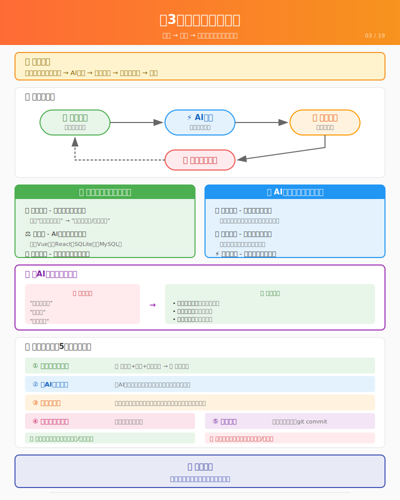

# 第3课：人机协作范式



> 📍 **学习进度**：第1阶段 - 认知与方法（3/3）
> 
> 前置课程：[第2课：工具准备](./L02-tooling.md)

## 📋 学习目标

学完这一课，你将能够：

- [ ] 解释"思考 → 执行 → 验收"的协作循环
- [ ] 说清楚人类和AI各自负责什么
- [ ] 使用正确的格式向AI描述问题
- [ ] 知道什么时候该打断AI

---

## 场景引入

你现在有了一个AI助手（opencode），它听你的指挥。

但是...**你应该指挥它做什么？**

这就像你雇了一个非常厉害的工人，但你不知道该让他干什么。他会砌墙、会走水电、会刷漆，但你得告诉他：
- 哪里需要墙
- 墙要多高
- 什么颜色

这就是"人机协作"的核心：**人类负责思考和决策，AI负责执行。**

---

## 核心模式：思考 → 执行 → 验收

记住这个循环：

```
┌─────────────┐
│  人类思考    │  ← 你要想清楚要什么
└──────┬──────┘
       ↓
┌─────────────┐
│  AI执行     │  ← AI去实现
└──────┬──────┘
       ↓
┌─────────────┐
│  人类验收    │  ← 你判断对不对
└──────┬──────┘
       │
       │ 不满意？
       ↓
  回到"人类思考"，告诉AI哪里不对
```

这个循环会一直重复，直到你满意为止。

---

## 人类做什么？

### 1. 描述需求

把模糊的想法变成清晰的描述。

```
模糊的想法："我想做一个二手平台"
               ↓
清晰的描述："校园二手交易平台，学生可以发布闲置物品、浏览物品、联系卖家"
```

AI需要清晰的信息才能工作。你的描述越清楚，AI越容易理解。

**怎么描述才清楚？**

- 说清楚是给谁用的（目标用户）
- 说清楚能做什么（核心功能）
- 说清楚长什么样（界面风格）
- 说出你的限制（时间、技术偏好）

### 2. 做决策

AI会给你选项，你来选。

```
AI：我可以用 Vue 或 React，你选哪个？
你：Vue 吧，听说比较简单

AI：数据库用 SQLite 还是 MySQL？
你：SQLite，因为是学习项目

AI：界面要什么风格？
你：简洁清新，类似小红书
```

AI不知道你的偏好，你得告诉它。

### 3. 判断结果（这是你的核心职责）

AI做完后，**你必须亲自检查**。这是你作为"指挥官"最重要的工作。

检查什么？
- 功能对不对？做了你要求的吗？
- 界面好不好看？符合预期吗？
- 有没有明显的bug？点一遍、试一遍
- 是不是你想要的？不满意就提出来

**记住：AI只是执行者，你才是判断者。** AI不会告诉你"我做得不好"，你必须自己发现。

---

## AI做什么？

### 1. 理解需求

AI会问问题，确保理解你的意思。

```
你：做一个登录功能
AI：需要支持哪些登录方式？账号密码？手机号？微信？
你：先用账号密码
AI：好的，需要记住登录状态吗？
你：需要
AI：明白了，我来实现
```

这个过程叫"需求澄清"。AI在确认它没理解错。

### 2. 给出方案

AI会告诉你它打算怎么做。

```
AI：我计划这样实现登录功能：
    1. 创建登录页面，包含用户名和密码输入框
    2. 后端接收登录请求，验证用户名密码
    3. 验证通过后返回token，前端保存
    
    这个方案可以吗？
```

AI不是直接开始做，而是先说方案。你可以确认或提出修改。

### 3. 执行实现

方案确认后，AI开始干活。

它会：
- 创建文件
- 写代码
- 安装依赖
- 运行测试

你只需要等它完成。

---

## 一个完整的协作案例

让我们看一个真实的例子：**实现"发布物品"功能**

### 第1轮：人类思考 → AI执行

```
你：我需要实现"发布物品"功能，用户能发布自己的闲置物品

AI：好的，我需要确认几个问题：
    1. 物品需要哪些信息？（名称、价格、图片、描述？）
    2. 图片怎么上传？
    3. 需要审核吗？

你：物品要有名称、价格、描述、联系方式。图片先不做，审核也不需要。

AI：明白了。我来实现：
    - 创建"发布物品"页面
    - 表单包含：名称、价格、描述、联系方式
    - 提交后保存到数据库
    
    开始实现...
    [创建页面文件]
    [创建接口]
    [测试]
    
    完成了，你可以试试发布物品。

你：好的，我来试试
```

### 第2轮：人类验收 → 发现问题

```
你：页面打开了，但是提交后没反应

AI：我来检查一下... 看到错误了，是接口地址写错了。
    已修复，再试试？

你：可以了！但是价格输入框能输入负数，这不对吧？

AI：确实，我来加验证...
    [修改代码]
    现在只能输入正数了。

你：完美！
```

看到了吗？协作就是一个不断循环的过程：
1. 你说需求
2. AI实现
3. 你检查
4. 有问题就改
5. 满意为止

---

## 如何向AI描述问题

### 场景

你遇到了一个报错，不知道怎么跟AI说。

### 错误示范

❌ "代码不跑了"
❌ "报错了"
❌ "运行不了"

这些描述AI没法帮你，因为它不知道发生了什么。

### 正确做法

**1. 截图**

- 把报错信息完整截图
- 把相关代码也截进去
- 用红框标出问题位置

**2. 描述**

用这个格式说清楚：

> 我在做什么：[描述你的操作]
> 预期结果：[应该发生什么]
> 实际结果：[实际发生了什么]
> 报错信息：[复制粘贴报错]

**3. 提问模板**

```
我在做[功能]，遇到了问题：
- 操作：我点击了[按钮]
- 报错：[复制报错信息]
- 代码：[粘贴相关代码]
请帮我看看是什么问题。
```

### 示例对话

```
你：我在做登录功能，遇到了问题：
    - 操作：我点击"登录"按钮
    - 报错：TypeError: Cannot read property 'password' of undefined
    - 代码：
      const user = users.find(u => u.name === name)
      if (user.password === password) { ... }
    请帮我看看是什么问题。

AI：我来分析一下...
    
    错误原因：users 数组里没有找到匹配的用户，所以 user 是 undefined，
    访问 undefined.password 就报错了。
    
    解决方法：在访问 password 前先判断 user 是否存在：
    
    const user = users.find(u => u.name === name)
    if (!user) {
      return '用户不存在'
    }
    if (user.password === password) { ... }
    
    我来帮你修复这个问题。

你：好的，请修复

AI：[修改代码] 已修复，你再试试。

你：可以了！
```

看，问题描述得越清楚，AI越容易帮你找到原因。

---

## AI理解错了怎么办？

这是最常见的情况：**你说的和AI理解的不一样**。

### 情况1：你说得不够清楚

```
你：做一个搜索功能

AI：好的，[做了一个简单的关键词搜索]

你：不是这个意思，我要的是能按价格范围筛选

AI：哦，明白了。我来修改...
```

**解决方法**：说得更具体。不要只说"搜索"，要说"能按价格范围筛选"。

### 情况2：AI假设了错误的东西

```
你：做一个列表页

AI：好的，[做了个10条数据的列表]

你：怎么没有分页？我可能有几百条数据

AI：我默认先做了简单版本。我来加分页...
```

**解决方法**：明确提出你的要求，不要假设AI知道。

### 情况3：AI完全理解错了

```
你：做一个收藏功能

AI：[做了个"收藏到浏览器书签"的功能]

你：不是...我是说用户能在平台里收藏物品

AI：抱歉理解错了，我来重做...
```

**解决方法**：AI做错了就重新说明。不用担心，AI不会生气。

---

## 几条黄金法则

### 1. 一次只说一件事

```
❌ "做一个登录页面，还要有注册，然后个人中心也要做"
✅ "先做一个登录页面"
```

一次说太多，AI容易漏掉，你也难以验收。

### 2. 让AI先说方案

```
你：我要实现支付功能

AI：我建议这样做...
    （列出方案）

你：可以，就按这个来
```

让AI先说方案，你能知道它理解得对不对。

### 3. 验收要仔细

AI做完后，你要认真测试：
- 点点点，看看有没有报错
- 输入一些极端情况（空的、很长的、特殊字符）
- 想想有没有遗漏的场景

### 4. 不满意就说出来

```
❌ （心里想：好像不太对，但算了）
✅ "这个不对，我要的是xxx"
```

你是产品的主人，不满意就要说。

### 5. 保存进度

每完成一个功能，用 git 保存一下：

```
你：这个功能好了，帮我提交一下

AI：好的，[git add, git commit]
    已保存。
```

这样如果后面改坏了，可以回退。

---

## 什么时候该打断AI？

AI在执行时，什么时候该打断它？

### 应该打断：

- AI在做一个你不需要的功能
- AI的方向明显偏了
- 你发现你的需求变了

### 不应该打断：

- AI在执行你确认过的方案
- AI在安装依赖（需要时间）
- 只是因为等待有点久

---

## 一个"失败"的协作案例

看看这个反面教材：

```
你：做一个电商网站

AI：好的，我来创建项目... [开始做]

你：（5分钟后）做好了没？

AI：还在做，已经完成了用户模块，正在做商品模块...

你：我要的是简单的，你做这么复杂干嘛？

AI：你没说要多简单...

你：...
```

**问题在哪里？**

1. 需求太模糊（"电商网站"范围太大）
2. 没让AI先说方案
3. 中途没验收

**正确的做法：**

```
你：我想做一个最简单的电商网站，能浏览商品就行

AI：好的，我的理解是：
    - 商品列表页
    - 商品详情页
    - 暂时不需要购物车和支付
    
    对吗？

你：对，先做这两个

AI：好的，开始实现...
    [完成列表页]
    列表页好了，你先看看？

你：（查看）可以，继续

AI：[完成详情页]
    详情页也好了

你：都好了，提交代码吧
```

---

## 课后练习

### 练习：和AI聊聊你的想法

想象你要让AI帮你做一个"待办事项"应用。试着写出：

1. 你的需求描述（要清晰）
2. 可能会问AI什么问题
3. 可能会遇到什么问题，怎么解决

然后真的找 opencode 试试看。

**验收标准：**
- [ ] 你成功向AI描述了一个想法
- [ ] AI给出了至少3条建议
- [ ] 你理解了AI的建议（能用自己的话复述）

---

## 小结

人机协作的本质：

| 人类 | AI |
|------|-----|
| 想清楚要什么 | 理解需求 |
| 做决策 | 给出方案 |
| 验收结果 | 执行实现 |
| 提出修改 | 修复问题 |

记住：**你是产品的主人，AI是帮你实现的工具。**

你需要学会的是：
- 如何清晰描述需求
- 如何做出合理的决策
- 如何判断结果好坏
- 如何有效地提出修改

这些能力，就是"AI协作开发"的核心。

---

## 下一阶段

现在你已经理解了：
- ✅ AI时代你的角色变了（第1课）
- ✅ 工具准备好了（第2课）
- ✅ 人机协作的模式（第3课）

接下来，我们要开始真正的项目了。

[下一阶段：从想法到需求](../02-requirements/L04-idea.md) - 把"做一个二手平台"这个模糊想法，变成清晰的产品需求。

---

## ✅ 理解检查

学完这一章，你能回答这些问题吗？

**基础问题**（所有人要会）：
- 人类在AI协作中负责什么？AI负责什么？
- 为什么要"亲自验收"？
- 一次说太多需求会有什么问题？

**进阶问题**（想提升的同学思考）：
- 如果AI理解错了你的需求，你发现了哪些信号？
- 你会如何修正描述让AI重新理解？
- 什么情况下应该打断AI？

**挑战问题**（试着不问AI）：
- 如果AI给出的方案你不满意，你有哪些策略？
- 如何判断AI是否真正理解了你的意图？

---

## 🎯 费曼学习法检验

### 你能解释这些概念吗？

**1. "思考 → 执行 → 验收"循环是什么？**
> 提示：想想协作的基本流程...

<details>
<summary>参考答案</summary>

这是人机协作的核心循环：
1. 人类思考：想清楚要什么，描述清楚需求
2. AI执行：根据需求写代码、创建文件
3. 人类验收：检查做得对不对，有问题就反馈修改

这个循环会一直重复，直到满意为止。
</details>

**2. 为什么必须亲自验收？**
> 提示：想想AI的特性...

<details>
<summary>参考答案</summary>

因为AI不会告诉你"我做得不好"。AI可能理解错了需求、写了有bug的代码、或者做得不符合你的预期。只有你亲自验收才能发现问题，然后让AI修改。
</details>

### 你能教给别人吗？

**教学检验**：找一个同学（或对着空气），尝试讲清楚：

1. 人类和AI的分工是什么？
2. 如何向AI描述一个bug？
3. 什么时候应该打断AI？

### 自测题

**第1题**：向AI描述问题时，应该包含哪些信息？

A. 只说"报错了"
B. 我在做什么、预期结果、实际结果、报错信息
C. 只发截图
D. 只发代码

<details>
<summary>答案</summary>

**B** - 完整的问题描述应该包含：我在做什么（操作）、预期结果（应该发生什么）、实际结果（实际发生了什么）、报错信息（如果有）。
</details>

**第2题**：以下哪种做法是正确的？

A. 一次说十个需求，让AI一起做
B. 一次只说一个需求，做完验收后再说下一个
C. 让AI自己决定做什么
D. 不验收，相信AI做得对

<details>
<summary>答案</summary>

**B** - 一次只说一个需求，做完验收后再说下一个。这样更容易发现问题，也更容易让AI理解。
</details>

**第3题**：什么时候应该打断AI？

A. AI在安装依赖时
B. AI在做一个你不需要的功能
C. AI在执行你确认过的方案
D. 等待有点久

<details>
<summary>答案</summary>

**B** - 当AI在做一个你不需要的功能、方向明显偏了、或者你的需求变了时，应该打断。安装依赖、执行确认过的方案时不应打断。
</details>

---

## 📚 扩展资源

### 官方文档
- [Prompt Engineering Guide](https://www.promptingguide.ai/zh) - 关键词：提示词工程、AI沟通
- [OpenAI Prompt设计指南](https://platform.openai.com/docs/guides/prompt-engineering) - 英文，权威参考

### 推荐阅读
- [如何写出好的Prompt](https://github.com/DL-Experiment-Hub/awesome-prompt) - Prompt技巧合集
- [AI协作开发最佳实践](https://github.blog/2023-06-20-how-to-write-faster-more-efficient-code-with-ai/) - GitHub官方建议

### 实用工具
- [ChatGPT Prompt 模板库](https://github.com/f/awesome-chatgpt-prompts) - 各种场景的Prompt参考
- [Prompt 编写技巧（少数派）](https://sspai.com) - 搜索"Prompt"获取中文教程

### 本课关键词
`需求描述` `验收` `迭代` `Prompt` `人机协作` `需求澄清`
