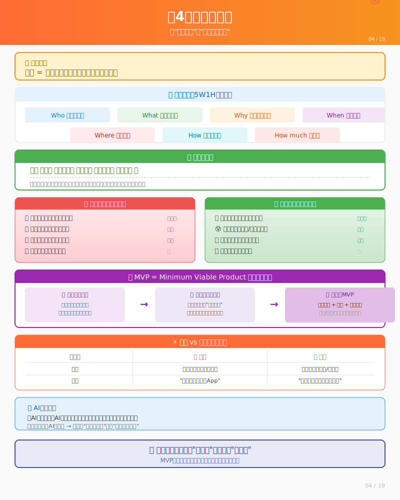

# 第4课：发现需求——从"想做点啥"到"解决什么问题"

> 📍 **学习进度**：第2阶段 - 从想法到需求（1/3）

## 📋 学习目标

学完这一课，你将能够：

- [ ] 用一句话说清楚你的产品解决什么问题
- [ ] 识别目标用户和核心痛点
- [ ] 理解什么是MVP（最小可用产品）
- [ ] 和AI进行需求澄清对话

---

## 场景引入

你有没有过这样的经历：突然灵光一闪，想到一个超棒的产品点子，兴冲冲开始做，结果做到一半发现"好像没那么简单"？或者做完了才发现"没人想用"？

这不是你的问题，是大多数项目的通病：**需求没想清楚就动手**。

想象你要盖房子。如果你只跟工人说"我要盖个房子"，工人会问你一堆问题：几层？多大？住几个人？要几室几厅？如果这些不说清楚，盖出来的房子肯定不是你想要的。

做软件也是一样。AI可以帮你写代码，但它需要你告诉它"要做什么"。这一课，我们来看看怎么把脑子里模糊的想法，变成清晰的需求。

---

## 思考过程

在和AI聊需求之前，你需要先自己想清楚几个问题。别担心，不需要写文档，心里有数就行。

### 人类需要想清楚什么？

**1. 用户是谁？**

不是"所有人"。微信的用户是所有人，但你的产品不是。越具体越好：本校学生？毕业季的学长学姐？想省钱的大一新生？

**2. 解决什么问题？**

不是"做一个平台"。平台本身不是目的，解决问题才是。真正的问题可能是：毕业了带不走的东西不知道怎么处理、想买二手但不知道谁在卖。

**3. 现有方案是什么？**

现在大家是怎么解决这个问题的？微信群？闲鱼？贴吧？它们有什么不好用？你的方案比它们好在哪？

### 一个小技巧：用一句话说清楚

如果你能用这个句式说清楚，说明需求想明白了：

> **给[什么人]，解决[什么问题]，通过[什么方式]**

比如：
> 给本校学生，解决二手物品交易信息不流通的问题，通过一个校园专属的闲置平台。

想不清楚没关系，这正是需要和AI聊的原因。AI会追问你，帮你理清思路。

---

## 实操对话

下面是真实的需求对话记录。注意看AI是怎么提问的，以及人类是怎么做决策的。

### 第一轮：想法萌芽

**人类**：
> 我现在要做一个校园闲置物品交换平台

**AI**：
> 你好！我了解到你想做一个校园闲置物品交换平台。在我们开始之前，我想先了解一下：
> 
> 1. 你观察到的问题是什么？是什么让你觉得校园里需要这样一个平台？
> 2. 目标用户是谁？只是你所在学校的学生？还是希望可以扩展到多个学校？
> 3. 目前大家是怎么解决这个需求的？微信群？贴吧/论坛？闲鱼？线下？

**【人类思考点】** AI在帮我梳理问题，而不是直接给方案。这是对的——需求没想清楚就动手，后面会返工。

---

### 第二轮：描述痛点

**人类**：
> 每年毕业的时候有很多闲置物品很难出手要不扔掉要不还得带回去

**AI**：
> 理解了。毕业季是一个很明确的场景——大量闲置物品需要处理，但现有渠道不够好用。
> 
> 让我帮你梳理一下这个问题：
> 
> | 时间 | 痛点 | 现有方案的问题 |
> |------|------|----------------|
> | 毕业季 | 大量物品要处理 | 扔了浪费，带回去麻烦 |
> | 日常 | 买东西贵/想省钱 | 不知道谁在卖，信息分散 |
> | 交易时 | 信任问题 | 陌生人交易，担心被骗 |
> 
> 我想追问几个问题，帮你把需求想清楚：
> 
> 1. 范围限定：只解决"毕业季"这个场景？还是日常也要支持？
> 2. 交易方式：线下见面交易？还是需要线上支付+邮寄？
> 3. 信任机制：需要实名认证吗？
> 4. 你最想解决的"一个核心问题"是什么？

**【人类思考点】** AI把模糊的想法变成了结构化的问题。我需要逐个回答。

---

### 第三轮：明确方向

**人类**：
> 这个平台可以从毕业季之前切入，作成本校区或者是全校异地的异物平台。交易线下进行。需要实名防止恶意捣乱的。痛点没想出来目前就这个想法想尝试一下。

**AI**：
> 没关系，想法本来就是聊出来的。我帮你挖掘一下痛点：
> 
> 基于你说的情况，我分析可能存在这些痛点：
> 
> | 角色 | 痛点 | 严重程度 |
> |------|------|----------|
> | 卖家（毕业生） | 不知道谁要买，群发没人回 | ⭐⭐⭐ |
> | 卖家 | 低价贱卖甚至扔掉，心疼 | ⭐⭐ |
> | 买家（低年级） | 不知道谁在卖，错过好东西 | ⭐⭐⭐ |
> | 买家 | 不敢买，怕被骗/东西有问题 | ⭐⭐ |
> | 双方 | 约时间地点麻烦 | ⭐ |
> 
> 基于你说的，我理解的产品形态：
> - 范围：本校学生（可扩展到异地校区）
> - 时机：毕业季前启动，全年可用
> - 交易：线下见面，平台只做信息撮合
> - 信任：实名认证（学号/校园卡）
> 
> 需要你拍板的几个决策：
> 1. 实名认证怎么做？A.自己填学号 B.上传校园卡照片 C.对接学校系统
> 2. 发布物品需要审核吗？
> 3. 联系方式怎么处理？

**【人类思考点】** AI给出了选择题，我只需要做决策，不需要懂技术细节。

---

## 知识提炼

### 什么是"需求"？

**需求 = 别人愿意为之付费（花时间）的问题**

不是所有问题都值得解决。只有足够痛、足够多人有的问题，才值得做产品。

打个比方：你想喝水，这是个需求。你想喝"珠穆朗玛峰顶的雪水"，这是个想法，但不是普遍需求。做产品要解决的是前一种——普遍存在的、真实的问题。

### 什么是MVP？

**MVP = Minimum Viable Product = 最小可用产品**

想象你要开一家餐厅。你会先花几百万装修豪华店面吗？不会，你会先在家里做几道菜，请朋友来吃，看他们喜不喜欢。这个"几道菜"就是MVP。

做软件也一样：先做最核心的功能，让用户能用起来，收集反馈，再迭代。不要一上来就想做"全能平台"。

本项目的MVP就是：能发布物品、能浏览、能联系卖家。聊天？支付？推荐算法？以后再说。

---

## 练习任务

1. **找一个你想解决的问题**
   
   可以是生活中的痛点（比如：食堂排队太长），也可以是工作中的麻烦（比如：每周写周报太烦）。

2. **回答这三个问题**：
   - 用户是谁？（具体到某类人）
   - 解决什么问题？（一句话说清楚）
   - 现有方案是什么？有什么不好用？

3. **用一句话描述你的产品**：
   > 给[什么人]，解决[什么问题]，通过[什么方式]

4. **（可选）和AI聊聊**，看它能不能帮你挖掘出更多痛点。

---

下一课，我们继续看对话的后半部分，学习如何把需求变成具体的功能清单。

---

## ✅ 理解检查

学完这一章，你能回答这些问题吗？

**基础问题**（所有人要会）：
- 什么是"需求"？需求等于想法吗？
- 为什么目标用户要具体，不能说"所有人"？
- MVP是什么？为什么要从MVP开始？

**进阶问题**（想提升的同学思考）：
- 如何判断一个痛点值不值得解决？
- 现有方案分析有什么用？
- 5W1H方法中，哪个维度最重要？

**挑战问题**（试着不问AI）：
- 如果痛点不够痛，产品会怎样？
- 如何用一句话说清楚你的产品定位？

---

## 🎯 费曼学习法检验

### 你能解释这些概念吗？

**1. 什么是"需求"？**
> 提示：想想"问题"和"解决方案"的区别...

参考答案

需求 = 别人愿意为之付费（花时间）的问题。

不是所有问题都值得解决。只有足够痛、足够多人有的问题，才值得做产品。想法不等于需求，想法需要经过验证才能变成需求。

**2. 什么是MVP？为什么要从MVP开始？**
> 提示：想想开餐厅的类比...

参考答案

MVP = Minimum Viable Product = 最小可用产品。

就像开餐厅，你不会先花几百万装修豪华店面，而是先在家里做几道菜请朋友吃。做软件也一样：先做最核心的功能，能用了再说，收集反馈再迭代。

### 你能教给别人吗？

**教学检验**：找一个同学（或对着空气），尝试讲清楚：

1. 需求和想法有什么区别？
2. 为什么目标用户不能说"所有人"？
3. 用"给[什么人]，解决[什么问题]，通过[什么方式]"说一个产品

### 自测题

**第1题**：以下哪个是好的需求描述？

A. "我想做一个好用的网站"
B. "给本校学生，解决二手物品信息不流通的问题，通过校园专属闲置平台"
C. "做一个类似淘宝的东西"
D. "做一个很牛的App"

答案

**B** - 好的需求描述应该包含：目标用户（本校学生）、解决什么问题（二手物品信息不流通）、通过什么方式（校园专属平台）。A、C、D都太模糊。

**第2题**：MVP的好处不包括？

A. 快速看到成果
B. 早点发现问题
C. 一次做完所有功能
D. 早点收集用户反馈

答案

**C** - MVP的好处是快速看到成果、早点发现问题、早点收集反馈。MVP明确不是一次做完所有功能，而是先做核心功能。

**第3题**：分析现有方案的目的是？

A. 抄袭竞品
B. 找到差异化机会
C. 证明自己更厉害
D. 没什么目的

参考答案

**B** - 分析现有方案是为了找到它们的不足，发现差异化机会。知道别人怎么做、有什么问题，才能做得更好。

---

## 📚 扩展资源

### 官方文档
- [产品需求文档指南](https://www.atlassian.com/agile/product-management/requirements) - 关键词：需求文档、敏捷开发
- [Google Design Sprint](https://designsprintkit.withgoogle.com/) - 关键词：设计冲刺、需求验证

### 推荐阅读
- [如何做好用户访谈](https://www.nngroup.com/articles/user-interviews/) - 用户调研的经典方法
- [痛点挖掘的5个方法](https://www.producthunt.com/blog/how-to-find-problems-worth-solving) - 找到值得解决的问题
- [《启示录：打造用户喜爱的产品》](https://book.douban.com/subject/10786402/) - 产品经理必读书籍

### 视频资源
- B站搜索"产品需求分析入门" - 系统学习需求分析方法
- 网易云课堂"产品经理必修课" - 完整的产品思维培养

### 实用模板
- [用户画像模板](https://miro.com/templates/user-persona/) - 画出你的目标用户
- [竞品分析表格](https://miro.com/templates/competitive-analysis/) - 对比分析现有方案

### 本课关键词
`需求分析` `痛点` `用户调研` `竞品分析` `目标用户` `场景分析` `MVP思维`
