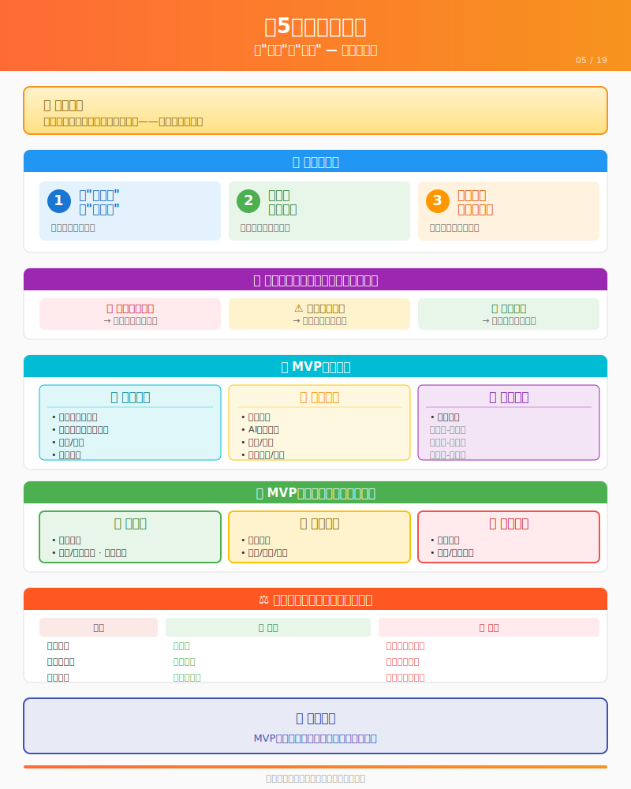

# 第5课：定义需求——从"选项"到"决定"



> 📍 **学习进度**：第2阶段 - 从想法到需求（2/3）
> 
> 前置课程：[第4课：发现需求](./L04-discovery.md)

## 📋 学习目标

学完这一课，你将能够：

- [ ] 在AI给的选项中做出合理决策
- [ ] 列出MVP功能清单
- [ ] 画出MVP边界（做什么、不做什么）
- [ ] 理解"权衡取舍"的概念

---

## 场景引入

上节课我们聊到了AI给出了几个选择题：

> 1. 实名认证怎么做？A.自己填学号 B.上传校园卡照片 C.对接学校系统
> 2. 发布物品需要审核吗？
> 3. 联系方式怎么处理？

这时候你需要做什么？**做决策**。

别慌，这不需要你懂技术。就像你去餐厅点菜，你不需要会做菜，但你需要告诉服务员"我要这个，不要那个"。AI给你选项，你做选择，就这么简单。

但问题是：怎么选？选错了怎么办？这一课我们来聊聊"做决策"这件事。

---

## 思考过程

### 人类做决策的三个原则

**原则1：先解决"有没有"，再解决"好不好"**

实名认证，对接学校系统肯定最靠谱，但那需要学校配合、可能要审批，时间不可控。上传校园卡照片？简单粗暴，先能用起来。

你要问自己：我要的是"完美但遥遥无期"，还是"能用且立刻上线"？

**原则2：能人工的就不自动化**

物品审核，一开始真的需要AI吗？一天只有几条发布，人工看一眼就完了。等每天几百条了，再考虑自动化。

不要一上来就追求"高大上"，那是给投资人看的，不是给用户用的。

**原则3：相信直觉，但不迷信直觉**

有些决策没有标准答案。比如"联系方式显示微信还是手机号"，你怎么选都对，怎么选都有人不满意。这时候相信你的直觉——你更习惯用哪个？

但也要留退路：先上线微信，如果用户反馈说想要手机号，再加就是了。软件的好处是随时可以改。

### 一个小技巧：问自己"如果不做会怎样"

纠结的时候，问自己：如果不做这个功能，用户还能用吗？

- 如果不能，那必须做（核心功能）
- 如果能用但体验差，看时间够不够（重要功能）
- 如果没影响，那可以先不做（锦上添花）

---

## 实操对话

接上节课，AI给出了选择题，人类需要做决策。

### 第四轮：关键决策

**AI**：
> 需要你拍板的几个决策：
> 1. 实名认证怎么做？A.自己填学号 B.上传校园卡照片 C.对接学校系统
> 2. 发布物品需要审核吗？
> 3. 联系方式怎么处理？

**人类**：
> 实名认证上传校园卡，发布物品需要审核可以考虑接入AI能力审核，显示微信号即可

**【人类决策点】**
- 实名认证：上传校园卡照片
- 内容审核：AI审核
- 联系方式：显示微信号

**AI**：
> 好的，三个关键决策定了。现在我可以画出MVP的功能清单了：
> 
> ```
> 【用户模块】
> ├── 注册（手机号/微信）
> ├── 实名认证（上传校园卡）
> ├── 登录/登出
> └── 个人中心（我的发布、我的收藏）
> 
> 【物品模块】
> ├── 发布物品（图片、描述、价格、分类）
> ├── AI内容审核
> ├── 编辑/下架
> ├── 浏览列表（分类、搜索）
> └── 物品详情（图片、描述、卖家微信）
> 
> 【交互模块】
> └── 收藏物品
> ```
> 
> 还需要确认几个细节：
> 1. 校园卡审核谁来审？
> 2. 物品分类怎么定？
> 3. 价格怎么处理？
> 4. 有没有想加的功能？

**【人类思考点】** AI没有一次性问完所有问题，而是逐步细化。这样不会让人感觉"问题太多"，而且每个阶段的决策都有上下文。

---

### 第五轮：补充细节

**人类**：
> 1. C（先让用户发，后续抽审）
> 2. A（你来定通用分类）
> 3. A（必须填价格）
> 4. 想要/求购功能

**【人类决策点】**
- 审核方式：先发布后抽审
- 分类：AI来定通用分类
- 价格：必填
- 新增：求购模块

**AI**：
> 最终MVP功能清单确定！
> 
> ```
> 【用户模块】
> ├── 注册（手机号）
> ├── 实名认证（上传校园卡，后续抽审）
> ├── 登录/登出
> └── 个人中心（我的发布、我的收藏、认证状态）
> 
> 【物品模块】
> ├── 发布物品（图片、标题、描述、分类、价格、微信）
> ├── AI内容审核
> ├── 编辑/下架
> ├── 浏览列表（分类筛选、搜索）
> └── 物品详情
> 
> 【求购模块】
> ├── 发布求购
> ├── 求购列表
> └── 求购详情
> 
> 【交互】
> └── 收藏物品
> ```

**【人类思考点】** 注意看，功能清单越来越具体了。从"注册"变成了"注册（手机号）"，从"物品模块"拆分出了"求购模块"。这就是需求细化的过程。

---

## 知识提炼

### 什么是"功能清单"？

**功能清单 = 产品要做的事情的清单**

就像装修公司的报价单，列清楚要做哪些项目。功能清单不是代码，是给人类看的——开发者看了知道要写什么，产品经理看了知道要验什么。

功能清单的作用：
- 给开发者：照着做，不会漏
- 给产品经理：验收时有标准
- 给老板/投资人：展示项目范围

### 什么是"MVP边界"？

**MVP边界 = 第一版做什么，不做什么**

不可能一次把所有功能都做完。需要画一条线：线内的是第一版必须有的，线外的是以后再说。

怎么画这条线？问自己：
1. 没有这个功能，产品能用吗？（不能→必须在MVP内）
2. 这个功能很复杂吗？收益大吗？（复杂但收益小→先不做）
3. 用户现在就需要吗？还是可以等？（可以等→先不做）

本项目的MVP边界：
```
✅ 必须有：注册登录、发布物品、浏览物品、联系方式
⭕ 可以后加：聊天、支付、推荐算法、评价系统
❌ 暂不考虑：视频展示、拍卖模式、物流跟踪
```

### 什么是"权衡取舍"？

**权衡取舍 = 每个选择都有代价，没有完美方案**

| 选择 | 好处 | 代价 |
|------|------|------|
| 对接学校系统 | 最权威 | 周期长、要审批 |
| 上传校园卡 | 简单快速 | 可能有人造假 |
| 先发后审 | 用户体验好 | 可能有违规内容 |
| 先审后发 | 内容干净 | 用户等待时间长 |

做产品就是做选择，没有对错，只有取舍。关键是：知道自己在取舍什么。

---

## 练习任务

1. **回顾你上节课想解决的问题**

2. **列出MVP的3-5个核心功能**

   用这个格式：
   ```
   【模块名】
   ├── 功能1
   ├── 功能2
   └── 功能3
   ```

3. **画出MVP边界**

   - ✅ 必须有：
   - ⭕ 可以后加：
   - ❌ 暂不考虑：

4. **（可选）和AI确认你的功能清单**

   把你的清单发给AI，让它帮你检查有没有遗漏或冗余。

---

下一课，我们学习如何把功能清单变成页面设计。

---

## ✅ 理解检查

学完这一章，你能回答这些问题吗？

**基础问题**（所有人要会）：
- 功能清单是什么？有什么用？
- 如何判断一个功能是否在MVP范围内？
- 什么是"权衡取舍"？

**进阶问题**（想提升的同学思考）：
- 做决策的三个原则是什么？
- "如果不做会怎样"这个方法怎么用？
- MVP边界应该怎么画？

**挑战问题**（试着不问AI）：
- 如果所有功能都想要，怎么取舍？
- 如何避免"完美主义陷阱"？

---

## 🎯 费曼学习法检验

### 你能解释这些概念吗？

**1. 功能清单是什么？**
> 提示：想想装修报价单...

<details>
<summary>参考答案</summary>

功能清单 = 产品要做的事情的清单。就像装修公司的报价单，列清楚要做哪些项目。它的作用是：给开发者照着做、给产品经理验收时做标准、给老板展示项目范围。
</details>

**2. 如何判断一个功能是否在MVP范围内？**
> 提示：想想"如果不做会怎样"...

<details>
<summary>参考答案</summary>

问自己：如果不做这个功能，用户还能用吗？
- 如果不能用，那必须做（核心功能）
- 如果能用但体验差，看时间够不够（重要功能）
- 如果没影响，那可以先不做（锦上添花）
</details>

### 你能教给别人吗？

**教学检验**：找一个同学（或对着空气），尝试讲清楚：

1. 为什么没有完美方案？
2. 如何用"三个原则"做决策？
3. MVP边界怎么画？

### 自测题

**第1题**：以下哪个是正确的决策原则？

A. 先解决"好不好"，再解决"有没有"
B. 能自动化的就不要人工
C. 先解决"有没有"，再解决"好不好"
D. 追求完美，一次到位

<details>
<summary>答案</summary>

**C** - 先解决"有没有"（能用了再说），再解决"好不好"（慢慢优化）。这是MVP思维的核心。B说反了，应该是"能人工的就不自动化"。
</details>

**第2题**：MVP边界的作用是？

A. 限制创意
B. 明确第一版做什么、不做什么
C. 证明功能太少
D. 让投资人看

<details>
<summary>答案</summary>

**B** - MVP边界的作用是明确第一版做什么、不做什么，避免范围蔓延，确保能在有限时间内上线。
</details>

**第3题**：权衡取舍的本质是？

A. 每个选择都有代价，没有完美方案
B. 选最便宜的方案
C. 选最贵的方案
D. 不需要取舍

<details>
<summary>答案</summary>

**A** - 权衡取舍的本质是：每个选择都有代价，没有完美方案。关键是知道自己在取舍什么。
</details>

---

## 📚 扩展资源

### 官方文档
- [MVP指南 - 产品联盟](https://www.productplan.com/glossary/minimum-viable-product/) - 关键词：MVP、最小可行产品
- [功能优先级排序方法](https://www.atlassian.com/agile/product-management/prioritization) - 关键词：优先级、需求排序

### 推荐阅读
- [RICE优先级模型详解](https://www.intercom.com/blog/rice-simple-prioritization-for-product-managers/) - 四个维度评估功能价值
- [《精益创业》核心概念](https://www.startuplessonslearned.com/) - MVP思想的来源
- [如何写出好的验收标准](https://www.mountaingoatsoftware.com/agile/user-stories) - 用户故事与验收条件

### 视频资源
- B站搜索"MVP产品设计" - 了解最小可行产品理念
- YouTube: "Product Prioritization Frameworks" - 优先级排序方法对比

### 实用工具
- [Notion功能清单模板](https://www.notion.so/templates/product-management) - 功能管理
- [Miro功能地图模板](https://miro.com/templates/feature-map/) - 可视化功能结构

### 本课关键词
`MVP` `功能清单` `验收标准` `优先级` `需求权衡` `产品边界` `迭代思维`
