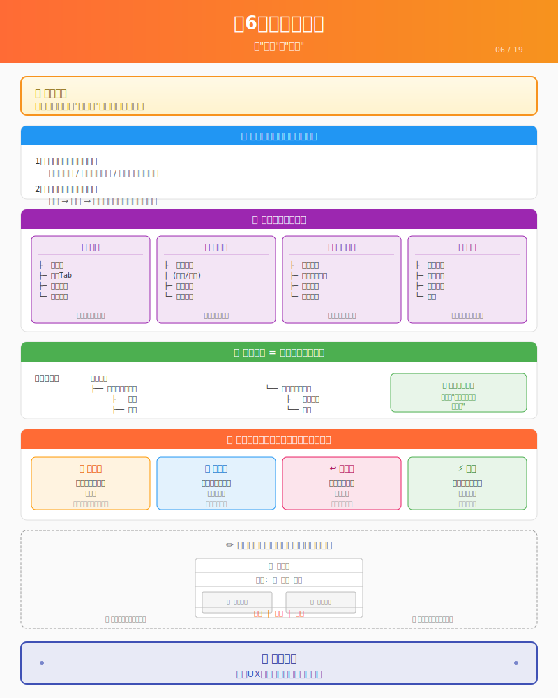

# 第6课：产品设计——从"功能"到"页面"



> 📍 **学习进度**：第2阶段 - 从想法到需求（3/3）
> 
> 前置课程：[第5课：定义需求](./L05-definition.md)

## 📋 学习目标

学完这一课，你将能够：

- [ ] 把功能清单转化为页面结构
- [ ] 画出简单的页面草图
- [ ] 理解"用户路径"和"信息架构"
- [ ] 判断页面设计是否合理

---

## 场景引入

上节课我们确定了功能清单：

```
【用户模块】注册、认证、登录、个人中心
【物品模块】发布、审核、浏览、详情
【求购模块】发布、列表、详情
【交互】收藏
```

现在问题来了：这些功能怎么变成用户能看到的页面？

想象你要开一家便利店。你知道要卖饮料、零食、日用品。但货架怎么摆？入口在哪？收银台放哪？这些都要设计。顾客一进来能不能快速找到东西，取决于你的"店面设计"。

做软件也一样。功能是"卖什么"，页面设计是"怎么摆"。这一课我们来看看如何把功能变成页面。

---

## 思考过程

### 页面设计的核心问题

在设计页面之前，你需要想清楚：

**1. 用户要完成什么任务？**

用户来这里不是为了"浏览页面"，而是为了"做某件事"。比如：
- 我想卖掉我的旧教材
- 我想买个二手耳机
- 我想看看有没有人在卖自行车

每个任务对应一条"用户路径"。页面设计要让这条路径尽可能短。

**2. 最重要的信息是什么？**

用户看一个物品详情页，最想知道什么？
- 图片（长什么样）
- 价格（买不买得起）
- 联系方式（怎么联系卖家）

这三样东西要最显眼。其他信息（发布时间、浏览量）可以放后面。

**3. 常用功能放在哪？**

用户最常用的操作是：
- 浏览物品（最常用）
- 发布物品（次常用）
- 看我的发布/收藏（偶尔用）

所以底部导航通常是：首页、发布、我的。三个按钮，用户一秒钟就能点到。

### 一个小技巧：画草图

别一上来就用设计软件。拿张纸，画几个方框，代表页面。在方框里写上这个页面有什么元素。这样最快，改起来也最方便。

```
┌─────────────────┐
│  搜索栏          │
├─────────────────┤
│ 分类: 书 数码.. │
├─────────────────┤
│ ┌───┐ 物品卡片  │
│ │图 │ 标题      │
│ │片 │ 价格      │
│ └───┘           │
│ ┌───┐ 物品卡片  │
│ │图 │ 标题      │
│ │片 │ 价格      │
│ └───┘           │
└─────────────────┘
│ 首页 发布 我的  │
└─────────────────┘
```

---

## 实操对话

功能清单确定后，AI主动输出了页面结构。

### 第六轮：产品结构

**AI**：
> 产品设计 - 页面结构：
> 
> ```
> 首页
> ├── 搜索栏
> ├── 分类Tab
> ├── 物品列表
> └── 底部导航
> 
> 发布页
> ├── 选择类型（出售/求购）
> └── 表单
> 
> 物品详情页
> ├── 图片轮播
> ├── 标题、价格、描述
> ├── 卖家微信
> └── 收藏按钮
> 
> 我的页面
> ├── 认证状态
> ├── 我的发布
> ├── 我的收藏
> └── 设置
> ```

**【人类思考点】** AI自动把功能映射成了页面。我只需要看看这个结构对不对，有没有漏掉什么。如果觉得哪里不对，直接说就行。

---

**人类**：
> （假设人类看完觉得没问题，可以回应）
> 这个结构可以，先按这个来。

**AI**：
> 好的，页面结构确定了。下一步我可以帮你：
> 1. 画线框图（更详细的页面布局）
> 2. 设计数据库结构
> 3. 开始写代码
> 
> 你想先做哪个？

**【人类决策点】** AI又给出了选择题。这次的选择决定了下一步做什么。

---

## 知识提炼

### 什么是"页面结构"？

**页面结构 = 有哪些页面，每个页面有什么内容**

就像酒店的楼层图：告诉你有几种房间（单人间、双人间、套房），每种房间有什么设施（床、电视、浴室）。

页面结构不是设计稿，不关心颜色、字体、间距，只关心"有什么"。

### 什么是"信息架构"？

**信息架构 = 信息怎么组织，用户怎么找到**

想象一个超市。如果你把酱油放在"饮料区"，顾客肯定找不到。好的信息架构就是让用户"不用想就知道去哪找"。

本项目的信息架构：
```
一级分类
├── 出售（我要卖）
│   ├── 书籍
│   ├── 数码
│   ├── 生活用品
│   └── 其他
└── 求购（我要买）
    └── （同上）
```

用户想买书，点"出售"→"书籍"，逻辑很清晰。

### 什么是"用户体验"？

**用户体验 = 用户用起来爽不爽**

一个好的用户体验，用户感觉不到它的存在。一个坏的体验，用户每一步都想骂人。

好体验的特征：
- **可见性**：我想要的功能在哪里？
- **反馈性**：我点了按钮，有反应吗？
- **容错性**：我点错了，能撤销吗？
- **效率**：常用操作要几步？

打个比方：电梯按钮。
- 可见性：按钮在显眼位置，不用找
- 反馈性：按下后灯亮了，知道按到了
- 容错性：按错了能取消
- 效率：不用等太久

---

## 页面结构速查

本项目最终确定的页面结构：

| 页面 | 核心功能 | 用户任务 |
|------|----------|----------|
| 首页 | 搜索、分类、物品列表 | 浏览找东西 |
| 发布页 | 表单 | 发布出售/求购 |
| 物品详情 | 图片、价格、联系方式 | 决定买不买 |
| 我的 | 发布记录、收藏、认证 | 管理自己的信息 |

底部导航：首页 | 发布 | 我的

---

## 练习任务

1. **画一个首页草图**

   拿纸和笔，画出首页的大致布局。包括：
   - 搜索栏
   - 分类选项
   - 物品卡片（图片+标题+价格）
   - 底部导航

2. **梳理你的项目的页面结构**

   用这个格式：
   ```
   页面名
   ├── 元素1
   ├── 元素2
   └── 元素3
   ```

3. **检查信息架构**

   - 分类逻辑清晰吗？
   - 用户能快速找到想要的东西吗？
   - 有没有需要合并或拆分的页面？

4. **（可选）用AI画线框图**

   把你的页面结构发给AI，让它帮你画更详细的线框图。

---

恭喜！需求阶段到此结束。下一阶段，我们开始写代码。

---

## ✅ 理解检查

学完这一章，你能回答这些问题吗？

**基础问题**（所有人要会）：
- 页面结构和设计稿有什么区别？
- 用户来你的平台最想完成什么任务？
- 为什么常用功能要放在显眼位置？

**进阶问题**（想提升的同学思考）：
- 什么是"用户路径"？怎么让路径变短？
- 如果分类太多太乱，用户会怎么想？
- 画草图有什么好处？

**挑战问题**（试着不问AI）：
- 好的用户体验应该具备哪些特征？
- 如果让你重新设计这个平台的页面结构，你会怎么改？

---

## 🎯 费曼学习法检验

### 你能解释这些概念吗？

**1. 页面结构和设计稿有什么区别？**
> 提示：想想"有什么"和"长什么样"的区别...

<details>
<summary>参考答案</summary>

页面结构只关心"有什么"（这个页面有哪些元素），不关心颜色、字体、间距。
设计稿则关心所有视觉细节。

页面结构像建筑图纸（有墙、有窗、有门），设计稿像装修效果图（什么颜色、什么材质）。
</details>

**2. 什么是"用户路径"？**
> 提示：想想用户要完成一个任务需要几步...

<details>
<summary>参考答案</summary>

用户路径 = 用户完成一个任务需要的步骤。

比如"买一个二手耳机"的用户路径：
1. 打开首页
2. 搜索"耳机"
3. 浏览结果
4. 点击详情
5. 查看价格和联系方式
6. 联系卖家

好的设计要让路径尽可能短。
</details>

### 你能教给别人吗？

**教学检验**：找一个同学（或对着空气），尝试讲清楚：

1. 什么是页面结构？
2. 为什么常用功能要放显眼位置？
3. 好的用户体验有哪些特征？

### 自测题

**第1题**：页面结构应该包含什么？

A. 精确的颜色和字体
B. 页面有哪些元素，怎么组织
C. 代码实现细节
D. 数据库设计

<details>
<summary>答案</summary>

**B** - 页面结构只关心"有什么"（这个页面有哪些元素）和"怎么组织"（元素之间的关系）。颜色、代码、数据库不在页面结构范围内。
</details>

**第2题**：好的用户体验不包括？

A. 可见性：我想要的功能在哪里
B. 复杂性：功能越多越好
C. 反馈性：我点了按钮，有反应吗
D. 效率：常用操作要几步

<details>
<summary>答案</summary>

**B** - 好的用户体验应该是简洁的，不是功能越多越好。复杂性不是好体验的特征。
</details>

**第3题**：为什么要画草图？

A. 因为设计师需要
B. 快速试错，改起来方便
C. 交给程序员看
D. 凑文档页数

<details>
<summary>答案</summary>

**B** - 画草图的好处是快速试错、改起来方便。用纸笔画比用软件快得多，有想法马上能画出来。
</details>

---

## 📚 扩展资源

### 官方文档
- [Material Design 设计规范](https://material.io/design) - 关键词：设计系统、UI规范
- [Apple Human Interface Guidelines](https://developer.apple.com/design/human-interface-guidelines/) - 关键词：iOS设计、用户体验

### 推荐阅读
- [信息架构入门](https://www.nngroup.com/articles/ia-vs-navigation/) - 信息组织与导航设计
- [《用户体验要素》精读](https://www.jjg.net/elements/) - 五层模型理解产品设计
- [用户流程图设计指南](https://careerfoundry.com/en/blog/ux-design/what-are-user-flows/) - 画出清晰的用户路径

### 视频资源
- B站搜索"产品设计入门" - 页面结构与信息架构
- YouTube: "UX Design Course" - 完整的UX设计入门

### 实用工具
- [Figma 线框图模板](https://www.figma.com/community) - 快速绘制页面草图
- [Miro 用户流程图模板](https://miro.com/templates/user-flow/) - 绘制用户路径
- [ProcessOn](https://www.processon.com/) - 国内在线绘图工具

### 本课关键词
`产品设计` `页面结构` `信息架构` `用户流程` `线框图` `用户体验` `任务路径`
