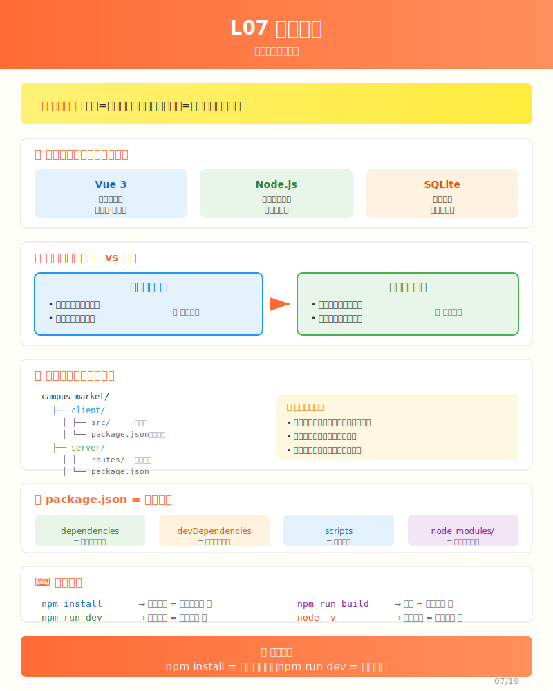

# 第7课：项目搭建——从零开始的第一步



## 场景引入

恭喜你！前面的课程里，我们完成了：
- 明确了要做什么（校园二手交易平台）
- 梳理了功能清单（用户、物品、求购、收藏）
- 设计了页面结构（首页、发布、详情、我的）

现在，终于要开始写代码了！

**但第一步不是写代码，是搭环境。**

想象你要开一家餐厅。你不能直接开始做菜，你得先：
- 租个店面
- 装修好
- 买厨具
- 招厨师

这些都准备好了，才能开始做菜。写代码也一样，先把"店面"搭起来。

这一课，我们来完成项目搭建，让你的项目"有地方写代码"。

---

## 思考过程

### 技术选型：盖房子先选材料

在让AI动手之前，你需要做一个重要决策：**用什么技术？**

就像盖房子，你可以用：
- 砖混结构（便宜、常见）
- 钢结构（现代、快速）
- 木结构（轻便、美观）

各有优缺点，选哪个取决于你的需求。

我们的校园二手交易平台，需求是：
- 功能不复杂
- 用户量不大（几千人）
- 要快速做出来
- 学生团队好维护

基于这些，我们选择：

| 技术 | 选择 | 为什么 |
|------|------|--------|
| 前端 | Vue 3 | 国内最流行、资料多、好上手 |
| 后端 | Node.js | 和前端用同一种语言、学习成本低 |
| 数据库 | SQLite | 开发阶段够用、不用装软件 |

**【人类决策点】** 技术选型是人类要做的决策。你可以问AI推荐，但最终选择权在你。AI会告诉你各种方案的优缺点，你来拍板。

### 为什么选这个组合？

**Vue 3 + Node.js** 这个组合，对高职学生来说有几个好处：

1. **语言统一**：前端后端都用 JavaScript，不用学两门语言
2. **生态成熟**：遇到问题，网上一搜就有答案
3. **学习曲线平缓**：不用一下子学太多东西
4. **就业市场认可**：Vue在国内用得很广

### 前端和后端是什么？

这是很多新手困惑的问题。用个类比来说明：

**想象你开了一家服装店：**

```
┌─────────────────────────────────────────────┐
│  前端（店面）                                │
│  ┌─────┐ ┌─────┐ ┌─────┐                   │
│  │展示柜│ │试衣间│ │收银台│                   │
│  └─────┘ └─────┘ └─────┘                   │
│  顾客看得到的：漂亮的装修、商品展示、交互按钮    │
└─────────────────────────────────────────────┘
         ↓ 顾客选好商品
         ↓
┌─────────────────────────────────────────────┐
│  后端（仓库）                                │
│  ┌─────┐ ┌─────┐ ┌─────┐                   │
│  │库存  │ │账本 │  │员工 │                   │
│  └─────┘ └─────┘ └─────┘                   │
│  顾客看不到的：数据存储、业务逻辑、安全验证     │
└─────────────────────────────────────────────┘
```

- **前端**：就是"店面"，用户看得到、点得到的东西
  - 按钮长什么样
  - 页面怎么布局
  - 点击后有什么动画

- **后端**：就是"仓库"，用户看不到但很重要的东西
  - 数据存在哪里
  - 怎么验证用户身份
  - 怎么处理业务逻辑

在我们的项目中：
- 前端负责：页面展示、用户交互
- 后端负责：数据存储、接口处理

---

## 实操对话

好了，概念讲完了。现在让我们看看怎么跟AI说，让它帮我们搭建项目。

### 第七轮：让AI推荐技术方案

**人类**：
> 我想开始做这个二手交易平台了。帮我推荐一个技术方案，要求是：
> - 我只会一点基础，不要太难
> - 要快，能在几周内做出来
> - 资料要多，遇到问题能搜到答案

**AI**：
> 根据你的需求，我推荐以下技术方案：
>
> **前端**：Vue 3 + Vite
> - Vue是国内最流行的前端框架，中文资料丰富
> - Vite是新一代构建工具，启动快、热更新快
>
> **后端**：Node.js + Express
> - Express是最流行的Node.js框架，简单易用
> - 前后端都用JavaScript，学习成本低
>
> **数据库**：SQLite（开发）→ MySQL（生产）
> - SQLite是一个文件，不需要安装，开发阶段够用
> - 上线后可以换成MySQL，代码改动很小
>
> 这个方案的优点：
> 1. 学习曲线平缓
> 2. 社区活跃，问题好搜
> 3. 部署简单
>
> 你觉得这个方案可以吗？

**【人类思考点】** AI给出了推荐，但你要判断：
- 这个方案你能学会吗？
- 你的团队能驾驭吗？
- 如果不确定，可以继续问AI："有没有更简单的方案？"

---

**人类**：
> 可以，就用这个方案。帮我初始化项目结构。

**AI**：
> 好的，我来创建项目结构。
>
> 首先，我们的项目会分成两个部分：
> - `client/` - 前端项目（Vue 3）
> - `server/` - 后端项目（Node.js）
>
> 这样做的好处是前后端分离，互不干扰。

```
campus-market/
├── client/                 # 前端项目
│   ├── src/
│   │   ├── views/          # 页面组件
│   │   ├── components/     # 可复用组件
│   │   ├── router/         # 路由配置
│   │   ├── api/            # 接口请求
│   │   └── assets/         # 静态资源
│   ├── index.html
│   ├── package.json
│   └── vite.config.js
│
├── server/                 # 后端项目
│   ├── routes/             # 路由（接口）
│   ├── models/             # 数据模型
│   ├── middleware/         # 中间件
│   ├── app.js              # 入口文件
│   └── package.json
│
└── README.md               # 项目说明
```

> 现在开始创建文件，请稍等...

**【人类决策点】** 项目结构AI会帮你设计，但你要检查：
- 这个结构你能看懂吗？
- 有没有需要调整的地方？

---

### 第八轮：创建项目

**AI**：
> 项目创建完成！让我解释一下每个文件的作用：

**先看 `server/package.json`：**

```json
{
  "name": "campus-market-server",
  "version": "1.0.0",
  "description": "校园二手交易平台 - 后端",
  "main": "app.js",
  "scripts": {
    "start": "node app.js",
    "dev": "node app.js"
  },
  "dependencies": {
    "express": "^4.18.2",
    "cors": "^2.8.5",
    "better-sqlite3": "^9.2.2"
  }
}
```

**这个文件是什么？**

`package.json` 就像一份"购物清单"。它告诉你：
- 这个项目叫什么（name）
- 需要哪些"食材"（dependencies）
- 怎么启动（scripts）

类比一下：
- `dependencies`：就像你做菜需要的食材（面粉、鸡蛋、油...）
- `npm install`：就像去超市把食材买回来
- `npm start`：就像开始做菜

---

**再看 `client/package.json`：**

```json
{
  "name": "campus-market-client",
  "version": "1.0.0",
  "type": "module",
  "scripts": {
    "dev": "vite",
    "build": "vite build",
    "preview": "vite preview"
  },
  "dependencies": {
    "vue": "^3.4.0",
    "vue-router": "^4.2.5"
  },
  "devDependencies": {
    "vite": "^5.0.0",
    "@vitejs/plugin-vue": "^4.5.0"
  }
}
```

**dependencies 和 devDependencies 的区别：**

- `dependencies`：项目运行必须的（就像做菜必须的食材）
- `devDependencies`：开发时才需要的（就像做菜用的锅铲，菜做完了锅铲不需要端上桌）

---

**人类**：
> 文件都创建好了，怎么运行起来？

**AI**：
> 很好的问题！按以下步骤操作：

**第一步：安装依赖**

打开终端（命令行），分别进入前后端目录，安装依赖：

```bash
# 安装后端依赖
cd server
npm install

# 安装前端依赖
cd ../client
npm install
```

`npm install` 会读取 `package.json`，把需要的依赖都下载到 `node_modules` 文件夹里。

**第二步：启动项目**

```bash
# 启动后端（在 server 目录）
npm start

# 启动前端（新开一个终端，在 client 目录）
npm run dev
```

**第三步：验证**

- 后端运行在 http://localhost:3000
- 前端运行在 http://localhost:5173

打开浏览器访问这两个地址，如果能看到页面，就说明环境搭建成功了！

---

### 常见问题

**人类**：
> 我运行 npm install 报错了，说 npm 不是命令？

**AI**：
> 这说明你的电脑还没有安装 Node.js。npm 是随 Node.js 一起安装的。
>
> **安装方法：**
> 1. 访问 https://nodejs.org
> 2. 下载 LTS 版本（长期支持版）
> 3. 双击安装，一路下一步
> 4. 安装完成后，重新打开终端，输入 `node -v` 验证

**【人类决策点】** 遇到问题是正常的。关键是要学会描述问题给AI，让它帮你解决。

---

## 知识提炼

### 什么是 npm？

**npm = Node Package Manager（Node包管理器）**

类比一下：
- npm 就像"应用商店"
- `package.json` 就像你的"下载列表"
- `npm install` 就像"一键下载列表里的所有应用"
- `node_modules/` 就是存放下载内容的地方

为什么要用 npm？
- 不用自己到处找库，一条命令搞定
- 版本管理方便
- 别人拿到你的代码，也能一键安装依赖

### 什么是 Node.js？

**Node.js = 让 JavaScript 可以在服务器上运行**

以前，JavaScript 只能在浏览器里跑（做前端）。
有了 Node.js，JavaScript 也能在服务器上跑了（做后端）。

这意味着：**你只需要学一门语言，就能做前后端！**

### 项目目录结构详解

用一个类比来理解：

```
project/
├── src/                  # 源代码（你的"厨房"）
│   ├── views/            # 页面（"菜单"上的菜）
│   ├── components/       # 组件（可复用的"半成品"）
│   ├── router/           # 路由（"菜单"，告诉客人去哪点菜）
│   └── api/              # 接口（"服务员"，负责和后厨沟通）
│
├── node_modules/         # 依赖（"仓库里的食材"）
├── package.json          # 配置（"采购清单"）
└── README.md             # 说明（"开店指南"）
```

**为什么要分这么多文件夹？**

想象你的厨房：
- 蔬菜放一个篮子
- 肉放一个篮子
- 调料放一个篮子

分开放的好处是：
- 找东西快
- 不会搞混
- 别人进来也能快速找到

代码也一样，分文件夹是为了"好找、好改、好合作"。

### 前后端分离的好处

```
┌──────────────┐         ┌──────────────┐
│   前端项目    │  HTTP   │   后端项目    │
│  (Vue项目)   │ ←─────→ │  (Node项目)  │
│              │         │              │
│  负责展示    │         │  负责数据     │
└──────────────┘         └──────────────┘
```

好处：
1. **职责清晰**：前端管展示，后端管数据
2. **独立开发**：前端改页面不影响后端
3. **独立部署**：可以部署到不同的服务器
4. **易于扩展**：以后想换个前端框架，后端不用改

---

## 快速参考

### 常用命令

| 命令 | 作用 | 类比 |
|------|------|------|
| `npm install` | 安装依赖 | 去超市买菜 |
| `npm run dev` | 启动开发服务器 | 开始做菜 |
| `npm run build` | 打包上线 | 装盒准备外卖 |
| `node -v` | 检查 Node 版本 | 检查厨具型号 |

### 项目结构一览

```
campus-market/
├── client/           # 前端（Vue 3）
│   ├── src/          # 源代码
│   └── package.json  # 依赖清单
│
├── server/           # 后端（Node.js）
│   ├── routes/       # 接口路由
│   ├── models/       # 数据模型
│   └── package.json  # 依赖清单
│
└── README.md         # 项目说明
```

---

## 练习任务

### 任务1：检查你的环境

在终端运行以下命令，确认环境已就绪：

```bash
node -v      # 应该显示 v18.x.x 或更高
npm -v       # 应该显示 9.x.x 或更高
```

如果报错，说明 Node.js 没装好，去 https://nodejs.org 下载安装。

### 任务2：创建一个空项目

自己动手创建一个最简单的项目：

1. 新建一个文件夹 `my-first-project`
2. 在里面新建一个 `package.json` 文件，写入：
   ```json
   {
     "name": "my-first-project",
     "version": "1.0.0"
   }
   ```
3. 新建一个 `index.js` 文件，写入：
   ```javascript
   console.log('Hello, World!')
   ```
4. 在终端运行 `node index.js`

如果看到 `Hello, World!`，恭喜你，你成功运行了第一个 Node.js 程序！

### 任务3：尝试用 AI 搭建项目

把下面的提示词发给 AI，看看它怎么帮你：

> "我想创建一个 Vue 3 + Node.js 的项目，帮我初始化项目结构，包括 package.json 和基本的目录结构。"

### 任务4：理解目录结构

看一下 AI 创建的项目结构，尝试回答：
- `views/` 文件夹是干什么用的？
- `package.json` 里的 `scripts` 是做什么的？
- 为什么要分 `client/` 和 `server/` 两个文件夹？

---

## 小结

这一课，我们完成了：

- [x] 理解了技术选型的逻辑
- [x] 知道了前端和后端的区别
- [x] 学会了 `package.json` 是什么
- [x] 理解了项目目录结构
- [x] 亲手把项目运行起来了

项目环境搭好了，下一课我们开始写第一个功能：用户注册。

**建议先看**：[补充课：Vue基础知识](./L07.5-vue-basics.md) - 如果你之前没有接触过Vue，建议先学习这节课，了解Vue的核心概念，这样更容易理解后续代码。

**下一课**：[第8课：用户注册——第一个功能](./L08-user-register.md)

---

## ✅ 理解检查

学完这一章，你能回答这些问题吗？

**基础问题**（所有人要会）：
- 前端和后端分别负责什么？
- package.json 是什么？有什么用？
- 为什么要把项目分成 client/ 和 server/？

**进阶问题**（想提升的同学思考）：
- dependencies 和 devDependencies 有什么区别？
- 为什么选择 Vue + Node.js 这个技术栈？
- npm install 做了什么？

**挑战问题**（试着不问AI）：
- 如果让你换一个技术栈（比如 React + Python），你会怎么做？
- 项目目录结构为什么要这样设计？

---

## 🎯 费曼学习法检验

### 你能解释这些概念吗？

**1. 前端和后端的区别是什么？**
> 提示：想想"店面"和"仓库"...

<details>
<summary>参考答案</summary>

前端 = 店面，用户看得到、点得到的东西（页面、按钮、动画）
后端 = 仓库，用户看不到但很重要的东西（数据存储、业务逻辑、安全验证）

前端负责展示，后端负责数据和逻辑。
</details>

**2. package.json 是什么？**
> 提示：想想"购物清单"...

<details>
<summary>参考答案</summary>

package.json 就像一份"购物清单"。它告诉你：
- 项目叫什么（name）
- 需要哪些依赖（dependencies）
- 怎么启动（scripts）

npm install 会读取这份清单，把需要的依赖都下载回来。
</details>

### 你能教给别人吗？

**教学检验**：找一个同学（或对着空气），尝试讲清楚：

1. 为什么要分 client/ 和 server/ 两个文件夹？
2. npm install 做了什么？
3. dependencies 和 devDependencies 有什么区别？

### 自测题

**第1题**：前端负责什么？

A. 数据存储
B. 用户界面展示
C. 业务逻辑处理
D. 数据库操作

<details>
<summary>答案</summary>

**B** - 前端负责用户界面展示，用户能看到、点击的都由前端处理。A、C、D都是后端的职责。
</details>

**第2题**：npm install 的作用是？

A. 启动项目
B. 打包项目
C. 安装 package.json 中列出的依赖
D. 创建项目

<details>
<summary>答案</summary>

**C** - npm install 会读取 package.json，把需要的依赖都下载到 node_modules 文件夹里。
</details>

**第3题**：devDependencies 中的依赖用于？

A. 项目运行时必须
B. 只在开发时需要
C. 不需要安装
D. 生产环境必须

<details>
<summary>答案</summary>

**B** - devDependencies 是开发时才需要的依赖（比如构建工具、测试框架）。项目上线后这些不需要。
</details>

---

## 📚 扩展资源

### 官方文档
- [Vue.js 官方文档（中文）](https://cn.vuejs.org/) - 关键词：Vue 3、组件化、响应式
- [Node.js 官方文档](https://nodejs.org/docs/latest/api/) - 关键词：模块、npm、异步
- [Express 官方文档](https://expressjs.com/) - 关键词：路由、中间件、Web框架
- [Vite 官方文档](https://vitejs.dev/) - 关键词：构建工具、热更新

### 推荐阅读
- [npm 入门教程（菜鸟教程）](https://www.runoob.com/nodejs/nodejs-npm.html) - npm 基础
- [Vue 3 快速上手](https://cn.vuejs.org/guide/introduction.html) - Vue 官方教程
- [Express 入门指南](https://www.expressjs.com.cn/starter/installing.html) - Express 中文网

### 视频资源
- B站搜索"Vue3 入门教程" - 跟着视频学习 Vue
- B站搜索"Node.js Express 入门" - 后端开发基础
- B站搜索"npm 使用教程" - 包管理基础

### 本课关键词
`前端` `后端` `Vue` `Node.js` `npm` `package.json` `项目结构` `依赖管理`
