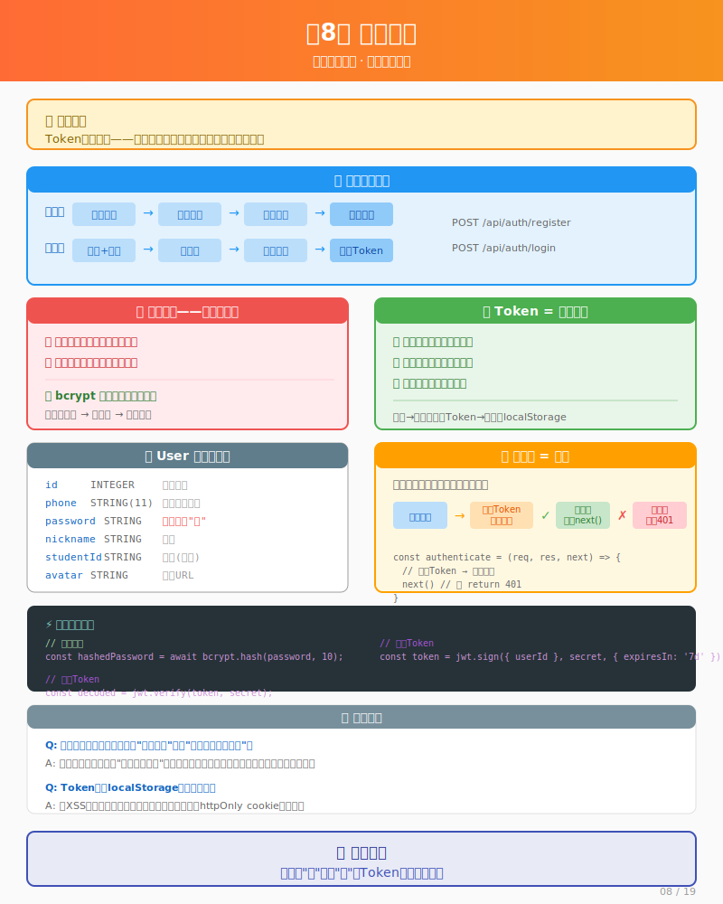

# 第8课：用户认证——让用户有身份



> 📍 **学习进度**：第3阶段 - 开发实战（4/7）
> 
> 前置课程：[L07 项目搭建](./L07-setup.md) | [L07.5 Vue 基础](./L07.5-vue-basics.md)

## 📋 学习目标

学完这一课，你将能够：

- [ ] 解释什么是 API，以及前后端如何通过 API 通信
- [ ] 理解密码加密的原理（为什么存"灰"不存"纸"）
- [ ] 说清楚 Token 是什么，起什么作用
- [ ] 实现用户注册和登录功能

---

## 场景引入

上一课，我们把项目搭起来了。但有个问题：**用户怎么证明"我是我"？**

想象你去图书馆借书：
- 第一次去，你要办一张借书证（注册）
- 以后每次去，出示借书证就行（登录）
- 图书馆通过借书证知道你是谁，借了什么书

我们的二手平台也一样：
- 用户要注册，告诉系统"我是谁"
- 以后访问时，系统要知道"这个请求是谁发的"
- 发布物品时，要记录"这是谁发布的"

这一课，我们来实现用户注册和登录功能。

---

## 思考过程

### 注册登录的流程是什么？

在让AI写代码之前，你需要先想清楚流程：

```
注册流程：
用户填写信息 → 系统检查手机号是否重复 → 密码加密 → 存入数据库

登录流程：
用户填写手机号密码 → 系统查找用户 → 验证密码 → 返回身份凭证
```

**【人类思考点】** 这里有几个关键决策：

1. **密码怎么存？**
   - 明文存？（绝对不行！数据库泄露就完了）
   - 加密存？（用bcrypt，单向加密，无法还原）

2. **登录后怎么保持状态？**
   - 用cookie？（传统方案）
   - 用token？（现代方案，我们用这个）

### 什么是 Token？

你住酒店时，前台会给你一张房卡。每次进房间，刷房卡就行。

**Token 就是房卡：**
- 登录成功后，服务器给你一张"房卡"（Token）
- 以后每次请求，带上这张"房卡"
- 服务器验证房卡，就知道你是谁了

```
登录成功 → 服务器返回 Token → 浏览器保存 Token
                    ↓
以后每次请求 → 带上 Token → 服务器验证 Token → 知道是谁
```

### 用户表需要什么字段？

用户表就像一个"会员档案"，需要存：

| 字段 | 说明 | 为什么需要 |
|------|------|-----------|
| id | 唯一编号 | 系统识别用户 |
| phone | 手机号 | 登录用 |
| password | 密码 | 验证身份（加密存储） |
| nickname | 昵称 | 显示给别人看 |
| avatar | 头像 | 个人形象 |
| studentId | 学号 | 实名认证用 |

---

## 实操对话

### 第九轮：设计用户表

**人类**：
> 开始做用户注册登录功能。先设计数据库表。

**AI**：
> 好的，先设计用户表。用Sequelize定义数据模型：

```javascript
// 文件: backend/src/models/User.js
const { DataTypes } = require('sequelize');

module.exports = (sequelize) => {
  const User = sequelize.define('User', {
    id: { type: DataTypes.INTEGER, primaryKey: true, autoIncrement: true },
    phone: { type: DataTypes.STRING(11), allowNull: false, unique: true },
    password: { type: DataTypes.STRING(255), allowNull: false },
    nickname: { type: DataTypes.STRING(50) },
    studentId: { type: DataTypes.STRING(20), comment: '学号，用于实名认证' },
    avatar: { type: DataTypes.STRING(255), defaultValue: '/default-avatar.png' }
  });
  return User;
};
```

> 完整代码见 `project/campus-market/backend/src/models/User.js`

**【人类决策点】** AI设计的表结构，你要检查：
- 有没有遗漏必要字段？
- 字段类型是否合理？

---

**人类**：
> 密码就这样明文存吗？感觉不太安全。

**AI**：
> 好问题！密码确实需要加密。我们用 bcryptjs 来处理：

```javascript
// 注册时加密
const bcrypt = require('bcryptjs');
const hashedPassword = await bcrypt.hash(password, 10);

// 登录时验证
const isMatch = await bcrypt.compare(inputPassword, user.password);
```

**为什么用 10？** 这是"加盐轮数"，数字越大越安全但越慢。10是常用值，安全性和性能的平衡。

---

### 第十轮：实现注册接口

**AI**：
> 现在写注册接口，核心逻辑如下：

```javascript
// 文件: backend/src/routes/auth.js
router.post('/register', async (req, res) => {
  const { phone, password, nickname } = req.body;

  // 检查手机号是否已存在
  const existingUser = await User.findOne({ where: { phone } });
  if (existingUser) {
    return res.status(400).json({ message: '手机号已注册' });
  }

  // 加密密码并创建用户
  const hashedPassword = await bcrypt.hash(password, 10);
  const user = await User.create({ phone, password: hashedPassword, nickname });

  res.status(201).json({ message: '注册成功', user: { id: user.id, phone: user.phone } });
});
```

> 完整代码见 `project/campus-market/backend/src/routes/auth.js`

**人类**：
> 代码写好了，怎么测试？

**AI**：
> 可以用 curl 命令测试：

```bash
curl -X POST http://localhost:3000/api/auth/register \
  -H "Content-Type: application/json" \
  -d '{"phone":"13800138001","password":"123456","nickname":"测试用户"}'
```

---

### 第十一轮：实现登录接口

**AI**：
> 登录接口需要验证密码，然后生成 Token：

```javascript
// 文件: backend/src/routes/auth.js
const jwt = require('jsonwebtoken');

router.post('/login', async (req, res) => {
  const { phone, password } = req.body;

  // 查找用户
  const user = await User.findOne({ where: { phone } });
  if (!user) {
    return res.status(401).json({ message: '手机号或密码错误' });
  }

  // 验证密码
  const isMatch = await bcrypt.compare(password, user.password);
  if (!isMatch) {
    return res.status(401).json({ message: '手机号或密码错误' });
  }

  // 生成token
  const token = jwt.sign({ userId: user.id }, process.env.JWT_SECRET, { expiresIn: '7d' });

  res.json({ message: '登录成功', token, user: { id: user.id, phone: user.phone, nickname: user.nickname } });
});
```

**人类**：
> 为什么"手机号或密码错误"不说清楚是哪个错？

**AI**：
> 安全考虑。如果提示"手机号不存在"，黑客就知道可以换一个手机号试。统一提示，不给黑客额外信息。

---

### 第十二轮：前端保存 Token

**人类**：
> 登录成功返回了 Token，前端怎么保存？

**AI**：
> 用 localStorage 保存，每次请求自动带上：

```javascript
// 文件: frontend/src/api/auth.js
import axios from 'axios';

const api = axios.create({ baseURL: 'http://localhost:3000/api' });

// 请求时自动带上token
api.interceptors.request.use(config => {
  const token = localStorage.getItem('token');
  if (token) config.headers.Authorization = `Bearer ${token}`;
  return config;
});

export const login = async (phone, password) => {
  const res = await api.post('/auth/login', { phone, password });
  localStorage.setItem('token', res.data.token);
  return res.data;
};
```

> 完整代码见 `project/campus-market/frontend/src/api/auth.js`

**【人类思考点】** Token 存在哪里？
- localStorage：简单，但有 XSS 攻击风险
- httpOnly cookie：更安全，但配置复杂

学习项目用 localStorage 就够了，以后可以升级。

---

## 知识提炼

### 密码加密为什么不能解密？

bcrypt 是"哈希加密"，不是普通加密：

```
普通加密：明文 → 密文 → 明文（可逆）
哈希加密：明文 → 哈希值 → ？？？（不可逆）
```

就像把纸烧成灰：
- 你可以把纸烧成灰（加密）
- 但你不能把灰变回纸（无法解密）

那怎么验证密码？把用户输入的密码再次"烧"一遍，看两堆灰是否一样。

### JWT 是什么？

**JWT = JSON Web Token**

它是一张"电子身份证"，包含：
- 谁发的（服务器）
- 发给谁（用户ID）
- 什么时候过期
- 防伪签名

```
eyJhbGciOiJIUzI1NiIsInR5cCI6IkpXVCJ9.eyJ1c2VySWQiOjF9.abc123...
│                                      │              │
│                                      │              └── 签名（防伪）
│                                      └── 内容（用户ID）
└── 加密算法
```

### 什么是中间件？

认证中间件就像"门卫"：

```javascript
const authenticate = (req, res, next) => {
  // 检查有没有Token
  // 验证Token是否有效
  // 有效：放行 → next()
  // 无效：拦下 → return res.status(401)
};
```

每个需要登录的接口，都先经过这个"门卫"。

---

## 快速参考

### 注册登录流程

```
注册：
手机号+密码 → 检查重复 → 密码加密 → 存数据库

登录：
手机号+密码 → 查用户 → 验证密码 → 生成Token → 返回
```

### 常用代码片段

```javascript
// 密码加密
const hashedPassword = await bcrypt.hash(password, 10);

// 密码验证
const isMatch = await bcrypt.compare(inputPassword, user.password);

// 生成Token
const token = jwt.sign({ userId: user.id }, 'secret', { expiresIn: '7d' });

// 验证Token
const decoded = jwt.verify(token, 'secret');
```

---

## 练习任务

### 任务1：测试注册接口

用 curl 或 Postman 测试注册：
```bash
curl -X POST http://localhost:3000/api/auth/register \
  -H "Content-Type: application/json" \
  -d '{"phone":"13900139001","password":"123456"}'
```

试试注册相同的手机号，看返回什么错误。

### 任务2：查看加密后的密码

注册成功后，打开数据库文件，看看密码存的是什么样子。

你应该看到类似 `$2a$10$xxxxx` 的字符串，这就是加密后的密码。

### 任务3：理解为什么报错

故意在登录时输入错误的密码，观察返回的错误信息。
- 为什么不告诉你"密码错误"而是"手机号或密码错误"？

### 任务4：用AI实现退出登录

想想退出登录需要做什么？然后问AI：
> "前端怎么实现退出登录功能？"

---

## 小结

这一课，我们完成了：

- [x] 设计用户表结构
- [x] 理解密码加密（bcrypt）
- [x] 实现注册接口
- [x] 实现登录接口
- [x] 生成和保存 Token
- [x] 理解认证中间件

现在用户可以注册登录了。下一课，我们来实现最核心的功能：发布物品。

**下一课**：[第9课：发布物品——核心功能上线](./L09-item-publish.md)

---

## ✅ 理解检查

学完这一章，你能回答这些问题吗？

**基础问题**（所有人要会）：
- 为什么密码不能明文存储？
- Token 起什么作用？
- 注册时为什么要检查手机号是否重复？

**进阶问题**（想提升的同学思考）：
- bcrypt 加密为什么"不可逆"？那怎么验证密码对不对？
- 为什么登录失败不告诉你"密码错误"而是"手机号或密码错误"？
- Token 存在 localStorage 有什么风险？

**挑战问题**（试着不问AI）：
- 如果让你设计一个更安全的登录系统，你会加什么功能？
- JWT 包含哪些信息？为什么需要签名？

---

## 🎯 费曼学习法检验

### 你能解释这些概念吗？

试着用**自己的话**解释给不懂的人听（不要背定义）：

**1. 什么是 API？**
> 提示：想想餐厅点菜的例子...

<details>
<summary>参考答案</summary>

API 就像餐厅的服务员：
- 你（前端）告诉服务员（API）想要什么
- 服务员去厨房（后端）取菜
- 服务员把菜端给你

你不需要知道厨房怎么做菜，只需要告诉服务员你要什么。
</details>

**2. 前端和后端是怎么配合的？**
> 提示：想想分工...

<details>
<summary>参考答案</summary>

前端负责"门面"——用户能看到、能点击的界面
后端负责"后台"——存储数据、处理逻辑

配合方式：前端发请求（"我要注册"），后端处理（"好的，存入数据库"），返回结果（"注册成功"）
</details>

**3. Token 是做什么用的？**
> 提示：想想酒店的房卡...

<details>
<summary>参考答案</summary>

Token 就像酒店房卡：
- 登录成功 = 前台给你一张房卡
- 每次进房间 = 刷房卡验证身份
- 房卡过期 = 需要重新去前台（重新登录）

服务器通过 Token 知道"这个请求是谁发的"，而不用每次都输入密码。
</details>

### 你能教给别人吗？

**教学检验**：找一个同学（或对着空气），尝试讲清楚：

1. 为什么密码不能明文存储？（用"烧纸成灰"的例子）
2. 注册和登录的区别是什么？
3. Token 存在哪里？有什么风险？

如果你能讲清楚，说明你真的懂了！

### 自测题

**第1题**：用户注册时，密码在存入数据库之前，应该怎么处理？

A. 直接存入，反正数据库是安全的
B. 用可逆加密，方便以后还原
C. 用哈希加密（如 bcrypt），存的是"灰"不是"纸"
D. 存到另一个文件里

<details>
<summary>答案</summary>

**C** - 用哈希加密。明文存储不安全，可逆加密也不安全（密钥泄露就完了）。哈希加密是单向的，即使数据库泄露，黑客也无法还原出原始密码。
</details>

**第2题**：登录成功后，服务器返回 Token 的作用是什么？

A. 让前端知道登录成功了
B. 以后请求时带上 Token，服务器就能识别用户身份
C. 用来加密用户密码
D. 存入数据库作为用户记录

<details>
<summary>答案</summary>

**B** - Token 是用户的"临时身份证"，以后每次请求都带着它，服务器就能知道"这是谁发来的请求"，而不需要用户每次都输入密码。
</details>

**第3题**：为什么登录失败时，错误提示是"手机号或密码错误"，而不是明确告诉你哪里错了？

A. 代码写错了
B. 安全考虑，防止黑客试探
C. 提示太长，用户体验不好
D. 系统也不知道哪里错了

<details>
<summary>答案</summary>

**B** - 如果提示"手机号不存在"，黑客就知道可以换个手机号试。统一提示不给黑客额外信息，增加破解难度。
</details>

---

## 📚 扩展资源

### 官方文档

想深入了解？去看看官方文档：

| 资源 | 关键词 | 说明 |
|------|--------|------|
| [Node.js 官方文档](https://nodejs.org/docs/latest/api/) | 模块、npm、异步 | 后端运行环境 |
| [Express 官方文档](https://expressjs.com/) | 路由、中间件 | Web 框架 |
| [JWT.io](https://jwt.io/introduction) | JWT 介绍 | Token 的标准格式 |
| [bcryptjs (npm)](https://www.npmjs.com/package/bcryptjs) | 密码加密 | 密码哈希库 |

### 本课关键词

```
API         - 前后端通信的"约定"
路由        - URL 和处理函数的对应关系
中间件      - 请求和响应之间的"关卡"
bcrypt      - 密码哈希加密库
JWT/Token   - 用户身份凭证
localStorage - 浏览器本地存储
```

### 延伸阅读

- [HTTP 请求方法（GET/POST/PUT/DELETE）](https://developer.mozilla.org/zh-CN/docs/Web/HTTP/Methods)
- [什么是 RESTful API](https://www.runoob.com/w3cnote/restful-architecture.html)
