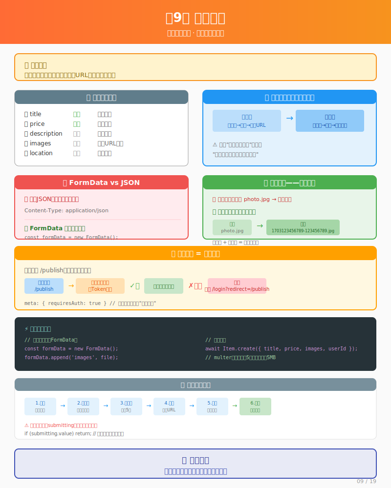

# 第9课：发布物品——核心功能上线



## 场景引入

上一课，用户可以注册登录了。但是登录了能干嘛？**得让用户能发布物品！**

这是二手平台的"核心业务"：没有物品，就没有交易。

想象你在闲鱼上卖东西：
1. 拍几张照片
2. 写个标题和描述
3. 标个价格
4. 选择成色和分类
5. 发布！

这一课，我们来实现发布物品功能。

---

## 思考过程

### 发布物品需要什么信息？

在让AI动手前，你需要想清楚：**用户要填什么？**

| 信息 | 是否必填 | 说明 |
|------|---------|------|
| 标题 | 是 | 物品名称，如"二手自行车" |
| 描述 | 否 | 详细说明 |
| 价格 | 是 | 卖多少钱 |
| 原价 | 否 | 对比用 |
| 成色 | 否 | 全新/几成新 |
| 图片 | 否 | 最多5张 |
| 交易地点 | 否 | 哪里见面交易 |

**【人类思考点】** 图片怎么存？

这是一个经典问题：
- **方案A：图片表** —— 一张图片一条记录，用外键关联物品
- **方案B：JSON存URL** —— 把图片URL数组转成字符串存

方案A更规范，但查询要JOIN，代码复杂。
方案B简单直接，我们的场景够用了。

你选哪个？我们选方案B，简单优先。

### 图片上传的流程是什么？

图片上传是个"两步走"过程：

```
第一步：用户选图片 → 上传到服务器 → 服务器返回图片URL
第二步：用户填完表单 → 把图片URL一起提交 → 创建物品
```

不是"选图片就上传"，而是"先上传图片，再关联到物品"。

---

## 实操对话

### 第十三轮：设计物品表

**人类**：
> 开始做发布物品功能。先设计物品表。

**AI**：
> 物品表结构如下，核心字段：

```javascript
// 文件: backend/src/models/Item.js
const { DataTypes } = require('sequelize');

module.exports = (sequelize) => {
  const Item = sequelize.define('Item', {
    id: { type: DataTypes.INTEGER, primaryKey: true, autoIncrement: true },
    title: { type: DataTypes.STRING(100), allowNull: false },
    description: { type: DataTypes.TEXT },
    price: { type: DataTypes.DECIMAL(10, 2), allowNull: false },
    originalPrice: { type: DataTypes.DECIMAL(10, 2) },
    images: { 
      type: DataTypes.TEXT,
      get() { return JSON.parse(this.getDataValue('images') || '[]'); },
      set(val) { this.setDataValue('images', JSON.stringify(val)); }
    },
    condition: { type: DataTypes.ENUM('全新', '几乎全新', '轻微使用痕迹', '有明显使用痕迹'), defaultValue: '几乎全新' },
    location: { type: DataTypes.STRING(100) },
    status: { type: DataTypes.ENUM('available', 'sold', 'reserved'), defaultValue: 'available' }
  });
  return Item;
};
```

> 完整代码见 `project/campus-market/backend/src/models/Item.js`

**人类**：
> 图片字段为什么用TEXT存JSON？

**AI**：
> 简单直接。每件物品最多5张图，JSON数组够用了。后续如果需要复杂操作，再改成图片表。

**【人类决策点】** 简单方案 vs 规范方案？
- MVP阶段：简单优先，快速上线
- 后续优化：有问题再重构

---

### 第十四轮：实现图片上传

**人类**：
> 图片上传怎么处理？

**AI**：
> 用 multer 中间件处理文件上传：

```javascript
// 文件: backend/src/middleware/upload.js
const multer = require('multer');
const path = require('path');

const storage = multer.diskStorage({
  destination: (req, file, cb) => cb(null, 'uploads/'),
  filename: (req, file, cb) => {
    const uniqueSuffix = Date.now() + '-' + Math.round(Math.random() * 1E9);
    cb(null, uniqueSuffix + path.extname(file.originalname));
  }
});

const upload = multer({
  storage,
  limits: { fileSize: 5 * 1024 * 1024 },  // 5MB
  fileFilter: (req, file, cb) => {
    const allowedTypes = ['image/jpeg', 'image/png', 'image/webp'];
    cb(null, allowedTypes.includes(file.mimetype));
  }
});

module.exports = upload;
```

> 上传接口：

```javascript
// 文件: backend/src/routes/upload.js
router.post('/upload', authenticate, upload.array('images', 5), (req, res) => {
  const urls = req.files.map(file => `/uploads/${file.filename}`);
  res.json({ urls });
});
```

> 完整代码见 `project/campus-market/backend/src/routes/upload.js`

**关键点：**
- `upload.array('images', 5)`：最多上传5张
- 返回URL数组，前端后面发布时用

---

### 第十五轮：实现发布接口

**AI**：
> 发布物品的接口：

```javascript
// 文件: backend/src/routes/items.js
router.post('/', authenticate, async (req, res) => {
  const { title, description, price, originalPrice, images = [], condition, location } = req.body;

  // 验证必填项
  if (!title || !price) {
    return res.status(400).json({ message: '标题和价格必填' });
  }

  // 验证图片数量
  if (images.length > 5) {
    return res.status(400).json({ message: '最多上传5张图片' });
  }

  const item = await Item.create({
    title, description, price, originalPrice, images, condition, location,
    userId: req.userId,  // 从Token解析出来的用户ID
    status: 'available'
  });

  res.status(201).json({ message: '发布成功', item });
});
```

> 完整代码见 `project/campus-market/backend/src/routes/items.js`

---

**人类**：
> 测试发布时报错了：`SQLITE_ERROR: no such table: Items`

**AI**：
> Item模型还没有同步到数据库。需要在 models/index.js 中添加关联并重启服务器：

```javascript
// 文件: backend/src/models/index.js
const Item = require('./Item')(sequelize);
User.hasMany(Item, { foreignKey: 'userId' });
Item.belongsTo(User, { foreignKey: 'userId' });
module.exports = { sequelize, User, Item };
```

---

### 第十六轮：前端发布页面

**人类**：
> 后端接口可以了，开始做前端发布页面。

**AI**：
> 发布页面核心逻辑：

```vue
<!-- 文件: frontend/src/views/Publish.vue -->
<script setup>
import { ref, reactive } from 'vue';
import { useRouter } from 'vue-router';
import { uploadImages, createItem } from '../api/items';

const router = useRouter();
const submitting = ref(false);
const form = reactive({
  title: '', description: '', price: null, originalPrice: null,
  condition: '几乎全新', location: '', images: []
});

// 图片上传
const handleUpload = async (e) => {
  const files = Array.from(e.target.files).slice(0, 5 - form.images.length);
  const formData = new FormData();
  files.forEach(file => formData.append('images', file));
  const res = await uploadImages(formData);
  form.images.push(...res.urls);
};

// 提交发布
const handleSubmit = async () => {
  if (submitting.value) return;
  submitting.value = true;
  try {
    await createItem(form);
    alert('发布成功！');
    router.push('/');
  } finally {
    submitting.value = false;
  }
};
</script>
```

> 完整代码见 `project/campus-market/frontend/src/views/Publish.vue`

**三个关键点：**

1. **图片上传流程**：用户选图片 → 上传 → 获取URL → 存到form.images
2. **图片预览**：遍历form.images数组显示
3. **防重复提交**：submitting变量控制按钮状态

---

**人类**：
> 提交表单时报错了：`Error: Request failed with status code 401`

**AI**：
> 发布物品需要先登录。添加路由守卫：

```javascript
// 文件: frontend/src/router/index.js
router.beforeEach((to, from, next) => {
  const token = localStorage.getItem('token');
  if (to.meta.requiresAuth && !token) {
    next('/login?redirect=' + to.path);
  } else {
    next();
  }
});
```

---

## 知识提炼

### 什么是 FormData？

普通JSON请求不能包含文件，上传图片要用FormData：

```javascript
const formData = new FormData();
formData.append('images', file);
```

### 文件上传为什么不直接存原文件名？

两个用户都上传 `photo.jpg`，会覆盖！服务器要生成唯一文件名：

```
原名：photo.jpg
存为：1703123456789-123456789.jpg
       ↑时间戳    ↑随机数
```

### 什么是路由守卫？

路由守卫就像"门禁"：

```
用户访问 /publish
    ↓
路由守卫检查：有Token吗？
    ↓
有 → 放行，显示页面
没有 → 拦截，跳转登录
```

`meta: { requiresAuth: true }` 就是给页面贴标签："需要登录"。

---

## 快速参考

### 发布物品流程

```
前端：
1. 用户填写表单
2. 选择图片 → 上传 → 获取URL
3. 提交表单（包含图片URL）

后端：
1. 验证是否登录
2. 验证必填字段
3. 存入数据库
```

### 关键代码片段

```javascript
// 图片上传
const formData = new FormData();
formData.append('images', file);
const res = await axios.post('/api/upload', formData);

// 创建物品
await Item.create({ title, price, images: imageUrls, userId: req.userId });

// 路由守卫
if (to.meta.requiresAuth && !token) {
  next('/login?redirect=' + to.path);
}
```

---

## 练习任务

### 任务1：测试发布功能

1. 先登录
2. 访问发布页面
3. 填写信息，上传图片
4. 提交，看是否成功

### 任务2：测试未登录访问

1. 退出登录（清除localStorage）
2. 直接访问 /publish
3. 观察是否跳转到登录页

### 任务3：测试图片限制

1. 尝试上传超过5张图片
2. 尝试上传超大图片（超过5MB）
3. 观察系统如何处理

### 任务4：查看数据库

打开数据库，查看Items表里的数据：
- images字段存的是什么？
- 为什么是字符串而不是数组？

---

## 小结

这一课，我们完成了：

- [x] 设计物品表结构
- [x] 实现图片上传（multer）
- [x] 实现发布接口
- [x] 前端发布表单
- [x] 路由守卫（登录验证）

现在用户可以发布物品了。但发布的物品怎么让别人看到？下一课，我们来实现浏览和搜索功能。

**下一课**：[第10课：浏览搜索——找到想要的东西](./L10-browse-search.md)

---

## 扩展资源

### 表单相关

- **表单验证**：[Vue表单验证指南](https://vuejs.org/guide/essentials/forms.html) — Vue官方表单处理文档
- **VeeValidate**：[vee-validate.dev](https://vee-validate.logaretm.com/) — Vue表单验证库，适合复杂表单
- **表单设计原则**：[表单设计最佳实践](https://www.smashingmagazine.com/2021/06/form-design-principles/) — 提升表单用户体验

### 文件上传

- **Multer文档**：[github.com/expressjs/multer](https://github.com/expressjs/multer) — Node.js文件上传中间件官方文档
- **图片压缩**：[sharp库](https://sharp.pixelplumbing.com/) — 上传前压缩图片，减少存储空间
- **云存储**：[阿里云OSS](https://www.aliyun.com/product/oss) / [腾讯云COS](https://cloud.tencent.com/product/cos) — 生产环境推荐用云存储

### 数据存储

- **Sequelize文档**：[sequelize.org](https://sequelize.org/) — ORM完整文档
- **SQLite教程**：[runoob.com SQLite](https://www.runoob.com/sqlite/) — SQLite入门教程
- **数据库设计**：[数据库设计入门](https://www.ibm.com/topics/relational-databases) — 关系型数据库设计原则

### CRUD操作

- **RESTful API设计**：[RESTful API指南](https://restfulapi.net/) — REST API设计规范
- **HTTP状态码**：[MDN HTTP状态码](https://developer.mozilla.org/zh-CN/docs/Web/HTTP/Status) — 常见状态码含义
