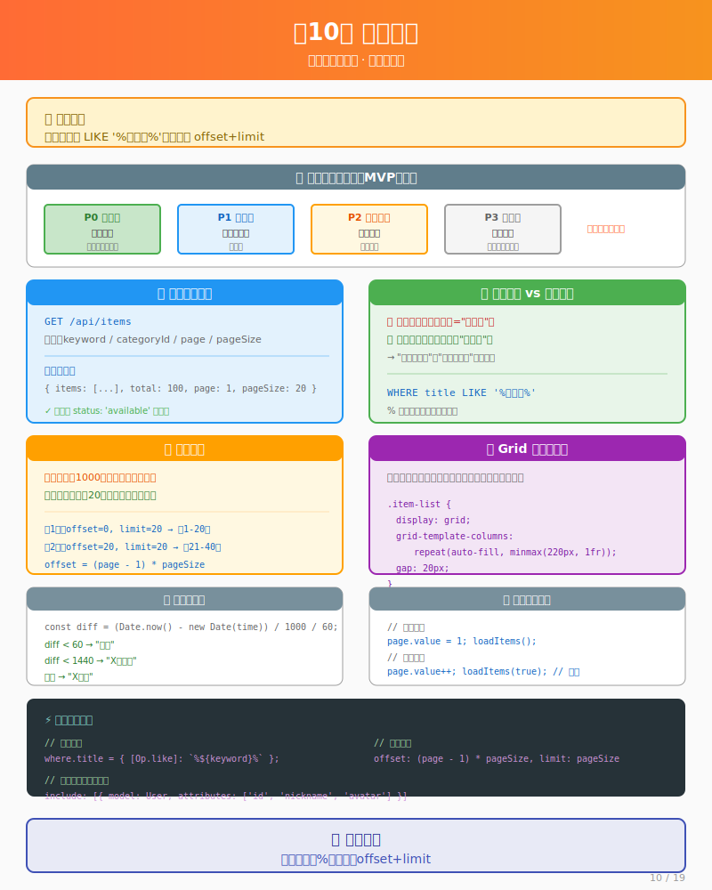

# 第10课：浏览搜索——找到想要的东西



## 场景引入

上一课，用户可以发布物品了。但有个问题：**别人怎么看到这些物品？**

想象你在逛超市：
- 货架上商品按类别摆放（零食、饮料、日用品...）
- 有导购牌指引（"日用品在三楼"）
- 有搜索服务（"请问牙膏在哪？"）

我们的平台也需要这样：
- 首页展示所有物品
- 可以按分类筛选
- 可以搜索关键词

这一课，我们来实现浏览和搜索功能。

---

## 思考过程

### 浏览页面的核心需求是什么？

在让AI动手前，你需要想清楚：**用户要怎么找东西？**

| 需求 | 说明 |
|------|------|
| 列表展示 | 一眼看多件物品 |
| 分类筛选 | 只看某个类别 |
| 关键词搜索 | 输入"自行车"找自行车 |
| 分页加载 | 物品太多，分批显示 |

**【人类思考点】** 先做哪个？

MVP原则：**先做最核心的**
1. 列表展示 —— 必须，否则看不到物品
2. 关键词搜索 —— 很有用，优先做
3. 分类筛选 —— 可以后做
4. 分页加载 —— 物品少时可以不做

我们按这个优先级来。

### 搜索怎么做？

最简单的搜索：**模糊匹配标题**

```sql
SELECT * FROM items WHERE title LIKE '%关键词%'
```

够用了。以后用户多了，再考虑更高级的搜索引擎。

---

## 实操对话

### 第十七轮：实现物品列表接口

**人类**：
> 先做首页的物品列表。

**AI**：
> 物品列表接口，支持搜索和分页：

```javascript
// 文件: backend/src/routes/items.js
const { Op } = require('sequelize');

// GET /api/items
router.get('/', async (req, res) => {
  const { keyword, page = 1, pageSize = 20 } = req.query;

  const where = { status: 'available' };  // 只显示在售的
  
  if (keyword) {
    where.title = { [Op.like]: `%${keyword}%` };
  }

  const { count, rows } = await Item.findAndCountAll({
    where,
    include: [{ model: User, attributes: ['id', 'nickname', 'avatar'] }],
    order: [['createdAt', 'DESC']],
    offset: (page - 1) * pageSize,
    limit: parseInt(pageSize)
  });

  res.json({ items: rows, total: count, page: parseInt(page), pageSize: parseInt(pageSize) });
});
```

> 完整代码见 `project/campus-market/backend/src/routes/items.js`

**关键点：**
1. **status: 'available'** —— 只显示在售的
2. **include User** —— 关联查询，获取发布者信息
3. **order** —— 按发布时间倒序
4. **offset/limit** —— 分页

---

**人类**：
> 测试了一下，返回空数组。数据库里明明有数据。

**AI**：
> 问题可能是 Op 未定义。需要在文件头部引入：

```javascript
const { Op } = require('sequelize');
```

---

### 第十八轮：前端列表页面

**AI**：
> 首页列表页面核心逻辑：

```html
<!-- 文件: frontend/src/views/Home.vue -->
<template>
  <div class="home">
    <div class="search-bar">
      <input v-model="searchKeyword" placeholder="搜索物品..." @keyup.enter="search" />
      <button @click="search">搜索</button>
    </div>

    <div class="item-list">
      <div v-for="item in items" :key="item.id" class="item-card" @click="$router.push(`/item/${item.id}`)">
        
        <div class="item-info">
          <h3>{{ item.title }}</h3>
          <p class="price">¥{{ item.price }}</p>
          <p class="meta">{{ item.location }} · {{ formatTime(item.createdAt) }}</p>
        </div>
      </div>
    </div>

    <div v-if="loading">加载中...</div>
    <div v-if="!loading && items.length === 0">暂无物品</div>
  </div>
</template>

<script setup>
import { ref, onMounted } from 'vue';
import { getItems } from '../api/items';

const items = ref([]);
const loading = ref(false);
const searchKeyword = ref('');

const loadItems = async () => {
  loading.value = true;
  const res = await getItems({ keyword: searchKeyword.value });
  items.value = res.items;
  loading.value = false;
};

const search = () => loadItems();

const formatTime = (time) => {
  const diff = (Date.now() - new Date(time)) / 1000 / 60;
  if (diff < 60) return '刚刚';
  if (diff < 1440) return Math.floor(diff / 60) + '小时前';
  return Math.floor(diff / 1440) + '天前';
};

onMounted(() => loadItems());
</script>
```

> 完整代码见 `project/campus-market/frontend/src/views/Home.vue`

---

**人类**：
> 列表显示出来了，但样式有点丑。能不能做成网格布局？

**AI**：
> 加上CSS网格布局：

```css
.item-list {
  display: grid;
  grid-template-columns: repeat(auto-fill, minmax(220px, 1fr));
  gap: 20px;
}
```

> 完整样式见 `project/campus-market/frontend/src/views/Home.vue`

---

**人类**：
> 图片有的显示不出来，显示破图标。

**AI**：
> 静态文件没配置。在 backend/app.js 中添加：

```javascript
// 文件: backend/src/app.js
app.use('/uploads', express.static('uploads'));
```

---

### 第十九轮：分类筛选

**人类**：
> 列表和搜索可以了。再加个分类筛选吧。

**AI**：
> 首先创建分类表，然后修改列表接口支持分类：

```javascript
// 文件: backend/src/models/Category.js
const Category = sequelize.define('Category', {
  id: { type: DataTypes.INTEGER, primaryKey: true, autoIncrement: true },
  name: { type: DataTypes.STRING(50), allowNull: false },
  sort: { type: DataTypes.INTEGER, defaultValue: 0 }
});
```

> 修改列表接口，添加分类筛选：

```javascript
// GET /api/items
router.get('/', async (req, res) => {
  const { keyword, categoryId, page = 1 } = req.query;
  
  const where = { status: 'available' };
  if (keyword) where.title = { [Op.like]: `%${keyword}%` };
  if (categoryId) where.categoryId = categoryId;
  
  // ... 其余代码
});
```

> 前端添加分类下拉：

```html
<select v-model="selectedCategory" @change="search">
  <option value="">全部分类</option>
  <option v-for="cat in categories" :key="cat.id" :value="cat.id">{{ cat.name }}</option>
</select>
```

> 完整代码见 `project/campus-market/backend/src/routes/items.js`

---

**人类**：
> 如果物品很多，需要分页吧？

**AI**：
> 后端已支持分页。前端加"加载更多"按钮：

```javascript
const page = ref(1);
const total = ref(0);

const loadMore = () => {
  page.value++;
  const res = await getItems({ keyword: searchKeyword.value, page: page.value });
  items.value.push(...res.items);  // 追加
  total.value = res.total;
};
```

---

## 知识提炼

### 什么是模糊搜索？

```
精确搜索：搜索"自行车" → 只找标题="自行车"的
模糊搜索：搜索"自行车" → 找标题包含"自行车"的
                        → "二手自行车"、"山地自行车"...
```

SQL写法：`LIKE '%关键词%'`，`%` 是通配符。

### 什么是分页？

一次性返回1000条数据：慢、卡、浪费。

分页返回：每次20条，用户要看更多再请求。

```
第1页：offset=0,  limit=20  → 第1-20条
第2页：offset=20, limit=20  → 第21-40条
```

### Grid布局是什么？

```css
.item-list {
  display: grid;
  grid-template-columns: repeat(auto-fill, minmax(220px, 1fr));
  gap: 20px;
}
```

效果：屏幕宽就多显示几列，屏幕窄就少显示几列。

---

## 快速参考

### 列表查询API

```
GET /api/items?keyword=xxx&categoryId=1&page=1&pageSize=20

返回：
{ items: [...], total: 100, page: 1, pageSize: 20 }
```

### 前端分页逻辑

```javascript
// 首次加载
page.value = 1;
loadItems();

// 加载更多
page.value++;
loadItems(true);

// 搜索时重置
page.value = 1;
loadItems();
```

### 时间格式化

```javascript
const formatTime = (time) => {
  const diff = (Date.now() - new Date(time)) / 1000 / 60;
  if (diff < 60) return '刚刚';
  if (diff < 1440) return Math.floor(diff / 60) + '小时前';
  return Math.floor(diff / 1440) + '天前';
};
```

---

## 练习任务

### 任务1：测试搜索功能

1. 发布几个物品，标题包含不同关键词
2. 搜索"二手"，看是否只显示包含"二手"的
3. 搜索不存在的关键词，看是否显示"暂无物品"

### 任务2：测试分类筛选

1. 给物品设置不同分类
2. 切换分类，看列表是否正确筛选
3. 组合使用：分类 + 关键词搜索

### 任务3：测试分页

1. 发布超过20个物品
2. 滚动到底部，点击"加载更多"
3. 观察是否追加显示

### 任务4：调整Grid布局

尝试修改CSS，让列表变成一行3列或5列。

---

## 小结

这一课，我们完成了：

- [x] 物品列表接口（分页、排序）
- [x] 关键词搜索（模糊匹配）
- [x] 分类筛选
- [x] 前端列表页面（Grid布局）
- [x] 加载更多（分页）

现在用户可以浏览物品、搜索物品了。但点击物品卡片后呢？下一课，我们来做物品详情页。

**下一课**：[第11课：物品详情——完整的商品信息](./L11-item-detail.md)

---

## ✅ 理解检查

学完这一章，你能回答这些问题吗？

**基础问题**（所有人要会）：
- 模糊搜索和精确搜索有什么区别？
- 为什么要分页，不能一次返回所有数据？
- Grid 布局有什么好处？

**进阶问题**（想提升的同学思考）：
- offset 和 limit 是怎么配合实现分页的？
- 如果用户快速点击"加载更多"，可能会出现什么问题？
- 时间格式化是怎么算出"刚刚"、"3小时前"的？

**挑战问题**（试着不问AI）：
- 搜索功能还能怎么优化？（提示：拼音搜索、搜索历史...）
- 如果数据量很大，`LIKE '%关键词%'` 会有性能问题，怎么解决？

---

## 扩展资源

### 列表渲染

- **Vue列表渲染**：[Vue v-for文档](https://vuejs.org/guide/essentials/list.html) — 官方列表渲染指南
- **虚拟列表**：[vue-virtual-scroller](https://github.com/Akryum/vue-virtual-scroller) — 大数据量列表优化方案
- **列表性能优化**：[Vue性能优化](https://vuejs.org/guide/best-practices/performance.html) — 官方性能指南

### 分页技术

- **分页实现方案**：[后端分页 vs 前端分页](https://www.baeldung.com/cs/pagination) — 分页策略对比
- **无限滚动**：[Intersection Observer API](https://developer.mozilla.org/zh-CN/docs/Web/API/Intersection_Observer_API) — 实现滚动加载更多
- **游标分页**：[Cursor-based Pagination](https://slack.dev/node-slack-sdk/tutorials/pagination) — 比offset更高效的分页方式

### 搜索功能

- **模糊搜索进阶**：[全文搜索简介](https://www.postgresql.org/docs/current/textsearch.html) — PostgreSQL全文搜索
- **Elasticsearch**：[elastic.co](https://www.elastic.co/cn/) — 专业搜索引擎，适合海量数据
- **拼音搜索**：[pinyin库](https://github.com/hotoo/pinyin) — 中文转拼音，支持拼音搜索
- **搜索高亮**：[搜索关键词高亮实现](https://www.npmjs.com/package/vue-highlight-words) — 搜索结果高亮显示

### 筛选与排序

- **多条件筛选**：[URL参数设计](https://www.mnot.net/blog/2022/06/11/query-params) — 复杂筛选的URL设计
- **前端排序**：[Array.sort()](https://developer.mozilla.org/zh-CN/docs/Web/JavaScript/Reference/Global_Objects/Array/sort) — JavaScript数组排序
