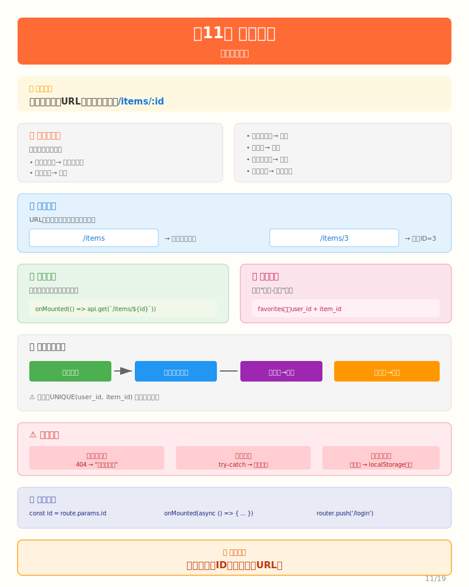

# 第11课：物品详情——点击进去看看



> ⚠️ **先修提示**：这节课涉及Vue代码。如果你还没看过 [L07.5 Vue基础知识](./L07.5-vue-basics.md)，建议先看那节。
>
> 如果你不懂Vue，可以跳过代码部分，重点理解"思路"和"与AI沟通的方法"。

## 场景引入

首页做好了，物品列表能显示了。但有个问题——

用户看到一件二手自行车，标题写着"9成新山地车，便宜出"，但不知道：
- 具体多少钱？
- 在哪个宿舍楼交易？
- 卖家是谁？靠谱吗？

**用户需要点进去看详情。**

这就像逛淘宝，列表页只是"门面"，详情页才是"正厅"。用户做购买决策，90%的信息来自详情页。

这一课，我们来做一个完整的物品详情页，顺便加上"收藏"功能。

---

## 思考过程

### 详情页需要什么信息？

在让AI动手之前，你要先想想：用户看详情页时，想知道什么？

站在买家的角度：

```
┌─────────────────────────────────────────┐
│  我想买这件东西，我需要知道...           │
├─────────────────────────────────────────┤
│  1. 这是什么？（标题、描述）             │
│  2. 多少钱？（价格）                     │
│  3. 长什么样？（图片）                   │
│  4. 多新？（成色）                       │
│  5. 在哪交易？（位置）                   │
│  6. 谁卖的？（卖家信息）                 │
└─────────────────────────────────────────┘
```

### 怎么告诉AI"我要看哪个物品"？

这里有个关键问题：

首页可能有100件物品，用户点击第3件，详情页怎么知道显示第3件的信息？

答案是：**路由参数**。

```
首页列表：/items          → 显示所有物品
点击第3件物品后：/items/3  → 显示ID为3的物品详情
                          ↑
                      这个3就是参数
```

类比一下：
- 首页就像"通讯录列表"
- 详情页就像"联系人详情"
- 路由参数就像"电话号码"，告诉系统你要找谁

### 收藏功能怎么实现？

收藏本质上是建立"用户-物品"的关系，需要一个收藏表来记录。

---

## 实操对话

### 第N轮：创建详情页

**人类**：
> 现在首页的物品列表可以显示了，但点击物品还没有反应。我要做一个详情页，需求是：
> 
> 1. 显示物品的完整信息：标题、价格、描述、成色、交易地点、发布时间
> 2. 显示卖家信息：昵称、头像
> 3. 有一个"收藏"按钮
> 4. URL格式是 /items/:id，比如 /items/3 表示查看ID为3的物品

**AI**：
> 好的，我来实现物品详情页。需要做以下几件事：
> 1. 添加路由配置，支持 `/items/:id` 格式
> 2. 创建详情页组件，接收路由参数
> 3. 从后端获取物品数据
> 4. 渲染到页面上

**【人类决策点】** AI开始干活了。你要确认它理解对了需求。

---

**AI**：
> 路由配置好了。详情页的核心逻辑是这样的：

```javascript
// client/src/views/ItemDetail.vue（核心逻辑）

// 1. 从URL获取物品ID
const route = useRoute()
const itemId = route.params.id  // 比如 "3"

// 2. 进入页面时，获取物品数据
onMounted(async () => {
  const res = await api.get(`/items/${itemId}`)
  item.value = res.data
})

// 3. 检查是否已收藏（如果已登录）
if (userStore.isLoggedIn) {
  const favRes = await api.get(`/items/${itemId}/favorite`)
  isFavorited.value = favRes.data.isFavorited
}
```

> 💡 **如果你不懂Vue**：
> - `route.params.id` 是从URL里取参数
> - `onMounted` 是页面加载后执行的代码
> - `value` 是Vue响应式数据的写法

**人类**：
> 布局看起来可以。但我发现一个问题：卖家信息是从哪来的？

**AI**：
> 好问题！物品数据里只存了 `seller_id`，卖家信息需要再查一次。
> 
> 有两种方案：
> 1. 前端拿到物品数据后，再发一个请求获取卖家信息
> 2. 后端接口直接把卖家信息一起返回
> 
> 推荐方案2，减少请求次数，性能更好。

**【人类决策点】** AI给了两个方案，你来选。对于学生项目，选方案2更简单。

**人类**：
> 用方案2，后端把卖家信息一起返回。

**AI**：
> 好的，后端用 JOIN 查询把卖家信息一起返回：

```javascript
// server/routes/items.js

router.get('/:id', (req, res) => {
  const { id } = req.params;
  
  const item = db.prepare(`
    SELECT items.*, users.nickname, users.avatar
    FROM items
    JOIN users ON items.seller_id = users.id
    WHERE items.id = ?
  `).get(id);
  
  res.json(item);
});
```

---

### 第N+1轮：添加收藏功能

**人类**：
> 详情页能正常显示了！现在来加收藏功能。

**AI**：
> 收藏功能需要：
> 1. 数据库：创建收藏表
> 2. 后端：添加收藏/取消收藏的接口
> 3. 前端：收藏按钮的交互
> 
> 先创建数据库表：

```sql
CREATE TABLE favorites (
  id INTEGER PRIMARY KEY,
  user_id INTEGER,    -- 谁收藏的
  item_id INTEGER,    -- 收藏了什么
  created_at DATETIME DEFAULT CURRENT_TIMESTAMP,
  UNIQUE(user_id, item_id)  -- 防止重复收藏
);
```

> 注意 `UNIQUE(user_id, item_id)`，这保证同一个用户不能重复收藏同一件物品。

> 后端接口有三个：
> - `POST /items/:id/favorite` → 收藏
> - `DELETE /items/:id/favorite` → 取消收藏
> - `GET /items/:id/favorite` → 检查是否已收藏

> 前端收藏按钮的核心逻辑：

```javascript
// client/src/views/ItemDetail.vue

const toggleFavorite = async () => {
  // 未登录，跳转登录页
  if (!userStore.isLoggedIn) {
    router.push('/login')
    return
  }
  
  // 已收藏就取消，未收藏就添加
  if (isFavorited.value) {
    await api.delete(`/items/${itemId}/favorite`)
    isFavorited.value = false
  } else {
    await api.post(`/items/${itemId}/favorite`)
    isFavorited.value = true
  }
}
```

---

## 遇到的问题

### 问题1：刷新页面后，收藏状态丢了

**人类**：
> 我收藏了一件物品，刷新页面，收藏按钮变回"收藏"了，但数据库里是有记录的。

**AI**：
> 这说明前端的状态管理有问题。检查一下 `userStore.isLoggedIn` 刷新后还是 true 吗？

**人类**：
> 问题是刷新后 `userStore.isLoggedIn` 变成 false 了，虽然 localStorage 里有 token。

**AI**：
> 明白了！页面刷新时，Pinia store 会重新初始化，状态丢失。
> 
> 需要在 store 初始化时从 localStorage 恢复用户状态：

```javascript
// stores/user.js

export const useUserStore = defineStore('user', {
  state: () => ({
    // 页面刷新时，从 localStorage 恢复
    token: localStorage.getItem('token') || null,
    user: JSON.parse(localStorage.getItem('user') || 'null')
  }),
  
  getters: {
    isLoggedIn: (state) => !!state.token && !!state.user
  }
})
```

---

### 问题2：404页面处理

**人类**：
> 我手动输入了一个不存在的物品ID，比如 `/items/999`，页面显示空白。

**AI**：
> 这是因为后端返回了404，但前端没有处理错误状态。需要在获取数据时加 try-catch：

```javascript
onMounted(async () => {
  try {
    const res = await api.get(`/items/${itemId}`)
    item.value = res.data
  } catch (err) {
    if (err.response?.status === 404) {
      error.value = '物品不存在或已下架'
    }
  }
})
```

---

## 知识提炼

### 路由参数是什么？

**路由参数**就是URL中变化的部分，用来传递信息。

```javascript
// 配置路由
{ path: '/items/:id', component: ItemDetail }

// 跳转到详情页
router.push(`/items/${id}`)

// 在组件中获取参数
const route = useRoute()
const id = route.params.id
```

类比：
- `/items/:id` 就像"第几号楼"的规则
- `/items/3` 就是"3号楼"

### 状态持久化

Pinia 的状态存在内存里，刷新页面就没了。要持久化，需要存到 localStorage。

---

## 快速参考

```javascript
// 路由参数
const route = useRoute()
const id = route.params.id

// 数据获取
onMounted(async () => {
  try {
    const res = await api.get('/items/' + id)
    data.value = res.data
  } catch (err) {
    error.value = '加载失败'
  }
})

// 条件渲染
if (userStore.isLoggedIn) { ... }
```

---

## 练习任务

1. **添加"返回"功能**：在详情页添加返回按钮，用 `router.back()`

2. **添加"复制链接"功能**：用 `navigator.clipboard.writeText()`

3. **优化加载体验**：做一个更好看的加载动画

---

## 小结

这一课，我们完成了：

- [x] 理解了路由参数的概念
- [x] 实现了物品详情页
- [x] 加上了收藏功能
- [x] 处理了错误状态

详情页做好了，用户可以完整地浏览物品信息、收藏感兴趣的物品。

但有个问题——现在的界面有点丑。下一课，我们来美化界面。

---

> 📎 **完整代码**：本课涉及的完整代码，请查看项目仓库的 `L11-code` 分支。

**下一课**：[第12课：界面美化——让产品更好看](./L12-ui-polish.md)

---

## 扩展资源

### 路由参数

- **Vue Router动态路由**：[官方文档](https://router.vuejs.org/zh/guide/essentials/dynamic-matching.html) — 动态路由匹配详解
- **路由传参方式**：[params vs query](https://router.vuejs.org/zh/guide/essentials/passing-props.html) — 两种传参方式对比
- **路由守卫进阶**：[导航守卫](https://router.vuejs.org/zh/guide/advanced/navigation-guards.html) — 完整的守卫机制

### 状态管理

- **Pinia官方文档**：[pinia.vuejs.org](https://pinia.vuejs.org/zh/) — Pinia状态管理完整指南
- **状态持久化**：[pinia-plugin-persistedstate](https://prazdevs.github.io/pinia-plugin-persistedstate/zh/) — 自动持久化插件
- **Vuex迁移**：[从Vuex迁移](https://pinia.vuejs.org/zh/cookbook/migration-vuex.html) — 如果你在用Vuex
- **状态管理模式**：[状态管理最佳实践](https://vuejs.org/guide/scaling-up/state-management.html) — Vue官方状态管理指南

### 收藏/点赞功能

- **关系型数据设计**：[多对多关系设计](https://www.ibm.com/docs/en/infosphere-master-data-management/10.0?topic=design-many-many-relationships) — 收藏表的数据库设计
- **乐观更新**：[Optimistic UI](https://www.apollographql.com/docs/react/performance/optimistic-ui/) — 先更新界面再请求后端
- **防抖节流**：[lodash debounce](https://lodash.com/docs/4.17.15#debounce) — 防止重复点击

### 错误处理

- **Vue错误处理**：[错误处理指南](https://vuejs.org/api/application.html#app-config-errorhandler) — 全局错误捕获
- **HTTP错误处理**：[Axios拦截器](https://axios-http.com/zh/docs/interceptors) — 统一处理API错误
- **404页面设计**：[优秀的404页面](https://www.smashingmagazine.com/2021/07/404-page-examples/) — 提升错误页体验
