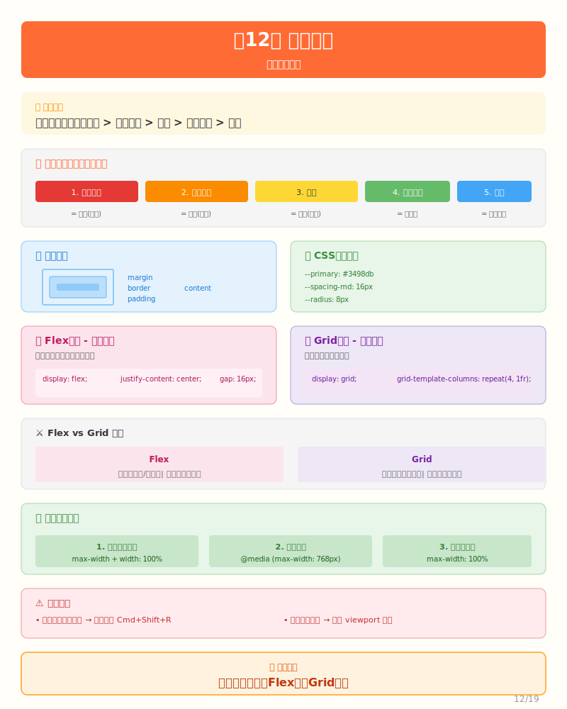

# 第12课：界面美化——让产品更好看



## 场景引入

功能都做完了，你兴奋地展示给室友看。

室友："呃...能用是能用，但是...就是有点丑。像十年前的网站。"

扎心了。

**但用户体验很重要。** 同样的功能，好看的界面让人愿意用，丑的界面让人想关掉。

这一课，我们来美化界面。不是要做成艺术品，但至少要做到"不丑、好用、看起来像现代产品"。

---

## 思考过程

### 美化从哪里开始？

面对一堆"丑"的页面，新手往往不知道从哪下手。

告诉你一个秘诀：**先解决最影响视觉的问题。**

按优先级：

```
1. 对齐和间距 → 最大的视觉问题
2. 字体大小   → 决定可读性
3. 颜色       → 决定氛围
4. 圆角和阴影 → 锦上添花
5. 动画效果   → 最后考虑
```

类比装修：
- 对齐间距 = 刷墙（基础）
- 字体 = 灯光（功能性）
- 颜色 = 墙漆颜色（氛围）
- 圆角阴影 = 踢脚线（细节）

如果墙没刷好，装饰画再贵也没用。

### CSS基础：你需要知道什么？

**1. 盒子模型**

每个HTML元素都是一个"盒子"：

```
┌─────────────────────────────────────┐
│                margin               │  外边距
│  ┌─────────────────────────────┐   │
│  │           border            │   │  边框
│  │  ┌─────────────────────┐   │   │
│  │  │      padding        │   │   │  内边距
│  │  │  ┌─────────────┐    │   │   │
│  │  │  │   content   │    │   │   │  内容
│  │  │  └─────────────┘    │   │   │
│  │  └─────────────────────┘   │   │
│  └─────────────────────────────┘   │
└─────────────────────────────────────┘
```

**2. Flex布局**

让元素"乖乖排队"的神器：

```css
.container {
  display: flex;           /* 启用Flex布局 */
  justify-content: center; /* 水平居中 */
  align-items: center;     /* 垂直居中 */
  gap: 16px;              /* 元素之间的间距 */
}
```

**3. 响应式设计**

一套代码，适配多种屏幕。核心：用百分比和弹性布局，不用固定宽度。

---

## 实操对话

### 第N轮：建立样式规范

**人类**：
> 功能都做完了，但界面有点丑。帮我美化一下，我想要简洁专业的风格。

**AI**：
> 好的，我先定一套样式规范，然后逐个美化页面。

**配色方案：**

```css
/* client/src/assets/styles/main.css */

:root {
  /* 主色调：蓝色，传递信任感 */
  --primary: #3498db;
  
  /* 功能色 */
  --success: #27ae60;   /* 成功 */
  --danger: #e74c3c;    /* 删除/价格 */
  
  /* 文字色 */
  --text-primary: #2c3e50;
  --text-secondary: #7f8c8d;
  
  /* 间距规范 */
  --spacing-sm: 8px;
  --spacing-md: 16px;
  --spacing-lg: 24px;
  
  /* 圆角 */
  --radius: 8px;
}
```

**【人类决策点】** 配色方案AI可以推荐，但你要确认喜欢不喜欢。

---

### 第N+1轮：美化首页

**AI**：
> 首页优化重点：
> 1. 物品卡片用网格布局
> 2. 价格用红色突出
> 3. 添加悬停效果

**视觉效果：**

```
┌─────────────────────────────────────────────────────┐
│  ┌─────────┐  ┌─────────┐  ┌─────────┐  ┌─────────┐ │
│  │  图片   │  │  图片   │  │  图片   │  │  图片   │ │
│  │         │  │         │  │         │  │         │ │
│  ├─────────┤  ├─────────┤  ├─────────┤  ├─────────┤ │
│  │ 标题    │  │ 标题    │  │ 标题    │  │ 标题    │ │
│  │ ¥99     │  │ ¥199    │  │ ¥49     │  │ ¥299    │ │
│  │ 成色 位置│  │ 成色 位置│  │ 成色 位置│  │ 成色 位置│ │
│  └─────────┘  └─────────┘  └─────────┘  └─────────┘ │
└─────────────────────────────────────────────────────┘
        ↓ 鼠标悬停时，卡片微微上浮
            ┌─────────┐
            │  图片   │
            │         │
            ├─────────┤
            │ 标题    │
            │ ¥99     │
            └─────────┘
```

**关键CSS：**

```css
/* 物品网格 */
.items-grid {
  display: grid;
  grid-template-columns: repeat(auto-fill, minmax(220px, 1fr));
  gap: var(--spacing-md);
}

/* 卡片悬停效果 */
.item-card:hover {
  transform: translateY(-4px);
  box-shadow: 0 8px 24px rgba(0, 0, 0, 0.12);
}

/* 价格突出 */
.item-price {
  color: #e74c3c;
  font-size: 18px;
  font-weight: 600;
}
```

---

**人类**：
> 效果好多了！但我发现手机上卡片太小了。

**AI**：
> 加上响应式断点：

```css
/* 手机：一列 */
@media (max-width: 480px) {
  .items-grid {
    grid-template-columns: 1fr;
  }
}

/* 平板：两列 */
@media (max-width: 768px) {
  .items-grid {
    grid-template-columns: repeat(2, 1fr);
  }
}
```

---

### 第N+2轮：美化详情页

**AI**：
> 详情页优化重点：
> 1. 图片和信息分区
> 2. 价格区域更突出
> 3. 卖家信息卡片化

**视觉效果：**

```
┌─────────────────────────────────────┐
│                                     │
│           ┌─────────────┐           │
│           │   物品图片   │           │
│           │             │           │
│           └─────────────┘           │
│                                     │
│   二手自行车 9成新                    │
│   ¥199                              │
│   ─────────────────────            │
│   交易地点：7号楼                     │
│   发布时间：3天前                     │
│                                     │
│   ┌─────────────────────────────┐   │
│   │ 商品描述                     │   │
│   │ 买来骑了两个月，基本没怎么用  │   │
│   └─────────────────────────────┘   │
│                                     │
│   ┌─────────────────────────────┐   │
│   │ 👤 张三 | 已发布5件物品       │   │
│   └─────────────────────────────┘   │
│                                     │
│   [ 联系卖家 ]  [ 收藏 ]             │
│                                     │
└─────────────────────────────────────┘
```

---

### 第N+3轮：美化导航栏

**AI**：
> 导航栏要点：
> 1. 固定在顶部（sticky）
> 2. 左边Logo，中间链接，右边用户信息
> 3. 当前页面的链接高亮

**视觉效果：**

```
┌─────────────────────────────────────────────┐
│  校园二手      首页  发布        [登录]     │
│  ↑            ↑     ↑           ↑          │
│  Logo        导航链接          用户区域     │
└─────────────────────────────────────────────┘
```

**关键CSS：**

```css
.navbar {
  position: sticky;
  top: 0;
  background: white;
  box-shadow: 0 2px 8px rgba(0, 0, 0, 0.06);
}

/* 当前页面高亮 */
.nav-link.router-link-active {
  color: var(--primary);
  border-bottom: 2px solid var(--primary);
}
```

---

## 遇到的问题

### 问题1：修改样式后没变化

**原因**：浏览器缓存

**解决**：
- 强制刷新：`Cmd + Shift + R` (Mac) 或 `Ctrl + Shift + R` (Windows)
- 或开发者工具 → Network → Disable cache

### 问题2：手机上样式不对

**原因**：缺少 viewport 标签

**解决**：

```html
<!-- index.html -->
<meta name="viewport" content="width=device-width, initial-scale=1.0">
```

### 问题3：和想要的不一样

**解决**：给AI更具体的反馈

好的反馈：
- "价格再大一点"
- "卡片间距太小了"

不好的反馈：
- "感觉不对"（太模糊）

---

## 知识提炼

### Flex vs Grid

| | Flex | Grid |
|---|---|---|
| 维度 | 一维（一行/一列） | 二维（多行多列） |
| 适合场景 | 导航栏、按钮组 | 卡片网格、表格 |

### 响应式三原则

1. 不用固定宽度，用 `max-width` + `width: 100%`
2. 用媒体查询调整布局
3. 图片自适应：`max-width: 100%`

---

## 练习任务

1. **调整配色**：把蓝色改成绿色系

2. **添加悬停效果**：按钮悬停时背景变深

3. **优化移动端**：用手机打开网站，找出体验不好的地方

---

## 小结

这一课，我们完成了：

- [x] 建立了样式规范（颜色、间距、圆角）
- [x] 美化了首页物品列表
- [x] 美化了详情页
- [x] 美化了导航栏
- [x] 处理了响应式布局

现在产品看起来像样多了！但还有一个问题——你还没完整测试过。下一课，我们来系统测试，发现和修复bug。

**下一课**：[第13课：测试修复——发现问题的艺术](./L13-test-fix.md)

---

## 扩展资源

### CSS基础

- **MDN CSS教程**：[developer.mozilla.org/zh-CN/docs/Web/CSS](https://developer.mozilla.org/zh-CN/docs/Web/CSS) — 最权威的CSS文档
- **CSS盒子模型**：[Box Model详解](https://developer.mozilla.org/zh-CN/docs/Web/CSS/CSS_Box_Model) — 理解margin/padding/border
- **CSS选择器**：[CSS选择器手册](https://www.w3school.com.cn/cssref/css_selectors.asp) — 各种选择器用法

### Flexbox布局

- **Flexbox完整指南**：[CSS-Tricks Flexbox](https://css-tricks.com/snippets/css/a-guide-to-flexbox/) — 最经典的Flex教程
- **Flexbox Froggy**：[flexboxfroggy.com](https://flexboxfroggy.com/#zh-cn) — 通过游戏学习Flexbox
- **Flex布局可视化**：[flexbox.tech](https://flexbox.tech/) — 可视化理解Flex属性

### Grid布局

- **Grid完整指南**：[CSS-Tricks Grid](https://css-tricks.com/snippets/css/complete-guide-grid/) — Grid布局详解
- **Grid Garden**：[cssgridgarden.com](https://cssgridgarden.com/#zh-cn) — 通过游戏学习Grid
- **Grid vs Flexbox**：[何时用Grid何时用Flex](https://web.dev/patterns/layout/) — 布局方案选择

### 响应式设计

- **响应式设计基础**：[MDN响应式设计](https://developer.mozilla.org/zh-CN/docs/Learn/CSS/CSS_layout/Responsive_Design) — 响应式设计入门
- **媒体查询**：[Media Queries](https://developer.mozilla.org/zh-CN/docs/Web/CSS/Media_Queries) — 断点设置
- **移动端适配**：[rem与vw适配方案](https://github.com/imcoddy/postcss-rem-to-responsive-pixel) — 移动端单位选择

### CSS进阶

- **CSS变量**：[CSS自定义属性](https://developer.mozilla.org/zh-CN/docs/Web/CSS/Using_CSS_custom_properties) — 主题切换基础
- **CSS动画**：[CSS动画入门](https://animate.style/) — 开箱即用的CSS动画库
- **Tailwind CSS**：[tailwindcss.com](https://tailwindcss.com/) — 实用优先的CSS框架
- **CSS最佳实践**：[BEM命名规范](https://getbem.com/) — CSS类名命名规范
