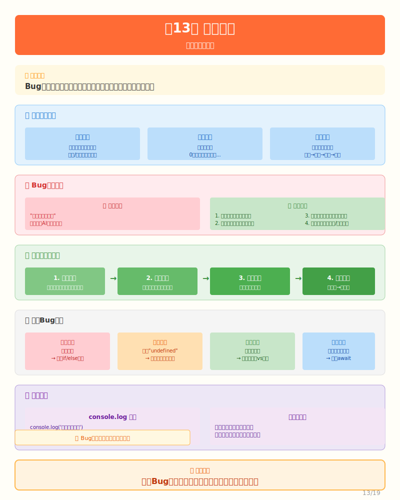

# 第13课：测试修复——发现问题的艺术



## 场景引入

界面美化了，功能也都有了。你觉得自己做完了。

你打开网站，从首页点进去，发布了一件物品，然后...咦？

物品发布成功了，但列表里没显示？

你刷新了一下，还是没显示。再发布一件，这次显示了，但第一件去哪了？

**恭喜你，你发现了第一个bug。**

这一课，我们来学习：
- 如何系统性地测试产品
- 如何向AI描述bug
- 如何一步步修复问题

---

## 思考过程

### 为什么会有bug？

bug是程序的错误。但为什么会产生？

常见原因：

```
1. 逻辑漏洞   → 没考虑到某种情况
2. 边界条件   → 输入超出了预期范围
3. 数据问题   → 数据格式不对、为空等
4. 环境差异   → 在你的电脑正常，别人电脑不正常
5. 粗心大意   → 拼写错误、漏掉代码
```

**重要的心态：bug是正常的，不是你太菜。** 

专业程序员每天也会写出bug。关键是：发现bug后，怎么高效地解决。

### 如何系统测试？

随机点点点，也能发现bug，但效率低。

更系统的方法：

**1. 功能测试（按功能清单测）**

```
□ 注册功能
  □ 正常注册
  □ 重复用户名
  □ 密码太短
  □ 手机号格式错误

□ 登录功能
  □ 正常登录
  □ 密码错误
  □ 用户不存在

□ 发布物品
  □ 正常发布
  □ 不填标题
  □ 价格填负数
  □ 不传图片

...以此类推
```

**2. 边界测试（测极端情况）**

```
□ 标题输入1个字
□ 标题输入1000个字
□ 价格输入0
□ 价格输入99999999
□ 不填任何内容直接提交
```

**3. 流程测试（测完整流程）**

```
□ 用户流程：注册 → 登录 → 发布物品 → 浏览 → 收藏 → 退出
□ 买家流程：浏览 → 搜索 → 看详情 → 收藏 → 联系卖家
```

### 如何向AI描述bug？

这是最重要的技能。

**差的描述：**
> "物品发布有问题"

AI不知道：
- 什么问题？报错？没反应？结果不对？
- 什么情况下出现？每次都这样还是偶尔？
- 你期望的结果是什么？

**好的描述：**
> 我发布了一件物品，显示"发布成功"，但回到首页列表看不到这件物品。我刷新了页面，还是看不到。
> 
> 预期结果：发布成功后，应该在首页列表中看到新发布的物品。
> 
> 实际结果：首页列表没有显示新发布的物品。
> 
> 浏览器控制台没有报错。

**好描述的要素：**

```
1. 操作步骤：你是怎么触发问题的
2. 预期结果：你觉得应该发生什么
3. 实际结果：实际发生了什么
4. 环境信息：浏览器、是否登录等
5. 错误信息：控制台有没有报错
```

---

## 实操对话

### Bug #1：发布后列表不显示

**人类**：
> 发现一个bug：
> 
> **操作步骤**：登录后，点击"发布物品"，填写信息，点击发布，页面显示"发布成功"，然后自动跳转到首页。
> 
> **预期结果**：首页列表中应该显示刚发布的物品。
> 
> **实际结果**：首页列表中没有显示刚发布的物品。我手动刷新页面，还是没有。但我再发布第二件物品时，第二件显示了，第一件还是不显示。
> 
> **环境**：Chrome浏览器，已登录状态。

**AI**：
> 感谢详细的bug描述！根据你的描述，问题可能出在以下几个地方：
> 
> 1. 数据确实保存成功了吗？
> 2. 首页获取列表的接口有没有过滤掉什么？
> 3. 前端列表渲染逻辑有问题？
> 
> 让我先检查一下后端数据库，看看数据有没有保存成功。
> 
> 请在终端运行以下命令，查看数据库中的物品：

```bash
cd server
sqlite3 database.db "SELECT id, title, status FROM items ORDER BY id DESC LIMIT 5;"
```

**【人类思考点】** AI开始帮你排查问题了。它会先定位问题在哪一层（后端？前端？数据库？），然后逐步缩小范围。

---

**人类**：
> 运行了，输出是：
> 
> ```
> 3|二手自行车|active
> 2|二手教材|active  
> 1|测试物品|pending
> ```
> 
> 我看到了！第一件物品的status是pending，后面两个是active。这有什么区别？

**AI**：
> 找到原因了！

> `status` 字段表示物品状态：
> - `pending`：待审核
> - `active`：已发布
> - `sold`：已售出

> 你发布的第一件物品，状态是 `pending`（待审核），而首页列表接口只显示 `active` 状态的物品。

> 现在的问题是：为什么第一件是pending，后面的都是active？

> 让我检查一下发布接口的代码：

```javascript
// server/routes/items.js

router.post('/', authenticateToken, (req, res) => {
  const { title, price, description, condition, location } = req.body;
  const seller_id = req.user.id;
  
  // 这里有问题！
  const status = req.body.status || 'pending';
  
  const result = db.prepare(`
    INSERT INTO items (title, price, description, condition, location, seller_id, status)
    VALUES (?, ?, ?, ?, ?, ?, ?)
  `).run(title, price, description, condition, location, seller_id, status);
  
  res.json({ success: true, id: result.lastInsertRowid });
});
```

> 问题找到了！
> 
> 代码写的是 `status = req.body.status || 'pending'`，意思是：
> - 如果前端传了status，就用前端传的
> - 如果没传，默认是pending
> 
> 但前端没有传status，所以第一件物品默认pending。
> 
> 那为什么后面两件是active呢？可能是你后来改过代码？

**人类**：
> 哦！我想起来了，第一次发布的时候我还没加这个字段，后来AI帮我加的，可能加的时候默认值设成了active。

**AI**：
> 明白了。现在的问题是：
> 
> 1. 发布接口应该自动设置status为active（不需要审核）
> 2. 或者保留审核机制，但需要管理员审核功能
> 
> 对于校园二手平台，建议直接设为active，简化流程。

```javascript
// 修改发布接口
router.post('/', authenticateToken, (req, res) => {
  const { title, price, description, condition, location } = req.body;
  const seller_id = req.user.id;
  
  // 直接设为active，不需要审核
  const status = 'active';
  
  const result = db.prepare(`
    INSERT INTO items (title, price, description, condition, location, seller_id, status)
    VALUES (?, ?, ?, ?, ?, ?, ?)
  `).run(title, price, description, condition, location, seller_id, status);
  
  res.json({ success: true, id: result.lastInsertRowid });
});
```

> 还需要把数据库里那件pending的物品改成active：

```sql
UPDATE items SET status = 'active' WHERE id = 1;
```

---

**人类**：
> 改好了！现在第一件物品也能显示了。

**AI**：
> 太好了！这个bug已经修复。

> 但我想提醒你：这个问题暴露了一个更大的问题——**没有审核功能，但代码里留下了审核相关的字段和逻辑**。

> 建议后续清理一下：
> - 要么删除status字段，所有物品默认显示
> - 要么保留status，但增加审核功能

> 现在先不改，记下来作为后续优化项。

**【人类决策点】** AI不仅帮你修了bug，还指出了潜在的设计问题。这些你可以现在处理，也可以记下来以后再说。

---

### Bug #2：搜索功能不工作

**人类**：
> 又发现一个bug：
> 
> **操作步骤**：在首页搜索框输入"自行车"，点击搜索按钮。
> 
> **预期结果**：列表只显示标题或描述中包含"自行车"的物品。
> 
> **实际结果**：列表没有变化，还是显示所有物品。搜索框里的字也没了。
> 
> **环境**：Chrome浏览器。

**AI**：
> 让我检查一下搜索功能的实现...

```vue
<!-- 首页代码 -->
<template>
  <div class="search-bar">
    <input 
      v-model="searchKeyword"
      placeholder="搜索你想要的物品..."
      class="input search-input"
    />
    <button class="btn btn-primary" @click="search">搜索</button>
  </div>
</template>

<script setup>
const searchKeyword = ref('')

// 问题：没有search方法！
</script>
```

> 找到问题了！搜索按钮绑定了 `@click="search"`，但没有定义 `search` 方法。

> 现在来补上：

```vue
<script setup>
import { ref, onMounted } from 'vue'
import api from '@/api'

const items = ref([])
const searchKeyword = ref('')
const loading = ref(true)

// 获取物品列表
const fetchItems = async (keyword = '') => {
  loading.value = true
  try {
    const params = keyword ? { keyword } : {}
    const res = await api.get('/items', { params })
    items.value = res.data
  } finally {
    loading.value = false
  }
}

// 搜索方法
const search = () => {
  fetchItems(searchKeyword.value)
}

onMounted(() => {
  fetchItems()
})
</script>
```

> 前端改好了，但还需要确认后端接口支持搜索参数：

```javascript
// server/routes/items.js

router.get('/', (req, res) => {
  const { keyword } = req.query;
  
  let sql = 'SELECT * FROM items WHERE status = ?';
  const params = ['active'];
  
  if (keyword) {
    sql += ' AND (title LIKE ? OR description LIKE ?)';
    params.push(`%${keyword}%`, `%${keyword}%`);
  }
  
  sql += ' ORDER BY created_at DESC';
  
  const items = db.prepare(sql).all(...params);
  res.json(items);
});
```

> 后端已经支持keyword参数了，所以只需要补上前端代码。

---

**人类**：
> 加上了，现在搜索有反应了！但搜索框里的字没了。

**AI**：
> 这说明搜索后页面刷新了，导致 `searchKeyword` 被重置。

> 检查一下，`fetchItems` 里有没有触发页面刷新的代码？

**人类**：
> 我看了，没有刷新。但搜索结果返回后，页面确实重新渲染了。

**AI**：
> 那应该不会丢失输入框内容。让我看一下完整代码...

> 哦，我发现问题了！

```vue
<!-- 搜索框 -->
<input 
  v-model="searchKeyword"
  placeholder="搜索你想要的物品..."
  class="input search-input"
/>
```

> 这个绑定是正确的，应该不会丢失。除非...

> 你是不是用了 `v-if` 之类的，导致整个组件重新渲染了？

**人类**：
> 没有啊...我看看...哦！我发现了！

> 我在 `loading` 的时候用了 `v-if`：

```vue
<div v-if="loading">加载中...</div>
<div v-else>
  <!-- 搜索框在这里 -->
</div>
```

**AI**：
> 找到原因了！

> 当你搜索时：
> 1. `loading` 变成 true
> 2. 搜索框所在的div被 `v-if` 隐藏
> 3. `searchKeyword` 的绑定断开
> 4. 搜索完成后 `loading` 变成 false
> 5. 搜索框重新创建，但 `searchKeyword` 已经被重置了

> 解决方法：把 `v-if` 改成 `v-show`，或者调整结构：

```vue
<div class="search-bar">
  <input 
    v-model="searchKeyword"
    placeholder="搜索你想要的物品..."
    class="input search-input"
  />
  <button class="btn btn-primary" @click="search">搜索</button>
</div>

<!-- 加载状态单独处理 -->
<div v-if="loading" class="loading">加载中...</div>

<div v-else class="items-grid">
  <!-- 物品列表 -->
</div>
```

> 这样搜索框始终存在，不会丢失输入。

---

### Bug #3：收藏按钮没有反馈

**人类**：
> 又发现一个bug：
> 
> **操作步骤**：在物品详情页，点击"收藏"按钮。
> 
> **预期结果**：按钮变成"已收藏"，并且有某种视觉反馈（比如提示"收藏成功"）。
> 
> **实际结果**：按钮确实变成"已收藏"了，但没有其他反馈。用户不知道操作成功了没。

**AI**：
> 这不是bug，是UX（用户体验）不够好。

> 来添加一个简单的提示：

```html
<script setup>
const showTip = ref(false)
const tipMessage = ref('')

const toggleFavorite = async () => {
  if (!userStore.isLoggedIn) {
    router.push('/login')
    return
  }
  
  if (isFavorited.value) {
    await api.delete(`/items/${itemId}/favorite`)
    isFavorited.value = false
    showToast('已取消收藏')
  } else {
    await api.post(`/items/${itemId}/favorite`)
    isFavorited.value = true
    showToast('收藏成功')
  }
}

const showToast = (message) => {
  tipMessage.value = message
  showTip.value = true
  setTimeout(() => {
    showTip.value = false
  }, 2000)
}
</script>

<template>
  <!-- 收藏按钮 -->
  <button @click="toggleFavorite" class="btn btn-outline">
    {{ isFavorited ? '已收藏' : '收藏' }}
  </button>
  
  <!-- 提示消息 -->
  <Transition name="fade">
    <div v-if="showTip" class="toast">
      {{ tipMessage }}
    </div>
  </Transition>
</template>

<style scoped>
.toast {
  position: fixed;
  bottom: 100px;
  left: 50%;
  transform: translateX(-50%);
  background: rgba(0, 0, 0, 0.8);
  color: white;
  padding: 12px 24px;
  border-radius: 8px;
  z-index: 1000;
}

.fade-enter-active,
.fade-leave-active {
  transition: opacity 0.3s ease;
}

.fade-enter-from,
.fade-leave-to {
  opacity: 0;
}
</style>
```

> 现在点击收藏，会有一个"收藏成功"的提示从底部弹出，2秒后自动消失。

---

## 更多测试发现的问题

你继续测试，又发现了一些问题：

### 问题清单

| # | 问题描述 | 严重程度 | 状态 |
|---|---------|---------|------|
| 1 | 发布物品不填标题，应该提示错误，但现在没反应 | 高 | 待修复 |
| 2 | 价格可以输入负数 | 中 | 待修复 |
| 3 | 手机端发布页面布局有问题 | 中 | 待修复 |
| 4 | 退出登录后，还会显示用户名一瞬间 | 低 | 待修复 |
| 5 | 物品描述太长时，列表页没有截断 | 低 | 待修复 |

**AI的建议**：
> 你发现了5个问题。建议按严重程度排序修复：
> 
> 1. **高**：影响核心功能，必须修
> 2. **中**：影响体验，应该修
> 3. **低**：细节问题，可以后面修
> 
> 先修复1和2，3-5有时间再做。

---

### 修复 #1：发布验证

**人类**：
> 先修复第一个：发布物品不填标题，应该提示错误。

**AI**：
> 需要在前端做表单验证：

```html
<script setup>
const form = ref({
  title: '',
  price: '',
  description: '',
  condition: '全新',
  location: ''
})

const errors = ref({})

const validateForm = () => {
  errors.value = {}
  
  if (!form.value.title.trim()) {
    errors.value.title = '请输入物品标题'
  }
  
  if (!form.value.price) {
    errors.value.price = '请输入价格'
  } else if (parseFloat(form.value.price) <= 0) {
    errors.value.price = '价格必须大于0'
  }
  
  return Object.keys(errors.value).length === 0
}

const submit = async () => {
  if (!validateForm()) {
    return
  }
  
  // 提交表单...
}
</script>

<template>
  <form @submit.prevent="submit">
    <div class="form-group">
      <input v-model="form.title" placeholder="物品标题" />
      <span v-if="errors.title" class="error">{{ errors.title }}</span>
    </div>
    
    <div class="form-group">
      <input v-model="form.price" type="number" placeholder="价格" />
      <span v-if="errors.price" class="error">{{ errors.price }}</span>
    </div>
    
    <button type="submit">发布</button>
  </form>
</template>

<style scoped>
.error {
  color: #e74c3c;
  font-size: 13px;
  margin-top: 4px;
  display: block;
}
</style>
```

---

## 知识提炼

### Bug描述模板

向AI（或任何人）描述bug时，用这个模板：

```
**操作步骤**：
1. 打开某某页面
2. 点击某某按钮
3. 输入某某内容
4. 点击提交

**预期结果**：
应该发生什么

**实际结果**：
实际发生了什么

**环境信息**：
- 浏览器：Chrome 120
- 是否登录：是
- 测试账号：test@test.com

**错误信息**：
控制台报错（如果有）
```

### 调试思路

遇到bug时，按这个顺序排查：

```
1. 确认问题
   - 能稳定复现吗？
   - 是偶发还是必现？

2. 定位层级
   - 前端问题？（界面不显示、交互没反应）
   - 后端问题？（接口报错、返回数据不对）
   - 数据库问题？（数据没存上、存错了）

3. 缩小范围
   - 打日志，看数据流向
   - 用断点，逐步执行

4. 修复验证
   - 改代码
   - 重新测试
   - 检查有没有影响其他功能
```

### 前端调试技巧

**1. 浏览器开发者工具**

- `Console`：看报错、打印日志
- `Network`：看接口请求、返回数据
- `Vue DevTools`：看组件状态、Pinia store

**2. console.log 大法**

```javascript
const fetchData = async () => {
  console.log('开始获取数据')
  const res = await api.get('/items')
  console.log('获取到的数据：', res.data)
  items.value = res.data
  console.log('赋值后的items：', items.value)
}
```

**3. 逐步注释法**

不确定哪段代码有问题？注释掉一半，看问题还在不在。

---

## 快速参考

### 常见bug类型

| 类型 | 表现 | 排查方向 |
|------|------|----------|
| 逻辑错误 | 功能不对 | 检查if/else条件 |
| 空值错误 | 报错"undefined" | 检查数据是否存在 |
| 类型错误 | 比较不生效 | 检查字符串vs数字 |
| 异步问题 | 数据没到就用了 | 检查await |
| 样式问题 | 布局错乱 | 检查CSS |

### Vue常见错误

| 错误信息 | 原因 | 解决 |
|---------|------|------|
| `Cannot read property 'x' of undefined` | 访问了不存在的属性 | 用 `?.` 或 `v-if` 判断 |
| `x is not defined` | 变量没声明 | 检查import或ref |
| `Duplicate keys detected` | v-for的key重复 | 确保key唯一 |

---

## 练习任务

### 任务1：修复剩余bug

我们还有3个待修复的问题，尝试自己描述bug并让AI帮你修复：

1. 价格可以输入负数
2. 手机端发布页面布局有问题
3. 退出登录后，还会显示用户名一瞬间

### 任务2：系统测试

按照本课讲的测试方法，对你的项目进行一轮完整测试：

1. 功能测试：每个功能都测一遍
2. 边界测试：试试极端输入
3. 流程测试：从注册到发布的完整流程

记录你发现的bug。

### 任务3：建立bug管理习惯

创建一个 `bugs.md` 文件，记录你发现的所有bug：

```markdown
# Bug列表

## 待修复

### Bug #6: 登录页面回车没反应
- 严重程度：中
- 发现时间：2024-01-15
- 操作步骤：在登录页面输入账号密码，按回车
- 预期结果：应该触发登录
- 实际结果：没反应，必须点按钮

## 已修复

### Bug #1: 发布后列表不显示
- 修复时间：2024-01-14
- 原因：status默认值为pending
- 解决：改为active
```

---

## 小结

这一课，我们完成了：

- [x] 学会了系统测试方法
- [x] 掌握了bug描述技巧
- [x] 修复了几个真实bug
- [x] 理解了调试思路

**最重要的收获**：遇到bug不要慌，用结构化的方式描述问题，让AI帮你定位和修复。

---

恭喜你！开发阶段的教程到这里就结束了。你已经：

- 搭建了项目环境
- 实现了用户注册登录
- 完成了物品发布和浏览
- 做好了详情页和收藏功能
- 美化了界面
- 测试并修复了bug

这是一个完整的产品开发流程！

接下来，如果你想让产品真正上线，让别人能访问，还需要学习部署相关知识。但那是另一个话题了。

**继续探索**：
- 如何部署到服务器？
- 如何配置域名？
- 如何做数据备份？
- 如何运营推广？

这些问题，我们后续课程再聊。

---

## 扩展资源

### 测试方法

- **软件测试基础**：[测试类型介绍](https://www.ibm.com/topics/software-testing) — 单元测试、集成测试、端到端测试
- **测试金字塔**：[Testing Pyramid](https://martinfowler.com/articles/practical-test-pyramid.html) — 测试策略最佳实践
- **测试用例设计**：[测试用例编写指南](https://www.guru99.com/test-case.html) — 如何设计完整的测试用例

### 前端测试工具

- **Vitest**：[vitest.dev](https://vitest.dev/) — Vue生态推荐的单元测试框架
- **Vue Test Utils**：[test-utils.vuejs.org](https://test-utils.vuejs.org/zh/) — Vue组件测试工具
- **Cypress**：[cypress.io](https://www.cypress.io/) — 端到端测试工具，可视化调试
- **Playwright**：[playwright.dev](https://playwright.dev/) — 微软开源的E2E测试框架

### 调试技巧

- **Chrome DevTools**：[开发者工具文档](https://developer.chrome.com/docs/devtools/) — 浏览器调试完整指南
- **Vue DevTools**：[Vue开发者工具](https://devtools.vuejs.org/) — Vue专用调试扩展
- **Node.js调试**：[Node调试指南](https://nodejs.org/zh-cn/docs/guides/debugging-getting-started/) — 后端代码调试
- **VS Code调试**：[VS Code调试配置](https://code.visualstudio.com/docs/editor/debugging) — 编辑器内置调试

### 错误处理

- **JavaScript错误类型**：[MDN错误对象](https://developer.mozilla.org/zh-CN/docs/Web/JavaScript/Reference/Global_Objects/Error) — 各种错误类型
- **try-catch最佳实践**：[错误处理指南](https://javascript.info/try-catch) — 异常处理模式
- **错误监控**：[Sentry](https://sentry.io/) — 生产环境错误收集平台

### Bug管理

- **GitHub Issues**：[Issues使用指南](https://docs.github.com/zh/issues) — 用Issue追踪bug
- **Bug报告模板**：[优秀的Bug报告](https://www.browserstack.com/guide/how-to-write-a-good-bug-report) — Bug报告怎么写
- **Git blame**：[查找问题代码](https://git-scm.com/docs/git-blame) — 定位谁改的代码
