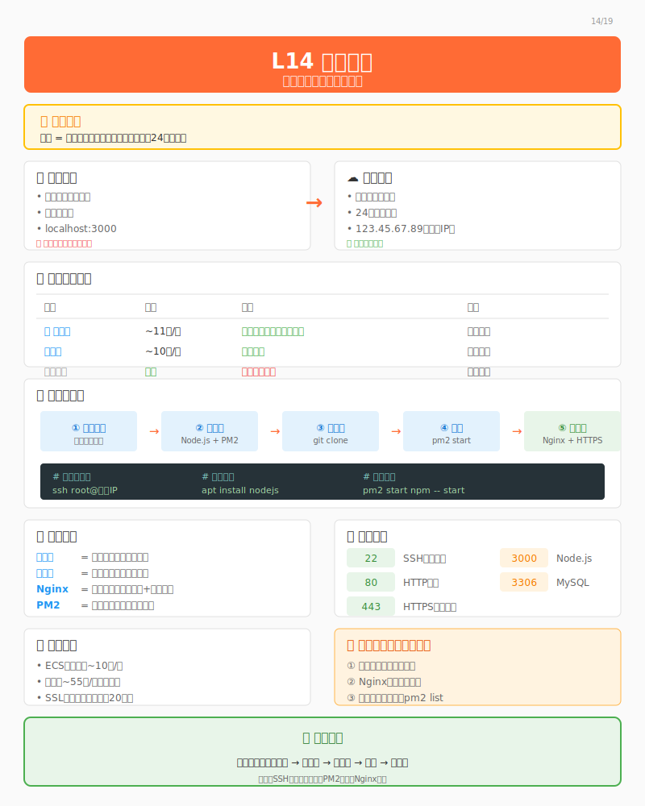

# 第14课：部署上线——让你的项目被全世界看到



> 📍 **学习进度**：第4阶段 - 发布上线（1/3）
> 
> 前置课程：[L13 测试修复](./L13-test-fix.md)

## 📋 学习目标

学完这一课，你将能够：

- [ ] 解释什么是云服务器，为什么需要它
- [ ] 理解域名和 DNS 的作用
- [ ] 独立完成项目的部署上线
- [ ] 使用 Nginx 配置网站和反向代理
- [ ] 为网站配置 HTTPS 安全证书

---

## ⚠️ 开始前准备

在开始部署之前，请确保你已经准备好：

### 必须有

| 准备项 | 说明 | 如何获取 |
|--------|------|----------|
| ✅ 云服务器账号 | 阿里云或腾讯云 | 去官网注册，学生有优惠 |
| ✅ 项目代码完整 | 本地能正常运行 | 前面13课完成的代码 |
| ✅ Git 已安装 | 用来管理代码 | 前面应该已经装了 |

### 可能有（取决于选择的方案）

| 准备项 | 说明 |
|--------|------|
| 阿里云/腾讯云账号 | 需要实名认证 |
| 学生认证 | 可以享受学生机优惠价格 |
| 域名（可选） | 如果想用自定义域名，需要购买 |

### 检查清单

在继续之前，请确认：

- [ ] 我有阿里云或腾讯云账号
- [ ] 我的项目本地能跑起来（`npm run dev` 能启动）
- [ ] 我知道怎么用终端（如果不清楚，回看 L02）

> 💡 **如果还没有云账号**：
> 1. 打开阿里云（aliyun.com）或腾讯云（cloud.tencent.com）
> 2. 点击"注册"
> 3. 完成实名认证（需要身份证）
> 4. 如果是学生，完成学生认证可以享受优惠

---

## 场景引入

经过前面13课的努力，你的校园二手平台已经：
- 能注册登录了
- 能发布物品了
- 能搜索浏览了
- 界面也美化过了
- 测试也通过了

**但是...** 只有你自己的电脑能访问。

你发链接给同学看，他们说："打不开啊？"

因为你的项目还在"本地"跑着，就像你在家做饭，别人吃不到。

这一课，我们要把项目"推出去"，让全世界都能访问。

这叫**部署**。

---

## 思考过程

### 什么是部署？

用个类比：

```
┌─────────────────────────────────────────────────────┐
│  本地开发                                            │
│  ┌─────────┐                                        │
│  │ 你的电脑 │  ← 只有你自己能用                        │
│  │         │                                        │
│  │ 项目运行 │  ← 关机就没了                           │
│  └─────────┘                                        │
└─────────────────────────────────────────────────────┘
                    ↓ 部署
┌─────────────────────────────────────────────────────┐
│  云服务器                                            │
│  ┌─────────┐                                        │
│  │ 24小时   │  ← 任何时间都能访问                      │
│  │ 不关机   │                                        │
│  │         │  ← 全世界都能访问                        │
│  └─────────┘                                        │
└─────────────────────────────────────────────────────┘
```

部署，就是把你的项目从"你的电脑"搬到"云服务器"上。

### 为什么不用国外平台？

你可能在其他教程里看到 Vercel、Render 这些平台，它们确实免费好用，但有个问题：

| 平台 | 国内访问情况 | 问题 |
|------|-------------|------|
| Vercel | 很慢或无法访问 | 服务器在国外，被墙 |
| Render | 很慢 | 冷启动慢，国内访问卡 |
| GitHub Pages | 不稳定 | 时好时坏 |
| Netlify | 很慢 | 服务器在国外 |

**对于国内用户来说，国内云服务是更好的选择。**

### 部署方案怎么选？

这是你需要做的重要决策。针对国内用户的方案：

| 方案 | 费用 | 优点 | 缺点 | 适合谁 |
|------|------|------|------|--------|
| **阿里云** | 约11元/月 | 稳定、文档全、学生优惠 | 需要实名认证 | 推荐首选 |
| **腾讯云** | 约10元/月 | 价格便宜、学生优惠 | 文档稍少 | 预算紧张 |
| **本地+内网穿透** | 免费 | 不花钱 | 电脑要一直开 | 临时展示 |

**【人类决策点】** 我们的项目是前后端分离的，需要选择一个能同时部署前后端的方案。

考虑到：
- 这是学习项目，预算有限
- 需要部署前端（Vue）和后端（Node.js）
- 主要面向国内用户

**推荐方案**：阿里云学生机 + OSS（约11元/月）

---

## 部署方案详解

### 方案1：阿里云（推荐）⭐

```
总费用：约11元/月

┌─────────────────────────────────────────┐
│  阿里云全家桶                             │
│                                         │
│  前端 ──→ OSS静态网站托管（约1元/月）      │
│  后端 ──→ ECS学生机（约10元/月）          │
│  域名 ──→ 阿里云（可选，约55元/年）        │
└─────────────────────────────────────────┘
```

**为什么推荐：**
- 国内访问快
- 文档最全，百度能搜到答案
- 学生机价格便宜
- 一家平台搞定所有

**前提条件：**
- 完成实名认证
- 完成学生认证（需要学信网验证）

### 方案2：腾讯云

```
总费用：约10元/月

┌─────────────────────────────────────────┐
│  腾讯云全家桶                             │
│                                         │
│  前端 ──→ COS静态网站托管（约1元/月）      │
│  后端 ──→ CVM学生机（约9元/月）           │
│  域名 ──→ 腾讯云（可选）                  │
└─────────────────────────────────────────┘
```

**适合谁：** 腾讯云经常有优惠券，有时候更便宜

### 方案3：本地+内网穿透（免费）

```
总费用：0元

┌─────────────────────────────────────────┐
│  你的电脑                                │
│                                         │
│  前端 ──→ 本地运行                        │
│  后端 ──→ 本地运行                        │
│  穿透 ──→ ngrok/frp（免费）              │
└─────────────────────────────────────────┘
```

**优点：** 完全免费

**缺点：** 
- 电脑要一直开着
- 重启后地址会变
- 适合临时展示，不适合长期运营

---

## 实操对话：阿里云部署

### 对话1：购买云服务器

**人类**：
> 我决定用阿里云了。第一步要做什么？

**AI**：
> 第一步是购买云服务器。
>
> **购买学生机步骤：**
>
> 1. 打开 https://university.aliyun.com/
> 2. 点击"学生认证"，完成学生身份验证
> 3. 认证通过后，看到"云服务器ECS"优惠
> 4. 选择配置：
>    - CPU：1核
>    - 内存：2G
>    - 系统：Ubuntu 22.04（推荐）
>    - 时长：选1个月或3个月试试
>
> **重要提示：**
> - 记住你设置的"实例密码"，后面要用
> - 选择"按量付费"或"包年包月"都可以
> - 学生机约9.5元/月

**人类**：
> 买好了！然后呢？

**AI**：
> 等几分钟，服务器启动后会给你一个"公网IP"，类似 `123.45.67.89`，这就是你服务器的地址。

---

### 对话2：连接服务器

**AI**：
> 现在要远程连接你的服务器。
>
> **Windows用户：**
> - 下载 PuTTY 或使用 Windows Terminal
> - 或者用阿里云控制台的"远程连接"按钮
>
> **Mac用户：**
> - 打开终端，运行：
>
> ```bash
> ssh root@你的公网IP
> ```
>
> 输入你设置的密码（输入时不会显示，正常输入后回车就行）

**人类**：
> 连上了！显示 `root@xxx:~#` 这是什么意思？

**AI**：
> 这说明你已经成功进入服务器了！
>
> - `root` 是管理员用户
> - `xxx` 是服务器名字
> - `#` 表示你是管理员，可以执行任何命令
>
> 现在你的终端操作的是远程服务器，不是你自己的电脑了。

**【真实错误案例】**

**人类**：
> 我输入密码总是提示 "Permission denied"：

**AI**：
> 可能的原因：
>
> 1. **密码输错了**：再试一次，注意大小写
> 2. **服务器还没启动**：等2-3分钟再试
> 3. **安全组没配置**：
>    - 去阿里云控制台
>    - 找到你的ECS实例
>    - 点击"安全组" → "配置规则"
>    - 添加入方向规则：端口22，允许所有IP
>
> 或者直接用阿里云控制台的"远程连接"功能，不用本地SSH。

---

### 对话3：安装环境

**人类**：
> 连上服务器了，接下来怎么部署我的项目？

**AI**：
> 服务器是空的，需要先安装 Node.js 环境。
>
> 在服务器上执行以下命令：
>
> ```bash
> # 更新软件源
> apt update
>
> # 安装 Node.js（使用 NodeSource 源）
> curl -fsSL https://deb.nodesource.com/setup_18.x | bash -
> apt install -y nodejs
>
> # 验证安装
> node -v
> npm -v
> ```
>
> 如果显示版本号，就说明安装成功了。

**人类**：
> 安装好了！显示 v18.x.x

**AI**：
> 接下来安装 PM2，它可以让你的后端持续运行，不会因为断开连接就停掉：
>
> ```bash
> npm install -g pm2
> ```

---

### 对话4：上传代码

**人类**：
> 怎么把我的代码传到服务器上？

**AI**：
> 有几种方法：
>
> **方法1：使用 Git（推荐）**
>
> 如果你的代码在 Gitee 或 GitHub 上：
>
> ```bash
> # 在服务器上
> cd /root
> git clone https://gitee.com/你的用户名/你的仓库.git
> ```
>
> **方法2：使用 SCP 上传**
>
> 在你自己的电脑上（不是服务器）：
>
> ```bash
> scp -r 你的项目路径 root@服务器IP:/root/
> ```
>
> 你选哪个？

**人类**：
> 用 Git 吧，代码在 Gitee 上。

**【人类决策点】** 为什么推荐 Gitee 而不是 GitHub？

> - Gitee 是国内平台，访问速度快
> - GitHub 在国内访问不稳定
> - 如果你有代理，GitHub 也可以

**AI**：
> 好的，先在服务器上安装 Git：
>
> ```bash
> apt install -y git
> ```
>
> 然后克隆你的仓库：
>
> ```bash
> git clone https://gitee.com/你的用户名/campus-market.git
> cd campus-market/server
> npm install
> ```

**人类**：
> 代码拉下来了，依赖也装好了！

---

### 对话5：启动后端

**AI**：
> 现在启动你的后端服务。
>
> 首先修改后端配置，让它监听所有网络请求（而不只是本地）：
>
> 检查 `server/app.js` 或入口文件，确保监听的是 `0.0.0.0` 而不是 `127.0.0.1`：
>
> ```javascript
> app.listen(3000, '0.0.0.0', () => {
>   console.log('服务器运行在端口 3000')
> })
> ```
>
> 然后用 PM2 启动：
>
> ```bash
> cd /root/campus-market/server
> pm2 start npm --name "campus-api" -- start
> pm2 save
> pm2 startup
> ```
>
> 最后一个命令会输出一行以 `sudo` 开头的命令，复制执行它，这样服务器重启后 PM2 会自动启动。

**人类**：
> 启动了！但是我在浏览器访问 `http://我的IP:3000` 打不开...

**AI**：
> 这通常是阿里云安全组的问题。
>
> 去阿里云控制台：
> 1. 找到你的 ECS 实例
> 2. 点击"安全组"
> 3. 点击"配置规则"
> 4. 点击"手动添加"
> 5. 添加规则：
>    - 端口范围：3000/3000
>    - 授权对象：0.0.0.0/0
> 6. 点击保存
>
> 等几十秒，再试试访问 `http://你的IP:3000`

**人类**：
> 可以了！看到返回数据了！

---

### 对话6：部署前端到 OSS

**AI**：
> 后端已经跑起来了。现在部署前端，我们用阿里云 OSS 静态网站托管，比放服务器上更便宜更快。
>
> **第一步：创建 OSS Bucket**
>
> 1. 打开阿里云控制台，搜索 "OSS"
> 2. 点击"创建 Bucket"
> 3. 配置：
>    - Bucket 名称：campus-market（要唯一）
>    - 地域：选离你近的（如华东、华北）
>    - 存储类型：标准存储
>    - 读写权限：公共读
>
> **第二步：配置静态网站**
>
> 1. 进入 Bucket，点击"基础设置" → "静态页面"
> 2. 默认首页：index.html
> 3. 默认 404 页：index.html（Vue 单页应用需要这个）
>
> **第三步：修改前端配置**
>
> 在你本地电脑上，修改前端配置，让 API 指向你的服务器：
>
> ```javascript
> // client/src/config.js 或类似文件
> export const API_BASE_URL = 'http://你的服务器IP:3000'
> ```
>
> 然后打包：
>
> ```bash
> cd client
> npm run build
> ```
>
> **第四步：上传到 OSS**
>
> 把 `client/dist` 目录下的所有文件上传到 OSS：
>
> 方法1：用 OSS 控制台上传（适合文件少的情况）
>
> 方法2：用 ossutil 命令行工具（推荐）：
>
> ```bash
> # 安装 ossutil
> # Mac
> brew install ossutil
>
> # 上传
> ossutil cp -r client/dist/ oss://你的bucket名称/
> ```

**人类**：
> 上传好了！但是访问 OSS 给的地址，页面空白...

**【真实错误案例】**

**AI**：
> Vue 单页应用常见问题。打开浏览器控制台看看有什么错误？

**人类**：
> 控制台显示：`Failed to load module script: Expected a JavaScript module script`

**AI**：
> 这是 MIME 类型问题。OSS 需要正确设置文件的 Content-Type。
>
> **解决方案：在 OSS 设置文件后缀的 MIME 类型**
>
> 1. 进入 OSS Bucket
> 2. 点击"基础设置" → "静态页面
> 3. 确保子目录首页开启
>
> 或者更简单的方法：**使用 OSS 的"镜像回源"功能**，但这个比较复杂。
>
> **更简单的方案：把前端也部署到服务器**
>
> 在服务器上用 Nginx 托管前端：
>
> ```bash
> # 安装 Nginx
> apt install -y nginx
>
> # 上传前端打包文件
> # 在本地电脑执行：
> scp -r client/dist/* root@服务器IP:/var/www/html/
>
> # 配置 Nginx
> nano /etc/nginx/sites-available/default
> ```
>
> 把内容改成：
>
> ```nginx
> server {
>     listen 80;
>     server_name 你的IP或域名;
>
>     # 前端
>     location / {
>         root /var/www/html;
>         index index.html;
>         try_files $uri $uri/ /index.html;
>     }
>
>     # 后端 API 代理
>     location /api {
>         proxy_pass http://127.0.0.1:3000;
>         proxy_set_header Host $host;
>         proxy_set_header X-Real-IP $remote_addr;
>     }
> }
> ```
>
> 重启 Nginx：
>
> ```bash
> nginx -t  # 测试配置是否正确
> systemctl restart nginx
> ```
>
> 这样前端和后端在同一个服务器，没有跨域问题，访问 `http://你的IP` 就能看到网站了。

**人类**：
> 用 Nginx 方案吧，OSS 太折腾了。

**AI**：
> 好的，Nginx 方案更简单直接。而且后续如果要绑定域名、配置 HTTPS 也更方便。

---

### 对话7：绑定域名（可选）

**人类**：
> 现在用 IP 访问 `http://123.45.67.89`，能绑定域名吗？

**AI**：
> 可以！如果你有域名的话。
>
> **第一步：购买域名**
>
> 在阿里云搜索"域名注册"，买个喜欢的：
> - `.com` 约55元/年
> - `.xyz` 约10元/年
> - `.top` 约10元/年
>
> **第二步：域名解析**
>
> 1. 进入阿里云"域名控制台"
> 2. 点击你的域名 → "解析"
> 3. 添加记录：
>    - 记录类型：A
>    - 主机记录：@（或者 www）
>    - 记录值：你的服务器IP
>
> **第三步：等待生效**
>
> DNS 解析需要几分钟到几小时不等。

**人类**：
> 域名解析好了，但是浏览器提示"不安全"？

**AI**：
> 这是因为没有 HTTPS。现在 HTTPS 几乎是必须的。
>
> **免费申请 SSL 证书：**
>
> 1. 阿里云搜索"SSL证书"
> 2. 选择"免费证书"（每年20个免费额度）
> 3. 申请证书，填你的域名
> 4. 验证通过后，下载证书（选 Nginx 格式）
>
> **配置 Nginx：**
>
> ```bash
> # 上传证书到服务器
> scp your-domain.pem root@服务器IP:/etc/nginx/
> scp your-domain.key root@服务器IP:/etc/nginx/
>
> # 修改 Nginx 配置
> nano /etc/nginx/sites-available/default
> ```
>
> ```nginx
> server {
>     listen 80;
>     server_name 你的域名.com;
>     return 301 https://$server_name$request_uri;  # HTTP 跳转 HTTPS
> }
>
> server {
>     listen 443 ssl;
>     server_name 你的域名.com;
>
>     ssl_certificate /etc/nginx/your-domain.pem;
>     ssl_certificate_key /etc/nginx/your-domain.key;
>
>     location / {
>         root /var/www/html;
>         index index.html;
>         try_files $uri $uri/ /index.html;
>     }
>
>     location /api {
>         proxy_pass http://127.0.0.1:3000;
>         proxy_set_header Host $host;
>         proxy_set_header X-Real-IP $remote_addr;
>     }
> }
> ```
>
> 重启 Nginx：
>
> ```bash
> nginx -t
> systemctl restart nginx
> ```

**人类**：
> 搞定了！现在显示小锁图标了！

---

## 备选方案：本地+内网穿透

如果你想先不花钱，用本地电脑做测试：

### 使用 ngrok

1. 去 https://ngrok.com 注册账号
2. 下载 ngrok
3. 运行：

```bash
# 后端跑在 3000 端口
ngrok http 3000
```

ngrok 会给你一个临时域名，如 `https://abc123.ngrok.io`，别人就能访问了。

**缺点：** 每次重启 ngrok，域名都会变。

### 使用 frp

frp 需要你有自己的服务器做中转，配置比 ngrok 复杂，但域名可以固定。

---

## 知识提炼

### 核心概念

#### 1. 云服务器

**云服务器 = 别人的电脑，你租来用**

```
你的电脑：
- 你自己管
- 关机就没了
- IP 经常变

云服务器：
- 阿里云/腾讯云管
- 24小时运行
- 有固定公网IP
```

#### 2. 安全组

**安全组 = 服务器的防火墙**

默认情况下，阿里云服务器只开放 22 端口（SSH）。你要用哪个端口，就得去安全组开放。

```
常见端口：
22   - SSH 远程连接
80   - HTTP 网页
443  - HTTPS 加密网页
3000 - Node.js 常用端口
3306 - MySQL 数据库
```

#### 3. Nginx

**Nginx = 流量分发员**

```
用户请求
    ↓
  Nginx（监听 80/443 端口）
    ↓
判断请求类型
    ├── 静态文件（HTML/CSS/JS）→ 返回文件
    └── API 请求（/api/xxx）→ 转发给后端
```

#### 4. PM2

**PM2 = 进程守护者**

```
没有 PM2：
- 你断开 SSH，后端进程就停了
- 后端崩溃了，没人知道

有 PM2：
- 后端崩溃自动重启
- 服务器重启后自动启动
- 可以查看日志
```

### 费用总结

| 项目 | 费用 | 说明 |
|------|------|------|
| ECS 学生机 | ~10元/月 | 完成学生认证 |
| 域名 | ~55元/年 | .com 域名 |
| SSL 证书 | 免费 | 阿里云每年20个免费额度 |
| OSS（可选） | ~1元/月 | 如果用 OSS 托管前端 |

**最低成本：约 10元/月**（只用学生机）

### 常见问题

**Q: 服务器连不上怎么办？**

A: 检查清单：
1. 服务器是否在运行（阿里云控制台看状态）
2. 安全组是否开放了 22 端口
3. 密码是否正确
4. 尝试用阿里云控制台的"远程连接"

**Q: 网站打不开怎么办？**

A: 检查清单：
1. Nginx 是否在运行：`systemctl status nginx`
2. 后端是否在运行：`pm2 list`
3. 安全组是否开放了 80 端口
4. 查看 Nginx 错误日志：`tail -f /var/log/nginx/error.log`

**Q: 数据库数据会丢吗？**

A: SQLite 数据存在文件里，不会丢。但建议定期备份：
```bash
# 备份数据库文件
cp /root/campus-market/server/database.db /root/backup/
```

---

## 快速参考

### 部署检查清单

- [ ] 购买阿里云/腾讯云服务器
- [ ] 配置安全组（开放 22, 80, 443, 3000 端口）
- [ ] SSH 连接服务器
- [ ] 安装 Node.js
- [ ] 安装 PM2
- [ ] 上传代码到服务器
- [ ] 安装依赖 `npm install`
- [ ] 启动后端 `pm2 start`
- [ ] 安装 Nginx
- [ ] 配置 Nginx
- [ ] 上传前端打包文件
- [ ] 测试访问
- [ ] 绑定域名（可选）
- [ ] 配置 HTTPS（可选）

### 常用命令

```bash
# SSH 连接
ssh root@服务器IP

# 查看后端状态
pm2 list
pm2 logs campus-api

# 重启后端
pm2 restart campus-api

# 查看 Nginx 状态
systemctl status nginx

# 重启 Nginx
systemctl restart nginx

# 查看日志
tail -f /var/log/nginx/error.log
pm2 logs

# 上传文件
scp -r 本地路径 root@服务器IP:远程路径
```

---

## 练习任务

### 任务1：部署你的项目

按照本课的步骤，把你的项目部署上线：
1. 购买学生机
2. 连接服务器
3. 安装环境
4. 部署前后端
5. 测试访问

### 任务2：记录部署过程

把你的部署过程记录下来：
- 遇到了什么问题？
- 是怎么解决的？
- 有什么心得？

### 任务3：分享你的链接

把部署好的链接分享给一个朋友试试，看他能不能正常使用。记录他的反馈。

---

## 小结

这一课，我们完成了：

- [x] 理解了什么是部署
- [x] 学会了选择国内部署方案
- [x] 亲手购买并配置了云服务器
- [x] 用 Nginx + PM2 部署了前后端
- [x] 了解了域名和 HTTPS

**现在，你的项目已经可以被全世界访问了！**

下一课，我们要让更多人知道你的平台——做推广物料。

**下一课**：[第15课：推广物料——让AI帮你写文案做海报](./L15-promotion.md)

---

## ✅ 学习检验

### 费曼学习法检验

**你能用自己的话解释这些概念吗？**

1. **什么是服务器？和你的电脑有什么区别？**
   - 试着解释给不懂技术的朋友听
   - 提示：从"谁在用"、"在哪里"、"什么时候能用"三个角度思考

2. **什么是域名？为什么需要它？**
   - 如果没有域名，我们怎么访问网站？
   - 域名和 IP 地址是什么关系？

3. **部署是什么意思？**
   - 用"搬家"的类比来解释
   - 部署前和部署后，项目有什么不同？

### 你能教给别人吗？

试着向一个不懂技术的朋友解释：

> "我刚做了一个网站，现在想让别人也能访问，我需要做什么？"

如果你能让他听懂，说明你真的理解了！

### 自测题

**基础问题**（所有人要会）：
- SSH 是什么？为什么连接服务器要用它？
- 安全组是什么？为什么要配置它？
- PM2 是什么？为什么用 PM2 而不是直接 `node app.js`？

**进阶问题**（想提升的同学思考）：
- Nginx 的"反向代理"是什么意思？有什么好处？
- 为什么 HTTPS 比 HTTP 安全？证书起什么作用？
- 前端部署到 OSS 和部署到服务器，各有什么优缺点？

**挑战问题**（试着不问AI）：
- 如果服务器突然访问不了了，你会按什么顺序排查问题？
- 如何实现"零停机部署"（更新代码时不中断服务）？
- 一个服务器能同时跑多少个网站？怎么实现？

---

## 📚 扩展资源

### 官方文档

| 资源 | 链接 | 说明 |
|------|------|------|
| 阿里云 ECS 文档 | https://help.aliyun.com/product/25365.html | 云服务器使用指南 |
| 阿里云 OSS 文档 | https://help.aliyun.com/product/31815.html | 对象存储使用指南 |
| 腾讯云 CVM 文档 | https://cloud.tencent.com/document/product/213 | 云服务器使用指南 |
| Nginx 官方文档 | https://nginx.org/en/docs/ | Web 服务器配置 |
| PM2 文档 | https://pm2.keymetrics.io/docs/usage/quick-start/ | Node.js 进程管理 |

### 推荐阅读

- [Linux 命令行入门](https://linux.cn/article-6160-1.html) - 服务器操作基础
- [Nginx 入门教程](https://juejin.cn/post/6844904125784653837) - 通俗易懂的 Nginx 配置
- [HTTPS 原理详解](https://juejin.cn/post/6844903606428246024) - 理解 HTTPS 的工作原理

### 本课关键词

`服务器` `域名` `DNS` `部署` `SSH` `安全组` `Nginx` `反向代理` `PM2` `HTTPS` `SSL证书` `OSS`
