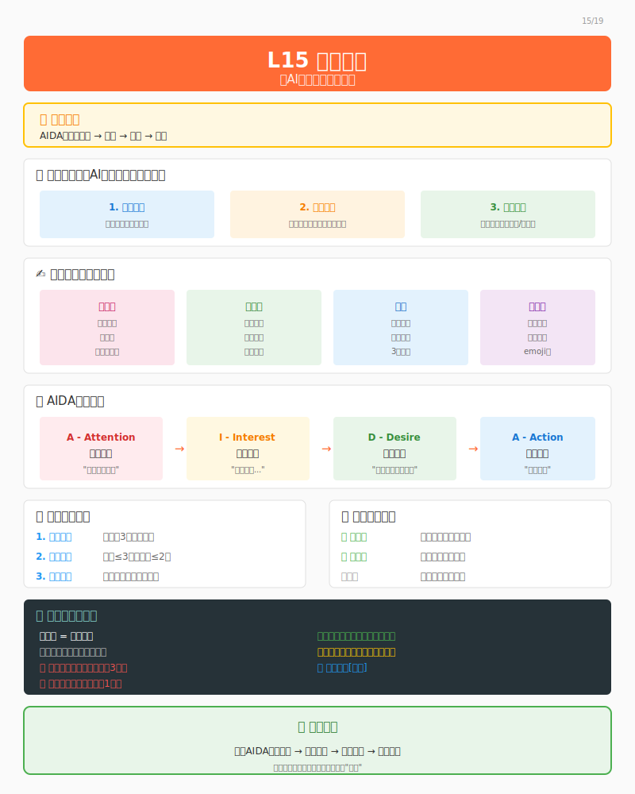

# 第15课：推广物料——让AI帮你写文案做海报



## 场景引入

你的校园二手平台已经上线了！

你激动地发了条朋友圈：
> "我做的校园二手平台上架啦！快来看看！"
> + 一个链接

然后你刷新了一下...没有人点赞。
再刷新...还是没有。

**为什么？**

- 朋友圈文案太平淡，没吸引到人
- 没有配图，视觉冲击力不够
- 没说清楚这个平台能干嘛
- 没有引导用户怎么用

这一课，我们来做**推广物料**——让AI帮你写吸引人的文案、做好看的海报。

---

## 思考过程

### 什么是推广物料？

推广物料就是你用来"推销"产品的所有东西：

```
推广物料 = 文案 + 图片 + 视频 + 教程
              ↓       ↓       ↓       ↓
           朋友圈   海报    短视频   使用指南
           公众号   Banner  演示    FAQ
```

类比一下：
- 产品是"商品"
- 推广物料是"包装"和"广告"
- 再好的商品，包装不好也没人买

### 推广的核心：对谁说、说什么、怎么说

在让AI写文案之前，你要想清楚三个问题：

**1. 对谁说？（目标用户）**
- 本校学生
- 有闲置物品的人
- 想淘便宜货的人

**2. 说什么？（核心价值）**
- 能卖闲置换钱
- 能淘到便宜好货
- 校园内交易，安全方便

**3. 怎么说？（渠道风格）**
- 朋友圈：短小精悍、口语化
- 公众号：详细、有故事
- 海报：视觉冲击、重点突出

**【人类决策点】** AI可以帮你写文案，但它不知道你的用户是谁、你的平台有什么特色。这些信息你需要先告诉AI。

---

## 实操对话

### 对话1：让AI了解你的平台

**人类**：
> 帮我写几条朋友圈文案，推广我的校园二手平台。

**AI**：
> 好的，但我需要先了解一下你的平台，才能写出合适的文案：
>
> 1. 你的平台叫什么名字？
> 2. 主要功能是什么？
> 3. 有什么特色/亮点？
> 4. 目标用户是谁？
> 5. 现在有什么内容吗（比如已经有人发布了物品）？

**【人类决策点】** AI在问关键信息。你需要认真回答，不然AI写出来的文案会很空泛。

**人类**：
> 1. 叫"校淘"，意思是校园淘宝
> 2. 学生可以发布闲置物品、浏览搜索、联系卖家
> 3. 特色是：只限本校学生用，需要校园卡认证，交易更安全
> 4. 目标用户是本校学生，特别是大三要实习和要毕业的
> 5. 现在还是空的，刚上线

**AI**：
> 了解了！你的平台有几个很好的点：
> - 校园卡认证 → 安全可信
> - 本校圈子 → 更有信任感
> - 毕业季刚需 → 时机对
>
> 我给你写几组不同风格的文案：

---

### 对话2：朋友圈文案

**AI**：
> **风格1：卖闲置的角度（适合发二手的人）**
>
> ```
> 📦 毕业倒计时！
> 一堆东西带不走，扔了又可惜...
> 
> 试试「校淘」！本校同学都在用
> 📱 手机拍个照，发布只需1分钟
> 💰 昨天室友在上面卖掉了用不到的台灯，30块！
> 
> 只限本校，比咸鱼靠谱多了
> 👉 [链接]
> ```
>
> **风格2：淘便宜的角度（适合捡漏的人）**
>
> ```
> 🔥 刚在学校群里发现一个宝藏平台！
> 
> 居然有人卖：
> ⭕ 九成新的自行车，原价500现价80
> ⭕ 小米台灯，15块
> ⭕ 考研资料，5块一套
> 
> 都是本校同学的闲置，支持校园卡验证
> 感觉像在学校里逛跳蚤市场 👀
> 
> 链接放这了：[链接]
> ```
>
> **风格3：直接安利型**
>
> ```
> 给大家安利一个学姐做的校园二手平台「校淘」✨
> 
> 专门给我们学校做的，只有本校学生能注册
> 再也不用在咸鱼上和陌生人扯皮了！
> 
> 界面超简洁，比学校贴吧好用100倍
> 刚上去看了一下，已经有不少好东西了
> 
> 👉 传送门：[链接]
> ```
>
> **风格4：幽默调侃型**
>
> ```
> 毕业季 = 断舍离季
> 
> 你的宿舍是不是也堆满了：
> ❌ 大一冲动买的吉他（弹过3次）
> ❌ 大二办的健身卡（去过1次）
> ❌ 大三买的考研书（全新）
> 
> 别扔！挂到「校淘」上卖掉回血！
> 学弟学妹们正等着接盘呢 😂
> 
> 👉 [链接]
> ```

**【人类决策点】** AI给了4种风格，你可以：
- 选一个最喜欢的
- 组合使用
- 让AI再写几个

**人类**：
> 风格4挺有趣的，但是我们的平台还没有内容，说"已经有不少好东西了"不太合适吧？

**AI**：
> 你说得对！这叫"过度承诺"，用户来了发现是空的，体验会很差。
>
> 来，我调整一下风格4：
>
> ```
> 毕业季 = 断舍离季
> 
> 你的宿舍是不是也堆满了：
> ❌ 大一冲动买的吉他（弹过3次）
> ❌ 大二办的健身卡（去过1次）
> ❌ 大三买的考研书（全新）
> 
> 别扔！「校淘」刚上线，快来当第一批卖家！
> 早发早卖，后面人会越来越多的
> 
> 👉 发布传送门：[链接]
> ```
>
> 这样更诚实，同时制造"早鸟"的感觉。

---

### 对话3：引导教程

**人类**：
> 朋友说不知道怎么用，能不能做个简单的使用教程？

**AI**：
> 好的，我给你写一个简单的新手指南：

---

> **校淘 · 新手使用指南**
>
> **你是卖家？看这里👇**
>
> **第1步：注册登录**
> 用手机号注册，需要上传校园卡照片认证
> （认证通过后才能发布，一般1小时内审核）
>
> **第2步：发布物品**
> 点击底部【发布】按钮
> - 拍张照片（最多9张）
> - 填写名称、价格、描述
> - 留下联系方式（微信/QQ）
> - 点击发布
>
> **第3步：等待联系**
> 有兴趣的买家会直接联系你
> 约个时间地点，当面交易，钱货两清！
>
> ---
>
> **你是买家？看这里👇**
>
> **第1步：浏览物品**
> 首页就是最新发布的物品
> 可以用搜索框搜你想要的
> 也可以按分类筛选
>
> **第2步：查看详情**
> 点击物品图片进入详情页
> 可以看大图、看描述、看价格
>
> **第3步：联系卖家**
> 看中了吗？点击【联系卖家】
> 复制卖家的微信/QQ，添加好友
> 聊一聊，约时间见面交易
>
> ---
>
> **常见问题**
>
> Q: 一定要校园卡认证吗？
> A: 是的，为了安全。只有本校学生才能用。
>
> Q: 平台收费吗？
> A: 完全免费！你们自己交易，我们不收任何费用。
>
> Q: 交易安全吗？
> A: 建议约在学校人多的地方当面交易。贵重物品记得检查清楚。
>
> Q: 怎么删除我发布的物品？
> A: 进入【我的】→【我发布的】→ 点击物品 → 点击删除。

**人类**：
> 这个太长了，朋友圈放不下。能做一个简洁版的图片吗？

**AI**：
> 文字版的教程确实太长。我建议你：
>
> 1. 把这个完整版放到公众号里
> 2. 朋友圈发一个简化版的步骤图
>
> 简化版步骤（做成图片）：
>
> ```
> ┌─────────────────────┐
> │    校淘 · 3步上手    │
> ├─────────────────────┤
> │                     │
> │  📱 注册 → 认证      │
> │     ↓               │
> │  📸 发布物品        │
> │     ↓               │
> │  💬 等人联系        │
> │                     │
> │  就这么简单！        │
> │                     │
> └─────────────────────┘
> ```

---

### 对话4：海报设计

**人类**：
> 能帮我设计一个海报吗？

**AI**：
> 我可以给你海报的设计方案和文案，但实际的图片设计需要用设计工具。
>
> **方案1：简洁风**
>
> ```
> ┌────────────────────────────┐
> │                            │
> │      🎓 毕业不带走        │
> │      💰 校淘帮你卖        │
> │                            │
> │   ─────────────────────   │
> │                            │
> │   校园二手 · 本校圈子      │
> │   校园卡认证 · 安全交易    │
> │                            │
> │         [二维码]           │
> │                            │
> │      扫码，开始淘好货      │
> │                            │
> └────────────────────────────┘
> ```
>
> **方案2：物品风**
>
> ```
> ┌────────────────────────────┐
> │  ┌───┐ ┌───┐ ┌───┐        │
> │  │📚 │ │🚲 │ │💡 │        │
> │  │5元│ │80 │ │15 │        │
> │  └───┘ └───┘ └───┘        │
> │                            │
> │    你要的，这里都有       │
> │    校淘 · 本校二手平台    │
> │                            │
> │         [二维码]           │
> └────────────────────────────┘
> ```
>
> **制作工具推荐：**
> - Canva（推荐，有很多模板）
> - 创客贴（中文友好）
> - Figma（专业，学习曲线陡）
>
> 你想让我帮你写更详细的海报文案，还是给你Canva的使用建议？

**【人类决策点】** AI不能直接做图，但可以：
- 给你设计方案和文案
- 告诉你用什么工具
- 帮你优化文案

**人类**：
> 我用Canva做过海报，但是不知道怎么把想法变成设计。能不能更具体一点？

**AI**：
> 好的，给你一个具体的Canva操作指南：
>
> **在Canva制作海报的步骤：**
>
> 1. 打开 Canva.com，搜索"校园活动海报"
> 2. 选择一个你喜欢的模板
> 3. 修改文字内容：
>    - 主标题：毕业不带走，校淘帮你卖
>    - 副标题：校园二手平台·本校圈子
>    - 底部放二维码
> 4. 调整颜色：
>    - 建议用学校的主色调
>    - 或者清新的蓝绿色系
> 5. 添加元素：
>    - 可以下载一些物品的PNG图标
>    - 书本、自行车、台灯之类的
> 6. 导出为PNG格式
>
> **给你一段可以用在Canva里的文字：**
>
> **主标题（大字）：**
> 毕业带不走？校淘帮你卖！
>
> **副标题：**
> 校园闲置交易平台
> 本校圈子 · 校园卡认证 · 安全交易
>
> **特点（小字）：**
> ✅ 免费发布，快速出手
> ✅ 本校学生，交易更放心
> ✅ 线下面交，钱货两清
>
> **行动号召：**
> 扫码发布你的第一个闲置 →
>
> 需要我帮你优化哪部分吗？

---

### 对话5：公众号文章

**人类**：
> 我想写一篇公众号文章详细介绍这个平台，怎么写？

**AI**：
> 公众号文章可以写得更详细。我给你一个大纲：

---

> **标题建议（选一个）：**
> - 《毕业季｜带不走的不是青春，是那堆闲置...》
> - 《本校学生专属的二手平台上线了！》
> - 《不花一分钱，我给学校做了个二手交易平台》
>
> **正文大纲：**
>
> **开头：共鸣场景**
> 毕业季快到了，你的宿舍是不是也开始"断舍离"？
> 那些当初冲动买的吉他、健身卡、考研书...
> 扔了可惜，带走麻烦，卖又没地方卖。
>
> **痛点：现有方式的问题**
> - 咸鱼？陌生人交易，怕被骗
> - 学校贴吧？发帖刷屏，效率低
> - 群里喊？没人看，沉得快
>
> **方案：介绍校淘**
> 所以我们做了一个专门给本校学生的二手平台——校淘。
> （这里可以放几张产品截图）
>
> **亮点：3大优势**
> 1. 本校圈子：只有通过校园卡认证的本校学生才能用
> 2. 简单易用：拍照发布，1分钟搞定
> 3. 安全交易：建议线下面交，看得见摸得着
>
> **使用方法：图文教程**
> （插入前面写的使用指南，配上截图）
>
> **结尾：行动号召**
> 现在正是第一批入驻的好时机！
> 早发的物品曝光更多，卖得更快。
> 扫码或点击阅读原文，开始发布你的第一个闲置吧！
>
> ---
>
> 你想让我把某个部分展开写吗？

**人类**：
> 开头部分帮我展开一下，要有趣一点。

**AI**：
> 好的，给你一个更生动的开头：
>
> ---
>
> 大四的学长学姐们，最近是不是很忙？
>
> 忙着拍毕业照，忙着写论文，忙着和喜欢的人表白...
>
> 还有一件事也很忙——**忙着收拾宿舍**。
>
> 打开柜子，一股灰尘扑面而来。仔细一看：
>
> - 大一买的吉他，当时信誓旦旦要当摇滚明星，现在只会弹小星星
> - 大二办的健身卡，当时想着要练出八块腹肌，现在腹肌是一块（也没了）
> - 大三买的考研资料，当时说要逆袭985，现在发现连快递都没拆
>
> 这些东西，扔了吧，舍不得；
> 带回去吧，火车上挤得像沙丁鱼罐头；
> 送给学弟学妹吧...他们宿舍也塞不下了。
>
> **要是有人能来收走就好了...**
>
> 于是，我们做了「校淘」——一个专门给本校学生的二手交易平台。

---

## 知识提炼

### 文案写作技巧

**1. AIDA模型**

```
A - Attention（注意）：用标题或开头抓住眼球
I - Interest（兴趣）：描述和用户相关的痛点
D - Desire（欲望）：展示你的解决方案和价值
A - Action（行动）：告诉用户下一步做什么
```

比如校淘的文案：
- Attention：毕业季！带不走的不是青春...
- Interest：扔了可惜，带走麻烦
- Desire：校园卡认证，本校圈子，安全交易
- Action：扫码发布你的第一个闲置

**2. 针对不同用户写不同文案**

| 用户类型 | 关注点 | 文案风格 |
|----------|--------|----------|
| 卖家 | 能不能卖掉？快不快？ | 强调效率、曝光 |
| 买家 | 有没有好东西？靠谱吗？ | 强调安全、便宜 |
| 围观群众 | 这是啥？跟我有关系吗？ | 用故事、用幽默 |

**3. 真实感很重要**

```
❌ "最好用的校园二手平台"（太空泛）
✅ "昨天室友卖掉了用不到的台灯，30块"（有细节）
```

### 海报设计原则

**1. 一眼看清**

海报只有3秒的注意力时间。主信息要在3秒内被理解。

```
核心信息层次：
第1眼看到：标题（毕业带不走？校淘帮你卖）
第2眼看到：价值点（本校圈子·安全交易）
第3眼看到：行动（扫码）
```

**2. 视觉统一**

- 颜色不超过3种
- 字体不超过2种
- 风格和产品调性一致

**3. 留白**

不要塞满！留白让海报"呼吸"，信息更清晰。

### 推广渠道选择

| 渠道 | 特点 | 适合内容 |
|------|------|----------|
| 朋友圈 | 熟人传播，信任度高 | 短文案+链接/海报 |
| 班级群 | 精准触达 | 简洁介绍+链接 |
| 公众号 | 长内容，可被搜索 | 详细教程、故事 |
| 小红书 | 年轻人多，容易爆 | 图文教程、真实分享 |
| 抖音 | 流量大，竞争大 | 短视频、趣味内容 |

---

## 快速参考

### 文案清单

```
✓ 朋友圈文案 × 4种风格
✓ 使用教程（完整版 + 简化版）
✓ 公众号文章大纲
✓ 海报文案
✓ 新手FAQ
```

### 推广节奏建议

```
Day 1: 发朋友圈 + 班级群（造势）
Day 2: 发公众号文章（详细介绍）
Day 3: 发小红书/抖音（扩大传播）
Day 7: 复盘数据，优化内容
```

---

## 练习任务

### 任务1：写你的朋友圈文案

根据你的平台实际情况，写3条不同风格的朋友圈文案，发给朋友试试，看哪条点赞多。

### 任务2：制作一张海报

用Canva或其他工具，根据本课的方案，制作一张推广海报。

### 任务3：写一篇公众号文章

按照本课的大纲，写一篇完整的公众号文章介绍你的平台。

---

## 小结

这一课，我们完成了：

- [x] 学会了让AI帮你写推广文案
- [x] 了解了不同场景需要不同的文案风格
- [x] 学会了设计海报的基本原则
- [x] 制作了完整的使用教程
- [x] 掌握了公众号文章的写作方法

**现在，你的推广物料准备好了！**

下一课，我们要把物料发出去，看效果，做优化。

**下一课**：[第16课：推广运营——让真实用户用起来](./L16-operations.md)

---

## 扩展资源

### 推荐阅读

| 资源 | 说明 |
|------|------|
| 《文案训练手册》| 约瑟夫·休格曼，文案经典 |
| 《影响力》| 罗伯特·西奥迪尼，说服心理学 |
| 《疯传》| 乔纳·伯杰，病毒传播原理 |

### 在线工具

| 工具 | 用途 | 链接 |
|------|------|------|
| Canva | 海报设计 | canva.com |
| 创客贴 | 中文海报模板 | chuangkit.com |
| 稿定设计 | 在线设计 | gaoding.com |
| 秀米 | 公众号排版 | xiumi.us |
| 135编辑器 | 公众号排版 | 135editor.com |

### 文案模板库

**朋友圈文案公式**：
```
痛点/共鸣 + 解决方案 + 行动号召
例：宿舍东西堆不下？（痛点）
    上校淘一键发布（方案）
    扫码试试→（行动）
```

**海报文案公式**：
```
主标题（1句话抓住注意）
副标题（说清楚是什么）
3个卖点（为什么选你）
行动号召（扫码/点击）
```

### 进阶学习

- 小红书运营：搜索"小红书文案技巧"
- 抖音短视频：搜索"抖音爆款文案"
- A/B测试：同一产品写3版文案，看哪个效果好
