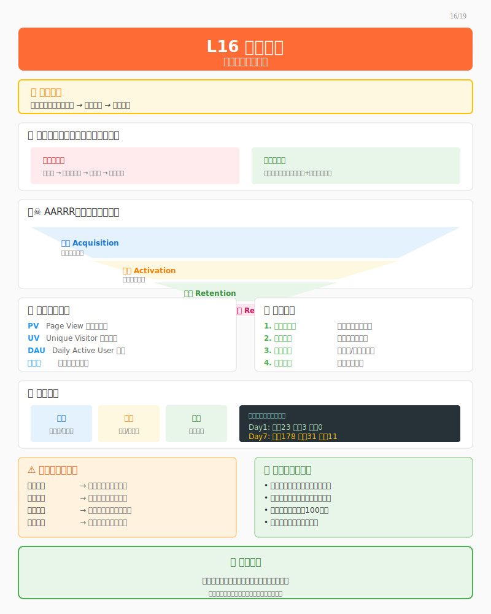

# 第16课：推广运营——让真实用户用起来



## 场景引入

推广物料准备好了，文案发了，海报贴了。

你满怀期待地打开后台... 

**数据是这样的：**
- 访问量：23人
- 注册：3人
- 发布物品：0个

**"辛辛苦苦做出来，怎么没人用？"**

这是99%的项目会遇到的情况。不是产品不好，而是运营才刚开始。

这一课，我们来聊聊：**如何让真实用户真正用起来。**

---

## 思考过程

### 冷启动的困境

所有平台类产品都有一个"鸡生蛋还是蛋生鸡"的问题：

```
没有买家 → 卖家不愿意发布 → 没有物品 → 买家不愿意来 → 没有买家...
```

这叫**冷启动问题**。

解决方法：**先有内容，再拉用户**。

类比一下：
- 新开的超市，货架不能是空的
- 新开的餐厅，门口要有几个人排队
- 新的二手平台，首页要有一些物品

**【人类决策点】** 你要决定：冷启动的内容从哪里来？

选项：
1. 自己先发布几个物品（最快）
2. 拉几个朋友先发（更真实）
3. 等自然增长（最慢，可能永远等不到）

### 运营的核心：获取、激活、留存

```
┌─────────────────────────────────────────────┐
│                                             │
│   获取用户（Acquisition）                    │
│   让人知道你的产品                           │
│          ↓                                  │
│   激活用户（Activation）                     │
│   让人完成第一次使用                         │
│          ↓                                  │
│   留住用户（Retention）                      │
│   让人持续使用                               │
│          ↓                                  │
│   口碑传播（Referral）                       │
│   让人推荐给别人                             │
│                                             │
└─────────────────────────────────────────────┘
```

这叫**AARRR模型**（海盗模型），是互联网产品运营的经典框架。

---

## 实操对话

### 对话1：第一天数据复盘

**人类**：
> 我昨天发了朋友圈推广，数据很差：
> - 访问量23人
> - 注册3人
> - 发布物品0个
> 
> 是不是我的产品有问题？

**AI**：
> 先别急着否定产品。让我们分析一下数据：
>
> **漏斗分析：**
> ```
> 看到朋友圈的人：？？？（不知道）
>      ↓
> 点击链接：23人
>      ↓
> 注册：3人（转化率13%）
>      ↓
> 发布：0人
> ```
>
> **发现的问题：**
>
> 1. **点击率低**：23人访问，可能只有几十人看到朋友圈
>    - 可能原因：文案不够吸引，或者发的时间不对
>
> 2. **注册率还行**：13%的访问者注册了
>    - 说明愿意尝试的人比例还可以
>
> 3. **发布为0**：最大的问题
>    - 可能原因：首页空的，没有人愿意当"第一个"
>
> **建议：先解决"发布为0"的问题。**

**人类**：
> 怎么解决？

**AI**：
> **方法1：自己先发几个物品**
>
> 每个人都有闲置，你先发布几个：
> - 一本看过的书
> - 一个不用的水杯
> - 一件穿不下的衣服
>
> 标价便宜点，比如5块、10块。
>
> **方法2：拉朋友帮忙**
>
> 找3-5个朋友，让他们帮忙：
> 1. 注册账号
> 2. 每人发1-2个闲置物品
> 3. 给你反馈使用体验
>
> 作为回报，请他们喝奶茶。
>
> **方法3：定向邀请**
>
> 你知道谁肯定有东西要卖吗？
> - 大四要毕业的学长学姐
> - 准备考研/实习的同学
> 
> 直接私聊他们："学姐，你要毕业了，有些东西带不走吧？我做了个校园二手平台，要不要试试发上去？"

---

### 对话2：冷启动实战

**人类**：
> 我找了5个朋友，让他们每人发了2个物品。现在首页有10个物品了！
> 
> 接下来怎么让更多人知道？

**AI**：
> 太好了！有内容了，推广效果会好很多。
>
> 现在你有10个真实物品，可以用这些做内容：
>
> **策略1：晒"好物"**
>
> 选几个性价比高的物品，截图发朋友圈：
>
> ```
> 哇！刚看到有人卖：
> 
> 🔥 九成新自行车，80块！
> 🔥 小米台灯，15块！
> 🔥 考研全套资料，10块！
> 
> 都是本校同学的闲置，这也太便宜了吧
> 晚一步就没了...
> 
> 👉 [链接]
> ```
>
> **策略2：换个时间发**
>
> 昨天你几点发的朋友圈？
>
> 建议在用户活跃时间发：
> - 中午12:00-13:00（午休刷手机）
> - 晚上21:00-23:00（睡前刷手机）
>
> **策略3：扩大渠道**
>
> 朋友圈触达的是你的朋友，但你想用的是全校学生。
>
> 可以尝试：
> - 发到班级群、专业群
> - 找学生会/社团帮忙转发
> - 发到学校贴吧/表白墙
> - 印几张贴在食堂/宿舍

---

### 对话3：收集反馈

**人类**：
> 今天数据好一点了：
> - 新增访问85人
> - 新增注册12人
> - 新增发布3个物品
> 
> 有个用户给我发消息说："认证太慢了，我等了2小时还没通过"

**AI**：
> 这是一个很好的反馈！说明用户真的在用。
>
> **问题分析：**
> - 认证需要人工审核
> - 你可能不是随时在线
> - 用户等不及就流失了
>
> **解决方案：**
>
> **短期（马上能做）：**
> - 在认证页面加说明："通常1小时内审核，请耐心等待"
> - 尽量及时审核，或者找朋友帮忙
>
> **长期（需要开发）：**
> - 自动识别校园卡照片
> - 或者先用邀请码代替认证
>
> 你现在审核机制是怎样的？

**人类**：
> 就是后台看到申请，我手动点通过。

**AI**：
> 那短期解决方案：
>
> 1. 设置手机提醒，定时查看
> 2. 在认证页面加预期说明
> 3. 审核通过后自动发通知
>
> 第3点需要开发，前两点现在就能做。
>
> 要我帮你加一段"审核说明"的文案吗？

**【人类决策点】** 用户反馈是运营的金矿。你需要：
- 建立反馈渠道（加微信、设群、后台留言）
- 及时响应用户问题
- 记录并分析反馈

---

### 对话4：数据埋点

**人类**：
> 我想知道用户在我的网站上做了什么，怎么看？

**AI**：
> 你问的是**数据埋点**和**用户行为分析**。
>
> 最简单的方式是用第三方工具：
>
> | 工具 | 特点 | 价格 |
> |------|------|------|
> | 百度统计 | 国内最常用 | 免费 |
> | 友盟+ | 阿里旗下 | 免费 |
> | Google Analytics | 全球最专业 | 免费 |
> | 友盟U-App | 移动端 | 免费基础版 |
>
> **推荐：先用百度统计**
>
> 接入步骤：
> 1. 注册百度统计账号
> 2. 创建站点，获取统计代码
> 3. 把代码加到你的网站里
>
> 在Vue项目里，加到 `index.html` 的 `<head>` 里就行：
>
> ```html
> <script>
> var _hmt = _hmt || [];
> (function() {
>   var hm = document.createElement("script");
>   hm.src = "https://hm.baidu.com/hm.js?你的ID";
>   var s = document.getElementsByTagName("script")[0]; 
>   s.parentNode.insertBefore(hm, s);
> })();
> </script>
> ```
>
> **能看到的指标：**
> - PV（页面浏览量）：有多少次访问
> - UV（独立访客）：有多少人访问
> - 来源：用户从哪里来的
> - 受访页面：哪些页面被看得最多
> - 停留时间：用户在你网站待多久
> - 地域：用户来自哪里
>
> **更进阶的埋点：**
>
> 如果你想知道：
> - 有多少人点击了"发布"按钮
> - 有多少人完成了发布流程
> - 用户从哪个页面流失
>
> 这需要**事件埋点**，要在代码里加统计逻辑。

**人类**：
> 先用百度统计基础版吧。但我更想知道怎么"看"数据，不是光看数字。

**AI**：
> 好问题！数据分析的关键是**问对问题**。
>
> **常见问题和分析方法：**
>
> **问题1：为什么没人注册？**
> - 看：注册页面UV vs 首页UV
> - 如果差距很大 → 首页到注册页的转化有问题
> - 如果差不多 → 注册表单有问题
>
> **问题2：为什么注册了不发布？**
> - 看：发布页面UV vs 注册用户数
> - 看发布流程每一步的流失
>
> **问题3：用户从哪里来？**
> - 看来源报告
> - 哪个渠道效果好，就加大那个渠道
>
> **问题4：什么时候发朋友圈效果好？**
> - 分时段发，看不同时段的访问量
> - 找出流量最高的时段
>
> **核心方法：对比**
>
> 数据本身没意义，对比才有意义：
> - 和昨天对比（增长还是下降？）
> - 和预期对比（达到目标了吗？）
> - 不同渠道对比（哪个更有效？）

---

### 对话5：持续迭代

**人类**：
> 运营了一周，数据是：
> - 累计注册：67人
> - 累计发布：45个物品
> - 日活（每天访问的人）：平均20人
> 
> 感觉增长很慢，怎么破？

**AI**：
> 先肯定一下：一周67个真实用户，这是很好的开始！
>
> 增长慢是正常的。大多数产品前几个月都是"缓慢爬坡"。
>
> **突破增长瓶颈的几个方向：**
>
> **1. 找到你的核心用户**
>
> 分析这67个人：
> - 谁发布最多？
> - 谁最活跃？
> - 他们有什么共同点？
>
> 核心用户可能是：大四要毕业的学生。针对他们做推广。
>
> **2. 制造传播节点**
>
> 想办法让用户帮你传播：
> - "发布成功后分享到朋友圈"
> - "卖出后评价平台"
> - "邀请室友注册，双方得福利"
>
> **3. 借势热点**
>
> - 毕业季 → 推"毕业清仓"专题
> - 开学季 → 推"学长学姐的闲置"
> - 考研季 → 推"考研资料专场"
>
> **4. 内容运营**
>
> 挑选优质物品，做成"今日好物"：
> - 每天在公众号/朋友圈发1-3个好物
> - 增加物品曝光
> - 吸引新用户
>
> **5. 线下活动**
>
> - 和学校跳蚤市场合作
> - 在毕业季搞线下市集
> - 现场扫码注册，送小礼品
>
> **你要先做哪个？**

**【人类决策点】** 运营是一个持续试错的过程。你需要：
- 选择一个方向重点突破
- 设定可衡量的目标
- 执行并收集反馈
- 根据结果调整

**人类**：
> 毕业季快到了，我想做"毕业清仓"专题。怎么做？

**AI**：
> 很好的切入点！给你一个执行计划：
>
> **毕业清仓专题执行计划**
>
> **第1步：预热（提前1周）**
> - 在大四群里预热："毕业清仓活动即将开始"
> - 招募第一批卖家（10-20人）
>
> **第2步：正式上线**
> - 在首页增加"毕业清仓"入口
> - 收集卖家信息，统一推广
> - 发朋友圈/公众号/群推广
>
> **文案示例：**
>
> ```
> 🎓 毕业倒计时！学长学姐开始清仓了！
> 
> 精选好物：
> ⭕ 九成新自行车 x5
> ⭕ 台灯/电风扇 x20
> ⭕ 考研资料/教材 x50
> ⭕ 衣服/鞋子/包包 x30
> 
> 都是一口价，先到先得
> 扫码进"毕业清仓"专区 👇
> [二维码]
> ```
>
> **第3步：持续运营**
> - 每天发"今日好物"
> - 卖出的物品及时标记
> - 收集买家好评晒图
>
> **目标：**
> - 新增发布：50个以上
> - 新增注册：100人以上
> - 至少促成10笔交易
>
> 需要我帮你设计"毕业清仓"页面的交互吗？

---

### 对话6：遇到困难怎么办

**人类**：
> 说实话，有时候觉得好累。做了这么多，用户还是很少。是不是该放弃？

**AI**：
> 理解你的感受。做产品就是这样，99%的时间是"没人用"、"没增长"、"没反馈"。
>
> 但是，**你比大多数人有勇气**——你真的做出了一个能用的产品，而且有人真的在用。
>
> 给你几个建议：
>
> **1. 调整预期**
> - 不是每个产品都能火
> - 但每个产品都能让你学到东西
> - 把"运营成功"改成"学到经验"
>
> **2. 找到乐趣**
> - 看到用户发布物品 → 开心
> - 收到用户反馈 → 开心
> - 帮同学卖掉闲置 → 更开心
> - 记录这些小确幸
>
> **3. 寻求帮助**
> - 找几个志同道合的朋友一起做
> - 向老师/学长请教
> - 在网上找做产品的社群
>
> **4. 设置里程碑**
> - 目标不要太大
> - "下周达到100个用户"
> - "一个月促成50笔交易"
> - 达成了就奖励自己
>
> **5. 记录过程**
> - 写运营日记
> - 记录数据和感受
> - 这些是宝贵的经验
>
> 哪怕最后项目没成功，你也会收获：
> - 一个完整的作品（简历加分）
> - 产品思维（面试加分）
> - 运营经验（工作加分）
> - 坚持的品格（人生加分）
>
> **要不要坚持下去，你自己决定。但我建议你至少运营到毕业季结束，看看能做成什么样。**

---

## 知识提炼

### 运营指标速查

| 指标 | 英文 | 含义 | 怎么算 |
|------|------|------|--------|
| PV | Page View | 页面浏览量 | 每打开一次算1 |
| UV | Unique Visitor | 独立访客 | 同一人多次访问算1 |
| DAU | Daily Active User | 日活跃用户 | 当天访问的用户数 |
| MAU | Monthly Active User | 月活跃用户 | 当月访问的用户数 |
| 转化率 | Conversion Rate | 完成目标的比例 | 完成数/访问数 |
| 留存率 | Retention Rate | 回来的用户比例 | 次日/7日/30日留存 |
| CAC | Customer Acquisition Cost | 获客成本 | 营销费用/新用户数 |

### 冷启动三步法

```
Step 1: 填充内容
├── 自己先发布
├── 找朋友帮忙
└── 定向邀请种子用户

Step 2: 精准推广
├── 找到目标用户在哪
├── 在他们出现的地方推广
└── 用他们关心的话术

Step 3: 口碑裂变
├── 让用户愿意分享
├── 设计分享激励机制
└── 用优质内容吸引新用户
```

### 常见问题与对策

| 问题 | 可能原因 | 解决方案 |
|------|----------|----------|
| 访问量低 | 推广渠道不够 | 扩大渠道，借势热点 |
| 注册率低 | 注册流程复杂 | 简化流程，降低门槛 |
| 发布率低 | 首页太空 | 先填充内容，制造氛围 |
| 流失率高 | 产品有bug或体验差 | 收集反馈，快速迭代 |
| 没人分享 | 缺乏动力 | 增加分享激励 |

### 真实案例：第一周数据对比

```
真实项目的前7天数据：

Day 1: 访问23，注册3，发布0
Day 2: 访问45，注册5，发布1（自己发）
Day 3: 访问67，注册8，发布3（朋友帮忙）
Day 4: 访问89，注册12，发布5（群推广）
Day 5: 访问156，注册25，发布8（公众号）
Day 6: 访问134，注册18，发布6
Day 7: 访问178，注册31，发布11（毕业季专题）

累计：注册102人，发布34个物品
```

**启示：**
- 第一天没人用很正常
- 内容填充是关键转折点
- 找到合适的推广渠道效果显著
- 持续运营才能看到增长

---

## 快速参考

### 运营日历模板

```
周一：复盘上周数据，制定本周计划
周二：内容更新，发布"好物推荐"
周三：社群运营，回复用户反馈
周四：产品迭代，修复bug
周五：推广活动，朋友圈/群推广
周六：数据分析，记录周报
周日：休息/思考/学习
```

### 数据监控清单

每天检查：
- [ ] 今日访问量（PV/UV）
- [ ] 今日新增注册
- [ ] 今日新增发布
- [ ] 是否有用户反馈

每周检查：
- [ ] 周增长趋势
- [ ] 用户来源分析
- [ ] 流失率分析
- [ ] 本周重点问题

---

## 练习任务

### 任务1：建立你的数据面板

用Excel或Notion，建立一个简单的运营数据面板，每天记录：
- 访问量
- 注册数
- 发布数
- 用户反馈
- 备注（做了什么推广）

### 任务2：分析一个用户反馈

找一个真实的用户反馈（或者自己模拟一个），分析：
- 问题的本质是什么？
- 影响范围有多大？
- 短期怎么解决？
- 长期怎么改进？

### 任务3：制定一周运营计划

写一份未来一周的运营计划，包括：
- 每天要做什么
- 推广渠道和内容
- 预期目标

---

## 小结

这一课，我们完成了：

- [x] 理解了冷启动的问题和解决方案
- [x] 学会了收集和分析用户反馈
- [x] 了解了数据埋点和分析方法
- [x] 掌握了持续迭代的运营方法
- [x] 建立了面对困难的心态

**恭喜你！你已经完成了从想法到上线的全过程！**

你做了一个真正能用的产品，有真实的用户，有真实的数据。无论结果如何，这都是一段宝贵的经历。

下一阶段，我们来总结这段旅程，提炼出可以复用的方法论。

**下一课**：[第17课：方法论总结——把经验变成能力](./L17-methodology.md)

---

## 扩展资源

### 推荐阅读

| 资源 | 说明 |
|------|------|
| 《增长黑客》| 肖恩·埃利斯，用户增长经典 |
| 《精益数据分析》| 数据驱动决策方法论 |
| 《从0到1》| 彼得·蒂尔，创业思维 |

### 数据分析工具

| 工具 | 用途 | 链接 |
|------|------|------|
| 百度统计 | 网站流量分析 | tongji.baidu.com |
| 友盟+ | 移动应用数据 | umeng.com |
| Google Analytics | 专业分析工具 | analytics.google.com |
| 神策数据 | 用户行为分析 | sensorsdata.cn |
| Metabase | 自建数据看板 | metabase.com |

### 运营模板

**每日运营检查清单**：
```
□ 查看今日数据（PV/UV/注册/发布）
□ 回复用户反馈/留言
□ 检查是否有待审核内容
□ 更新"好物推荐"（如有）
```

**周报模板**：
```
本周数据：
- 新增用户：XX人（环比+XX%）
- 新增物品：XX条
- 活跃用户：XX人

本周工作：
- 推广渠道：XXX
- 功能迭代：XXX
- 用户反馈处理：XXX条

下周计划：
- 重点突破：XXX
- 预期目标：XXX
```

### 进阶学习

- 冷启动策略：搜索"产品冷启动方法论"
- 社群运营：搜索"私域流量运营"
- 数据分析：B站搜索"数据分析入门"
