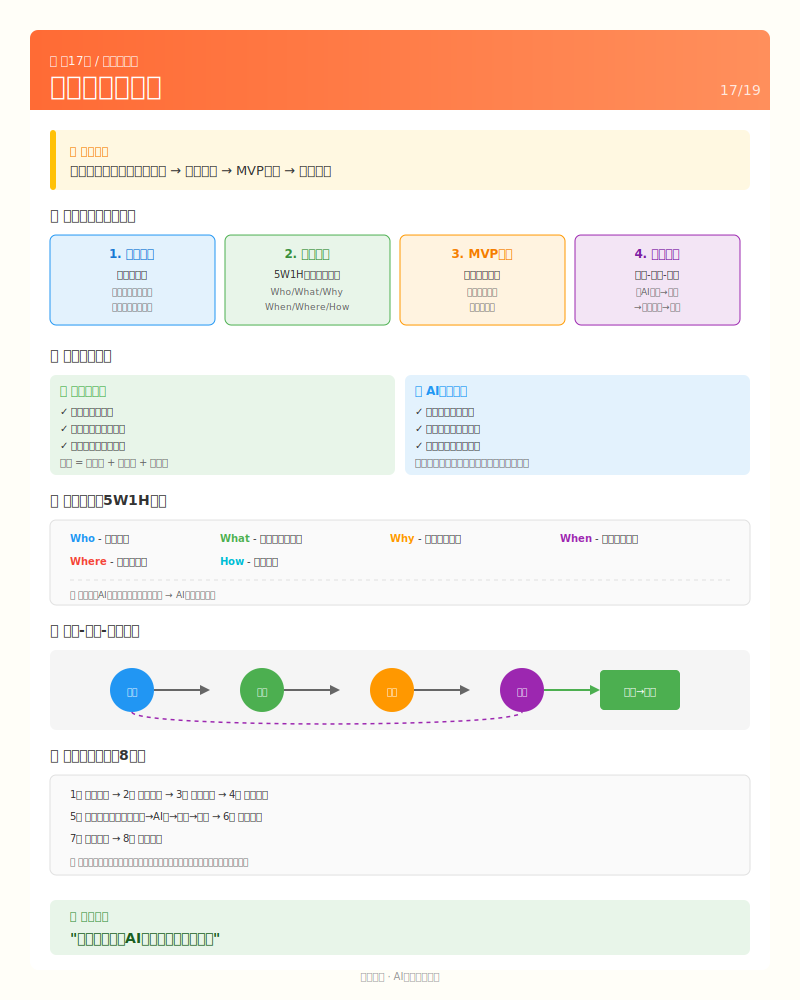

# 第17课：方法论总结——把经验变成能力



## 回顾：我们走过了什么

如果用一张图概括这18节课的旅程：

```
第1阶段：认知（L01-L03）
    │
    │  "原来我不用会写代码，只要会指挥"
    │
    ↓
第2阶段：需求（L04-L06）
    │
    │  "原来模糊的想法可以这样变清晰"
    │
    ↓
第3阶段：开发（L07-L13）
    │
    │  "原来AI真的能帮我写代码"
    │
    ↓
第4阶段：上线（L14-L16）
    │
    │  "原来做出来和有人用是两回事"
    │
    ↓
第5阶段：总结（L17-L18）
    │
    │  "原来我可以复制这套方法做其他项目"
    │
    ↓
   你
```

回头看，你最开始的问题可能是"我想做个东西，但不会写代码"。

现在，你的能力是"我能用AI把想法变成产品"。

---

## 核心方法论：人机协作的四个关键

### 1. 分清角色：你是指挥官

```
┌─────────────────────────────────────────────────────┐
│                                                     │
│   你（人类）                AI（助手）               │
│   ─────────                ─────────               │
│   做决策                    执行任务                │
│   定义需求                  写代码                  │
│   验收结果                  提供方案                │
│   判断质量                  解释原理                │
│   把方向                    干活                    │
│                                                     │
│   你的价值 = 决策能力 + 沟通能力 + 验收能力          │
│                                                     │
└─────────────────────────────────────────────────────┘
```

**记住**：AI不是万能的，它需要你的指挥。就像出租车司机能开车，但需要你告诉他去哪。

### 2. 把想法翻译成需求

AI听不懂"我想做一个好用的网站"。

它需要你翻译成：

```
原始想法："我想做个二手交易平台"

AI能理解的需求：
├── 目标用户：本校学生
├── 核心功能：
│   ├── 用户注册登录
│   ├── 发布物品（标题、描述、价格、图片）
│   ├── 浏览物品（列表、搜索、筛选）
│   └── 物品详情（查看、收藏、联系）
├── 页面结构：
│   ├── 首页（物品列表+搜索）
│   ├── 发布页
│   ├── 详情页
│   └── 个人中心
└── 技术栈：Vue + Node.js + SQLite
```

**方法**：用5W1H把模糊变清晰。

| 维度 | 问题 | 例子 |
|------|------|------|
| Who | 给谁用？ | 本校学生 |
| What | 解决什么问题？ | 闲置物品交易 |
| Why | 为什么需要？ | 群里发消息没人看 |
| When | 什么时候用？ | 主要是毕业季 |
| Where | 在哪里用？ | 手机浏览器 |
| How | 怎么用？ | 发布、浏览、线下交易 |

### 3. 小步快跑：MVP思维

**错误做法**：想清楚所有功能，一次性做完。

**正确做法**：先做最核心的功能，能用了再说。

```
MVP = Minimum Viable Product（最小可用产品）

校园二手平台的MVP：
├── 第一周：用户注册 + 发布物品 + 浏览列表
├── 第二周：物品详情 + 搜索功能
├── 第三周：个人中心 + 收藏功能
└── 第四周：界面美化 + bug修复

不是MVP（太多了）：
├── 即时聊天
├── 在线支付
├── 物流追踪
├── 信用评价
└── 优惠券系统
```

**为什么MVP有效**：
- 快速看到成果，有成就感
- 早点发现问题，改起来成本低
- 早点给用户用，收集真实反馈

### 4. 验收-反馈-迭代循环

```
     ┌─────────────────────────────────────┐
     │                                     │
     ↓                                     │
  让AI实现 ──→ 验收结果 ──→ 发现问题 ──→ 让AI修改
                  │                         ↑
                  │                         │
                  └──→ 满意 ──→ 继续下一个功能 ─┘
```

这个循环要一直转：

1. **让AI实现**：描述清楚需求，让AI写代码
2. **验收结果**：运行代码，看效果对不对
3. **发现问题**：bug、体验不好、不符合预期
4. **让AI修改**：描述问题，让AI修

**关键**：你不能懒，必须亲自验收。AI写的代码可能有bug，必须你发现。

---

## 通用工作流程

换一个项目，同样的流程：

```
┌─────────────────────────────────────────────────────────────┐
│                                                             │
│  第1步：发现需求                                             │
│  ─────────────                                              │
│  问自己：什么问题需要解决？                                   │
│  问AI：这个问题常见吗？有什么解决方案？                        │
│                                                             │
├─────────────────────────────────────────────────────────────┤
│                                                             │
│  第2步：定义需求                                             │
│  ─────────────                                              │
│  问自己：最核心的功能是什么？                                 │
│  问AI：帮我梳理功能清单和页面结构                             │
│                                                             │
├─────────────────────────────────────────────────────────────┤
│                                                             │
│  第3步：设计原型                                             │
│  ─────────────                                              │
│  问AI：帮我画页面草图                                        │
│  问AI：这个交互流程合理吗？                                   │
│                                                             │
├─────────────────────────────────────────────────────────────┤
│                                                             │
│  第4步：搭建项目                                             │
│  ─────────────                                              │
│  问AI：用什么技术栈合适？                                     │
│  问AI：帮我初始化项目                                        │
│                                                             │
├─────────────────────────────────────────────────────────────┤
│                                                             │
│  第5步：开发功能                                             │
│  ─────────────                                              │
│  循环：描述需求 → AI写代码 → 验收 → 反馈修改                  │
│  每次只做一个功能                                            │
│                                                             │
├─────────────────────────────────────────────────────────────┤
│                                                             │
│  第6步：测试修复                                             │
│  ─────────────                                              │
│  问自己：点遍所有按钮，有没有报错？                           │
│  问AI：这里报错了，帮我看看什么问题                           │
│                                                             │
├─────────────────────────────────────────────────────────────┤
│                                                             │
│  第7步：部署上线                                             │
│  ─────────────                                              │
│  问AI：怎么把这个项目部署到公网？                             │
│  问AI：域名、服务器怎么配置？                                 │
│                                                             │
├─────────────────────────────────────────────────────────────┤
│                                                             │
│  第8步：推广运营                                             │
│  ─────────────                                              │
│  问自己：目标用户在哪里？                                     │
│  问AI：帮我写推广文案                                        │
│  行动：去推广、收集反馈、持续迭代                             │
│                                                             │
└─────────────────────────────────────────────────────────────┘
```

---

## 换一个项目怎么做

假设你想做一个**课程表管理工具**：

### 第1步：发现需求

```
你的思考：
- 每学期选课很麻烦
- 课程时间容易冲突
- 想要一个工具帮我管理课程表

问AI：
"我想做一个课程表管理工具，你觉得这个需求怎么样？
 有没有类似的产品？我的差异化是什么？"
```

### 第2步：定义需求

```
问AI：
"帮我梳理这个工具的功能清单，要做一个MVP版本"

AI可能回答：
核心功能：
1. 添加课程（课程名、时间、地点、老师）
2. 查看周课表
3. 课程冲突提醒

不是MVP（以后再说）：
- 导入学校课表
- 作业提醒
- 考试安排
- 分享给同学
```

### 第3步：技术选型

```
问AI：
"这个工具用什么技术栈合适？我想做网页版，手机也能用"

AI可能回答：
- 前端：Vue 3（响应式设计，手机电脑都能用）
- 后端：Node.js + Express
- 数据库：SQLite（轻量）或 Firebase（不用自己管服务器）
```

### 第4-7步：开发、测试、部署

跟校园二手平台一样的流程：
1. 让AI帮你初始化项目
2. 一个功能一个功能做
3. 做完验收，发现问题让AI修
4. 测试通过后部署

### 第8步：推广

```
问AI：
"帮我写一段推广文案，发到班级群"

问AI：
"怎么让更多人知道这个工具？"
```

---

## 常见问题FAQ

### Q1：AI写的代码我看不懂怎么办？

**A**：你不需要精通每行代码，但你需要能判断核心代码是否正确实现了你的需求。

1. **验收结果**：运行代码，看效果对不对
2. **问AI解释**：不懂的地方，直接问"这段代码是干什么的？"
3. **关注逻辑**：理解"做了什么"，不用理解每个语法细节
4. **判断核心**：关键功能的逻辑，你要能看懂是否正确

类比：你是餐厅老板，不需要会做菜，但需要能判断菜好不好吃、是不是客人点的那个。

### Q2：AI理解错了我的需求怎么办？

**A**：这是常态，不是意外。解决方法：

1. **更具体地描述**：加细节、加例子
2. **提供参考**：发截图、链接类似产品
3. **分步说明**：把复杂需求拆成多个小需求
4. **确认理解**：问AI"你理解的XXX是什么意思？"

### Q3：AI写出的代码有bug怎么办？

**A**：三步走：

1. **描述bug**：告诉AI"我做了什么操作，期望什么结果，实际什么结果"
2. **提供报错信息**：把控制台的错误信息复制给AI
3. **让AI修**：90%的bug AI都能修

如果AI修不好：
- 搜一下报错信息，看有没有解决方案
- 在GitHub/Stack Overflow提问
- 或者绕过这个功能，先做别的

### Q4：我想加一个新功能，怎么开始？

**A**：按这个模板跟AI说：

```
我想给项目加一个[功能名称]功能。

具体需求：
1. [用户能做什么]
2. [什么场景下用]
3. [期望的效果]

参考：
- [有没有类似的功能/产品]

技术要求：
- [如果有特殊要求，比如要支持手机端]
```

### Q5：项目做了一半不想做了怎么办？

**A**：这很正常。建议：

1. **降低目标**：把"完美产品"改成"能用的demo"
2. **先上线**：哪怕不完美，先让别人用起来
3. **记录过程**：做项目的过程本身就是收获
4. **休息一下**：过段时间再看，可能有新想法

### Q6：我怎么知道AI做得对不对？

**A**：靠验收。每做一个功能，你都要：

1. **跑一遍**：打开页面，点点看
2. **测边界**：输入空内容、超长内容、特殊字符
3. **测异常**：断网情况下会怎样？
4. **测真实场景**：用真实数据跑一遍

### Q7：我想学更多技术，从哪开始？

**A**：建议顺序：

1. **先做项目**：通过项目学，比看书学快
2. **遇到什么学什么**：用到Vue就看Vue，用到数据库就看数据库
3. **系统补充**：做完项目后，再看系统教程补基础
4. **看AI写的代码**：让AI解释，边看边学

### Q8：AI会不会取代程序员？

**A**：不会取代，但会改变。

- **简单重复的工作**：会被AI取代
- **创造性的工作**：AI是助手，不是替代
- **你的竞争力**：变成"会用AI的人" vs "不会用AI的人"

现在学会AI协作，是在为未来做准备。

### Q9：我做出的产品没人用怎么办？

**A**：三个问题问自己：

1. **真的解决痛点了吗？** 还是只是"我觉得需要"
2. **目标用户知道你的产品吗？** 推广够不够
3. **产品好用吗？** 让朋友试试，听真话

如果都没问题，可能是：
- 时机不对（比如毕业季过了）
- 市场太小（用户基数不够）
- 竞品太强（有更好的替代品）

没关系，换个项目继续做。每次都会有进步。

### Q10：下一个项目做什么好？

**A**：从身边的问题找：

- 有什么让你觉得麻烦的事？
- 有什么你想要但没有的工具？
- 有什么你朋友抱怨的问题？

好的项目往往来自真实的需求，而不是"我想要做一个产品"。

---

## 如何向企业展示这种能力

学会AI协作开发后，你需要让企业知道你的价值。

### 核心定位

**你不是一个"会写代码的程序员"。**

**你是一个"能用AI高效交付产品的开发者"。**

这两种定位的区别：

| 定位 | 含义 | 价值 |
|------|------|------|
| 会写代码 | 我能实现功能 | 基础能力 |
| AI协作者 | 我能用AI提升3-10倍效率 | 稀缺能力 |

### 你的核心能力清单

在简历和面试中，强调这些能力：

**1. 需求翻译能力**
> 能把"我想做个二手平台"变成AI能理解的具体需求

**2. 技术决策能力**
> 在AI给的方案中选择最优解，知道为什么这么选

**3. 快速学习能力**
> 遇到新技术，问AI，1天上手；传统方式要1周

**4. 质量把控能力**
> AI写的代码，你能判断对不对，发现问题能让AI修

**5. 端到端交付能力**
> 从想法到上线，一个人就能搞定

### 给面试官的"钩子"

```
"我最大的优势不是'会写代码'，
而是'能用AI高效交付产品'。

我用2周完成了传统方式需要2个月的工作量。
这套方法论，可以应用到任何新项目上。"
```

### 什么样的公司值得去

**好公司的信号：**
- 问你"怎么让AI理解需求"
- 问你"怎么判断AI方案好不好"
- 对AI协作感兴趣

**不值得去的信号：**
- "AI写的代码不算数"
- "你必须能手写所有代码"
- 对AI话题不屑

**记住：面试是双向选择。**

不拥抱AI的公司，技术理念落后，不值得去。

---

## 你带走的方法论清单

完成这个项目后，你拥有了：

### 思维层面

- [ ] 知道自己是"指挥官"，不是"工人"
- [ ] 学会了把模糊想法变成清晰需求
- [ ] 理解了MVP思维，先做核心功能
- [ ] 建立了"验收-反馈-迭代"的循环意识

### 技能层面

- [ ] 能用AI工具写代码（即使自己不会写）
- [ ] 能看懂基本的项目结构
- [ ] 能描述bug让AI修复
- [ ] 能把项目部署到公网

### 产品层面

- [ ] 经历了从想法到上线的完整流程
- [ ] 理解了需求分析、功能设计的基本方法
- [ ] 体验了运营推广的挑战
- [ ] 收集过真实用户反馈

### 心态层面

- [ ] 不怕"不会写代码"
- [ ] 不怕"AI写错了"
- [ ] 不怕"没人用"
- [ ] 敢于开始，敢于试错

---

## 下一课

方法论有了，下一课我们来展示你的成果，看看这段旅程的终点是什么。

[第18课：成果展示——你做到了](./L18-showcase.md)

---

## ✅ 理解检查

学完这一章，你能回答这些问题吗？

**基础问题**（所有人要会）：
- 人机协作的四个关键是什么？
- MVP思维的好处是什么？
- 验收-反馈-迭代循环是怎么运作的？

**进阶问题**（想提升的同学思考）：
- 如何把模糊想法翻译成AI能理解的需求？
- 换一个项目，工作流程有什么变化？
- 如何向企业展示AI协作能力？

**挑战问题**（试着不问AI）：
- 总结你学到的核心方法论
- 你会如何教别人这套方法？

---

## 🎯 费曼学习法检验

### 你能解释这些概念吗？

**1. 人机协作的四个关键是什么？**
> 提示：想想角色分工、需求翻译、MVP、迭代循环...

<details>
<summary>参考答案</summary>

1. 分清角色：你是指挥官，做决策、验收结果；AI是助手，执行任务、提供方案
2. 把想法翻译成需求：用5W1H把模糊变清晰
3. 小步快跑（MVP思维）：先做核心功能，能用了再说
4. 验收-反馈-迭代循环：让AI实现 → 验收结果 → 发现问题 → 让AI修改
</details>

**2. 如何把模糊想法变成AI能理解的需求？**
> 提示：想想5W1H...

<details>
<summary>参考答案</summary>

用5W1H把模糊变清晰：
- Who：给谁用？（目标用户）
- What：解决什么问题？
- Why：为什么需要？
- When：什么时候用？
- Where：在哪里用？
- How：怎么用？

越具体，AI越容易理解。
</details>

### 你能教给别人吗？

**教学检验**：找一个同学（或对着空气），尝试讲清楚：

1. 你是指挥官，AI是助手，各自的职责是什么？
2. 换一个新项目，你会怎么开始？
3. 如何让企业看到你的AI协作能力？

### 自测题

**第1题**：MVP的好处不包括？

A. 快速看到成果
B. 早点发现问题
C. 一次做完所有功能
D. 早点收集用户反馈

<details>
<summary>答案</summary>

**C** - MVP的好处是快速看到成果、早点发现问题、早点收集反馈。MVP明确不是一次做完所有功能。
</details>

**第2题**：在验收-反馈-迭代循环中，人类最关键的职责是？

A. 写代码
B. 做决策和验收
C. 设计数据库
D. 配置服务器

<details>
<summary>答案</summary>

**B** - 人类的关键职责是做决策和验收。AI写代码，人类判断写得对不对。
</details>

---

## 📚 扩展资源

### 官方文档
- [Prompt Engineering Guide](https://www.promptingguide.ai/zh) - 关键词：提示词、AI沟通
- [GitHub Skills](https://skills.github.com/) - 关键词：Git、版本控制
- [Atlassian Agile](https://www.atlassian.com/agile) - 关键词：敏捷开发、Scrum

### 推荐阅读

| 资源 | 说明 |
|------|------|
| 《人月神话》| 软件工程经典，理解项目管理 |
| 《精益创业》| MVP思维源头 |
| 《程序员的职业素养》| Robert Martin，职业发展 |

### AI工具对比

| 工具 | 优势 | 适用场景 |
|------|------|----------|
| opencode | 命令行协作，适合项目开发 | 本教程推荐 |
| Cursor | IDE集成，代码补全强 | 日常开发 |
| GitHub Copilot | 行内补全，流畅 | 代码编写 |
| ChatGPT/Claude | 通用对话，解释能力强 | 学习、问答 |
| DeepSeek | 中文理解好，免费 | 日常使用 |

### 方法论速查卡

**需求描述模板**：
```
我想做一个[功能名称]。

具体要求：
1. 用户能做什么：XXX
2. 使用场景：XXX
3. 期望效果：XXX

参考（可选）：
- 类似功能：XXX
- 界面风格：XXX
```

**Bug反馈模板**：
```
问题：[一句话描述]

复现步骤：
1. 打开XXX页面
2. 点击XXX按钮
3. 出现XXX问题

期望结果：XXX
实际结果：XXX

环境：浏览器/手机型号
```

### 进阶学习

- 产品思维：《俞军产品方法论》
- 项目管理：《Scrum敏捷软件开发》
- 技术架构：《架构整洁之道》
