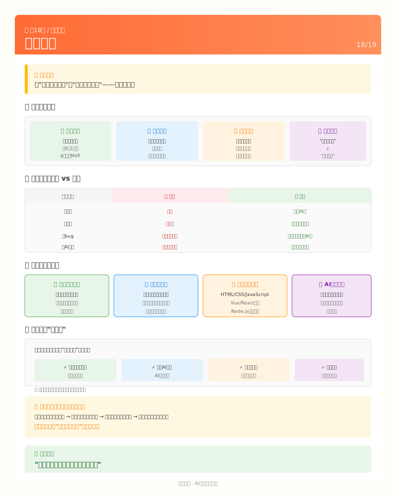

# 第18课：成果展示——你做到了



## 看看你的成果

如果从头到尾跟着做完，你现在拥有：

### 一个能用的产品

```
校园闲置交易平台

用户能做的：
├── 注册账号，校园卡认证
├── 发布闲置物品（带图片）
├── 浏览物品列表
├── 搜索想要的物品
├── 查看物品详情
├── 收藏感兴趣的物品
└── 管理自己的发布和收藏

你能做的：
├── 审核用户认证
├── 管理违规物品
├── 查看运营数据
└── 继续迭代优化
```

### 一段真实的经历

```
你经历了：

第1周：安装工具，理解"指挥官"角色
第2周：从"想做二手平台"到画出功能清单
第3周：搭建项目，第一次看到页面跑起来
第4周：做出注册登录，第一次存入数据库
第5周：做出发布功能，第一次上传图片
第6周：做出搜索功能，第一次体验筛选
第7周：界面美化，让产品"能看"
第8周：修bug，发现和解决问题
第9周：部署上线，产品在公网可访问
第10周：推广运营，让真实用户用起来

这些经历，比任何课程都珍贵。
```

---

## 你学到了什么

### 技术能力

| 能力 | 之前 | 现在 |
|------|------|------|
| 写代码 | 不会 | 还是不太会，但能让AI写 |
| 看代码 | 看不懂 | 能看懂基本结构 |
| 修bug | 不知道怎么修 | 知道怎么描述给AI修 |
| 部署项目 | 完全不懂 | 知道基本流程 |
| 数据库 | 听说过 | 用过，知道能存数据取数据 |

### 产品能力

| 能力 | 之前 | 现在 |
|------|------|------|
| 分析需求 | 想法很模糊 | 能写出功能清单 |
| 设计交互 | 凭感觉 | 知道画草图、理流程 |
| 用户体验 | 不太考虑 | 知道要替用户想 |
| 运营推广 | 没概念 | 做过冷启动，知道有多难 |

### 协作能力

| 能力 | 之前 | 现在 |
|------|------|------|
| 和AI沟通 | 不知道怎么问 | 能描述清楚需求 |
| 验收结果 | 不验收 | 会自己跑一遍 |
| 反馈问题 | 说"不对" | 能描述具体问题 |
| 迭代改进 | 想一次做完 | 知道要小步快跑 |

### 心态变化

```
之前：
"我不会写代码，做不了产品"

现在：
"我不怎么会写代码，但我做出了产品"

这个转变，是最大的收获。
```

---

## 你可以继续探索的方向

### 方向1：继续优化这个项目

```
可以加的功能：
├── 即时聊天（买卖双方沟通）
├── 在线支付（不用见面给钱）
├── 物品分类（书籍、电子产品、生活用品...）
├── 信用评价（交易后互评）
├── 举报功能（处理违规物品）
├── 消息通知（有人收藏/留言时提醒）
└── 微信小程序（更方便手机使用）

可以优化的地方：
├── 认证自动化（AI识别校园卡）
├── 图片压缩（加快加载）
├── 搜索优化（更智能的匹配）
├── 页面性能（更快响应）
└── 安全加固（防止攻击）
```

### 方向2：做新的项目

用同样的方法，你可以做：

**工具类**：
- 课程表管理
- 作业提醒
- 笔记整理
- 时间管理

**社区类**：
- 失物招领
- 组队找搭子
- 学习资源共享
- 校园活动信息

**信息类**：
- 学校新闻聚合
- 选课评价
- 美食推荐
- 兼职信息

### 方向3：深入学习技术

如果你想成为"真的会写代码"的人：

```
推荐学习路径：

前端：
├── HTML/CSS基础
├── JavaScript入门
├── Vue/React深入
└── 做几个小项目练手

后端：
├── Node.js基础
├── 数据库（MySQL/MongoDB）
├── API设计
└── 服务器部署

全栈：
├── 前后端都学
├── 做完整项目
└── 理解整个系统
```

### 方向4：探索AI的更多用法

```
AI不只是写代码：

文案写作：
├── 推广文案
├── 产品说明
├── 用户通知
└── 公众号文章

设计辅助：
├── 画UI草图
├── 生成海报
├── 配色建议
└── 图标设计

数据分析：
├── 解读数据
├── 找问题
├── 提建议
└── 写报告

学习助手：
├── 解释概念
├── 回答问题
├── 推荐资源
└── 模拟面试
```

---

## 给你的鼓励

### 你做到了大多数人没做到的事

```
想做个产品的人：很多
真正开始做的：很少
做出来能用的：更少
上线运营的：少之又少

你做到了。
```

### 你学会了一套"元技能"

什么是元技能？就是"学会学习"的能力。

- 你学会了怎么把想法变成需求
- 你学会了怎么指挥AI干活
- 你学会了怎么验收和反馈
- 你学会了怎么解决问题

这些能力，换个项目、换个行业，都能用。

### 你的简历多了亮点

```
之前：
"我会用Word/Excel"
"我学过C语言（但忘了）"

现在：
"独立完成了一个校园二手交易平台"
"从需求分析到上线运营，全程负责"
"学会了AI协作开发方法"
"有真实用户运营经验"

哪个更打动面试官？
```

### 失败也是一种收获

如果项目没有成功，你也收获了：

- 一个完整的作品集
- 产品思维的训练
- 项目管理的经验
- 面对困难的韧性
- "我做过"的底气

比"我想做但没做"强一万倍。

### 最后的话

```
┌─────────────────────────────────────────────────┐
│                                                 │
│   18节课前，你可能是这样想的：                   │
│                                                 │
│   "我不会写代码，做不了产品"                    │
│   "AI太复杂，我学不会"                          │
│   "做个东西出来太难了"                          │
│                                                 │
│   18节课后，希望你是这样想的：                   │
│                                                 │
│   "我不会写代码，但我能让AI写"                  │
│   "AI没那么复杂，就是沟通工具"                  │
│   "做个东西出来，原来我可以"                    │
│                                                 │
│   从"我不行"到"我可以"，                        │
│   这就是这门课的意义。                          │
│                                                 │
│   下一个项目，你准备做什么？                    │
│                                                 │
│   无论做什么，记得：                            │
│   你是指挥官，AI是助手。                        │
│   你只需要想清楚要什么，                        │
│   剩下的，交给AI。                              │
│                                                 │
│   祝你一路顺风。                                │
│                                                 │
└─────────────────────────────────────────────────┘
```

---

## 附录：资源链接

### AI工具

| 工具 | 用途 | 链接 |
|------|------|------|
| opencode | 代码编写（本教程用） | opencode.ai |
| 智谱AI | 通用AI助手（推荐） | chatglm.cn |
| DeepSeek | 代码能力强（推荐） | platform.deepseek.com |
| ChatGPT | 通用AI助手 | chat.openai.com（需代理） |
| GitHub Copilot | 代码补全 | github.com/features/copilot |

### 学习资源

| 资源 | 内容 | 链接 |
|------|------|------|
| MDN Web Docs | Web开发文档 | developer.mozilla.org |
| Vue官方文档 | Vue框架教程 | vuejs.org |
| Node.js官网 | Node.js文档 | nodejs.org |
| 菜鸟教程 | 编程入门教程 | runoob.com |
| 掘金 | 技术文章社区 | juejin.cn |

### 部署平台

| 平台 | 特点 | 价格 |
|------|------|------|
| Vercel | 前端部署，简单 | 免费额度 |
| Railway | 全栈部署 | 免费额度 |
| Render | 全栈部署 | 免费额度 |
| 阿里云 | 国内服务器 | 按量付费 |
| 腾讯云 | 国内服务器 | 按量付费 |

### 设计资源

| 资源 | 用途 | 链接 |
|------|------|------|
| Figma | UI设计 | figma.com |
| Canva | 海报制作 | canva.com |
| iconfont | 图标库 | iconfont.cn |
| Unsplash | 免费图片 | unsplash.com |

### 运营工具

| 工具 | 用途 | 链接 |
|------|------|------|
| 百度统计 | 数据分析 | tongji.baidu.com |
| 友盟+ | 数据分析 | umeng.com |
| 草料二维码 | 二维码生成 | cli.im |
| 易企秀 | H5制作 | eqxiu.com |

---

## 附录：常见问题速查

### 遇到报错怎么办？

```
Step 1: 复制报错信息
Step 2: 粘贴给AI，问"这个报错是什么意思？怎么解决？"
Step 3: 按AI的建议操作
Step 4: 如果还不行，搜索报错信息
Step 5: 还不行？去GitHub/Stack Overflow提问
```

### 功能做不出来怎么办？

```
Step 1: 确认需求描述够不够清楚
Step 2: 试着分成更小的步骤
Step 3: 让AI给一个简单版本先
Step 4: 一步步加功能
Step 5: 实在不行，换个实现方式
```

### 想加新功能从哪开始？

```
Step 1: 在AGENTS.md里确认项目规则
Step 2: 让AI帮你梳理需求
Step 3: 确定要改哪些文件
Step 4: 一次改一个地方
Step 5: 改完测试，没问题再继续
```

### 想重构代码怎么办？

```
Step 1: 先确保当前代码能跑
Step 2: 告诉AI你想重构哪部分
Step 3: 让AI解释会怎么改
Step 4: 确认没问题再执行
Step 5: 改完要测试所有功能
```

---

## 课程结束

恭喜你完成了《AI协作软件开发》课程！

你从"想做但不会做"，走到了"做出并上线"。

这18节课只是一个开始。

真正的学习，在下一个项目中。

**去吧，做你想做的。**

---

## 下一课

[第19课：就业指导](./L19-career.md) - 将项目经历转化为求职优势，准备简历和面试。

---

*如有问题或反馈，欢迎在课程仓库提issue。*

---

## 扩展资源

### 推荐阅读

| 资源 | 说明 |
|------|------|
| 《展示设计》| 演示与展示技巧 |
| 《金字塔原理》| 结构化表达 |
| 《TED演讲的秘密》| 演讲技巧 |

### 展示工具

| 工具 | 用途 | 链接 |
|------|------|------|
| 飞书文档 | 在线文档协作 | feishu.cn |
| Notion | 项目文档整理 | notion.so |
| 语雀 | 知识库管理 | yuque.com |
| ProcessOn | 流程图绘制 | processon.com |
| Figma | UI展示 | figma.com |

### 答辩/展示模板

**项目介绍结构**：
```
1. 背景与动机（为什么做）
2. 需求分析（解决了什么问题）
3. 技术方案（怎么实现的）
4. 核心功能演示（实际操作）
5. 成果数据（用户量、使用情况）
6. 收获与反思（学到了什么）
7. 未来规划（下一步做什么）
```

**复盘问题清单**：
```
□ 哪些做得好？（继续发扬）
□ 哪些出问题了？（避免再犯）
□ 哪些可以做得更好？（改进方向）
□ 如果重来一次会怎么做？（经验总结）
```

### 进阶学习

- 作品集制作：搜索"程序员作品集"
- 技术演讲：搜索"技术演讲技巧"
- 项目复盘：搜索"项目复盘方法"
