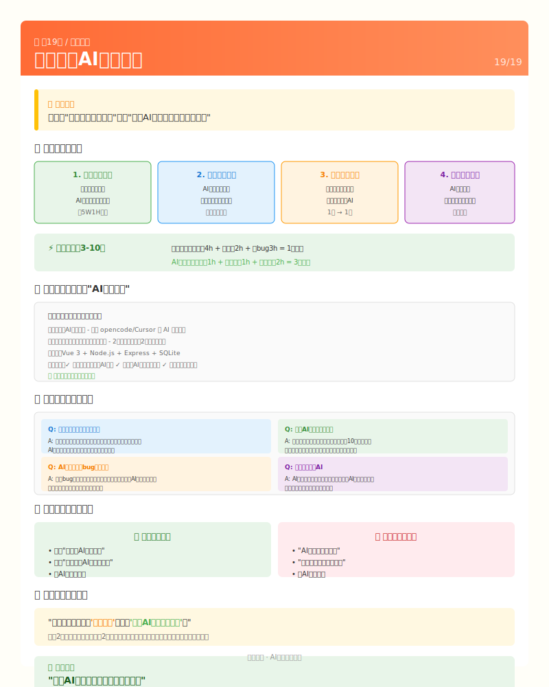

# 第19课：就业指导——展示你的AI协作能力



## 开篇：重新定义竞争力

先说一个事实：

**会用AI不是减分项，是加分项。**

未来不会用AI的程序员，就像现在不会用搜索引擎的程序员一样——不是会不会的问题，是该不该被雇佣的问题。

你学完这套教程，获得的核心能力是：

| 能力 | 说明 |
|------|------|
| 需求分析 | 把模糊想法变成AI能理解的描述 |
| 技术决策 | 在AI给的方案中选择最优解 |
| 快速学习 | 用AI加速掌握新技术 |
| 质量把控 | 判断AI输出是否靠谱 |

这些能力，比"会背几个API"值钱多了。

---

## 1. 你的核心竞争力是什么？

### 传统程序员 vs AI协作者

```
传统程序员的一天：
├── 写代码：4小时
├── 查文档：2小时
├── 改bug：3小时
├── 学新东西：下班后自己啃
└── 产出：一个功能

AI协作者的一天：
├── 描述需求：1小时
├── 审核AI方案：1小时
├── 验收和调整：2小时
├── 学新东西：问AI，10分钟搞懂
└── 产出：三个功能
```

**效率差距：3-10倍。**

### 你的核心能力清单

在简历和面试中，你要展示的是这些：

**1. 需求描述能力**

> 能把"我想做一个校园二手平台"变成AI能理解的具体需求

这不是天赋，是可以训练的技能。这套教程18课，你练的就是这个。

**2. 技术决策能力**

> AI给你三个方案，你选哪个？为什么？

比如：
- 数据库选SQLite还是MySQL？
- 认证用JWT还是Session？
- 部署用Vercel还是自己的服务器？

这些决策AI可以建议，但最终是你拍板。

**3. 快速学习能力**

> 遇到不懂的技术，你能多快上手？

传统方式：看书、看视频、看文档 → 1周
你的方式：问AI，让AI解释、举例、演示 → 1天

**4. 质量把控能力**

> AI写的代码，你怎么知道对不对？

这需要你：
- 会测试（点点看能不能跑）
- 会判断（结果符合预期吗）
- 会追问（AI解释为什么这么写）

---

## 2. 简历怎么写

### 大方写"AI协作开发"

不要藏着掖着，这是你的优势！

```
项目名称：校园闲置交易平台
项目时间：2026年2月 - 2026年6月
项目角色：项目负责人
技术栈：Vue 3 + Node.js + Express + SQLite

协作方式：AI辅助开发
- 使用 opencode/Cursor 等 AI 编程工具
- 负责需求分析、技术决策、功能验收
- 2周完成传统方式需要2个月的工作量

主要工作：
- 完成产品需求分析和功能设计
- 前后端开发（AI辅助代码实现）
- 项目部署和线上运营

项目成果：
- 累计注册用户XX人，发布物品XX条
- 从想法到上线仅用4周

核心能力展示：
- 能清晰描述需求让AI理解
- 能判断AI方案是否合理
- 能通过AI快速学习新技术
```

### 不同岗位怎么调整

**申请开发岗位**：

```
强调：
- AI辅助下你能完成全栈开发
- 你能做技术决策（不是AI替你决定）
- 你能快速学习新技术栈
```

**申请产品岗位**：

```
强调：
- 你能把模糊需求变成具体功能
- 你有从0到1做产品的完整经验
- 你能用AI快速验证想法
```

**申请创业公司**：

```
强调：
- 你一个人能顶一个团队
- 效率是传统开发的3-10倍
- 新技术？问AI，一周上手
```

---

## 3. 面试怎么讲

### 自我介绍（自信版）

```
我做过一个校园闲置交易平台，从需求分析到上线运营，
全程使用AI协作开发，2周完成了传统方式需要2个月的工作量。

这个过程中，我学会了：
- 如何把想法变成AI能理解的需求
- 如何判断AI给的方案好不好
- 如何用AI加速学习新技术

我觉得，未来工作中，能用好AI是一种核心竞争力。
不会用AI的程序员，效率会被远远甩在后面。
```

### 常见面试问题（自信回答）

**Q: 这个项目是你自己做的吗？**

```
自信回答：

是的，从需求分析到上线都是我负责。

代码实现上，我使用了AI工具来提高效率。
就像以前用IDE、用框架、用搜索引擎一样，
AI只是更强大的工具。

但关键决策都是我做的：
- 功能要不要做，我做主
- 技术方案怎么选，我拍板
- 代码对不对，我来验收

如果您感兴趣，我可以现场演示一下我是如何指挥AI工作的。
```

**Q: 没有AI你能写代码吗？**

```
自信回答：

当然可以。但问题是：为什么要拒绝一个能让效率提升10倍的工具？

就像您问我"没有Excel会用算盘吗"，答案是会，但没必要。

我的核心价值不是"能写代码"，而是：
- 能理解业务需求
- 能做出正确决策
- 能把控项目质量
- 能快速学习适应

这些能力，AI取代不了。
```

**Q: 你遇到最大的问题是什么？怎么解决的？**

```
展示你的AI协作能力：

最大的挑战是部署上线，我之前没有服务器经验。

我的解决方法：
1. 把报错信息发给AI，让它解释是什么问题
2. 让AI给出解决方案，我来判断是否可行
3. 一步步执行，遇到新问题继续问AI

整个过程中，AI就像一个随时在线的导师。
关键是：我要会问问题，会判断它的回答对不对。

这个过程让我明白了：
遇到问题不可怕，可怕的是不会利用工具解决问题。
```

**Q: AI写的代码有bug怎么办？**

```
自信回答：

发现bug本身就是一个能力。

我的流程是：
1. 先自己测试，发现问题
2. 把问题清楚描述给AI
3. AI修复后，我再验证

重点是：我负责验收，不是AI自己说了算。

而且我发现，描述bug的过程，本身就是在锻炼我的分析能力。
很多时候，把问题说清楚，答案就出来了一半。
```

---

## 4. 面试官不理解怎么办？

### 可能遇到的情况

**情况1：面试官觉得"AI写的代码不算数"**

```
回应：

我理解您的顾虑。但我想反问一句：

如果两个候选人：
- A：手写代码，一个项目做2个月
- B：AI协作，同样项目2周做完，质量相当

您会选谁？

未来不是"会不会写代码"的竞争，
而是"能不能高效交付"的竞争。

我觉得我的优势在于：能用好工具，快速出活。
```

**情况2：面试官一直问代码细节**

```
回应：

这个功能的代码确实是AI辅助写的。
如果要我逐行解释每一行，我可能说不清楚。

但我可以解释：
- 为什么要做这个功能（业务价值）
- 为什么选这个方案（技术决策）
- 怎么判断它是对的（验收标准）

如果您需要我深入理解某个模块，
我可以现在看代码，让AI解释给我听，然后复述给您。
这也是我平时学习的方式——不懂就问AI。
```

**情况3：面试官说"我们公司不用AI"**

```
心里话（不用说）：
这家公司技术理念落后，可能不值得去。

得体回应：

理解。每家公司的技术路线不同。

不过我想分享一下我的看法：
AI编程工具现在的普及速度很快，
GitHub Copilot、Cursor、opencode这些工具，
已经在很多公司成为标配。

未来几年，不用AI的程序员可能会像
现在不用搜索引擎的程序员一样少见。

如果贵司未来考虑引入AI工具，
我很乐意分享我的使用经验。
```

### 什么时候该考虑换一家

如果面试中出现这些信号，说明这家公司可能不适合你：

| 信号 | 说明 |
|------|------|
| "我们不用AI，那是偷懒" | 技术理念落后 |
| "你必须能手写所有代码" | 不重视效率 |
| 对AI话题完全不感兴趣 | 可能没有发展空间 |
| 面试官态度傲慢、不屑 | 公司文化可能有问题 |

**记住：面试是双向选择。**

你在挑公司，公司也在挑你。
如果一家公司不理解AI协作的价值，
那这家公司可能不值得你去。

---

## 5. 好公司会问什么问题？

真正理解AI价值的公司，会问这些问题：

### 期望被问到的问题

**Q: 你是怎么让AI理解你的需求的？**

```
这是好问题！说明面试官懂行。

我的回答：

关键是把模糊的想法变成具体的描述。

比如"我想做一个登录功能"太模糊了，
我会这样描述：

1. 用户用什么登录？（手机号/邮箱/用户名）
2. 登录失败怎么提示？
3. 要不要"记住我"？
4. 密码错误几次要锁定吗？
5. 登录后跳到哪里？

把这些想清楚，AI才能真正理解你想要什么。

这个过程，其实就是产品思维。
```

**Q: 你怎么判断AI给的方案好不好？**

```
我的判断标准：

1. 能不能解决我的问题？（功能对不对）
2. 有没有明显的bug？（质量好不好）
3. 代码我能看懂吗？（可维护性）
4. 有没有更简单的方案？（是否过度设计）

有时候AI给的方案太复杂，
我会追问："有没有更简单的实现方式？"

好的方案应该是：能跑、能看懂、能改。
```

**Q: 遇到AI解决不了的问题怎么办？**

```
我的处理流程：

1. 换个方式描述问题
   可能是我没说清楚

2. 把问题拆小
   大问题AI可能搞不定，小问题通常可以

3. 搜索引擎 + AI
   有些问题AI可能不知道，但网上有答案

4. 找人问
   AI不是万能的，该问人还是要问

最后这个其实很重要：
知道什么时候该用AI，什么时候该问人。
```

---

## 6. 你的独特价值主张

### 一句话总结

> **我不是"会写代码的程序员"，我是"会用AI高效交付产品的开发者"。**

### 你比别人强在哪

| 维度 | 传统程序员 | 你（AI协作者） |
|------|-----------|---------------|
| 写代码 | 手写，慢 | AI辅助，快 |
| 学新技术 | 看文档，周级 | 问AI，天级 |
| 解决问题 | 搜答案 | 问AI，即时 |
| 做决策 | 凭经验 | AI分析+人决策 |
| 交付速度 | 基准线 | 3-10倍 |

### 给面试官的"钩子"

在面试结尾，你可以说：

```
最后我想说：

通过这个项目，我最大的收获不是学会了Vue或Node.js，
而是学会了如何与AI协作高效交付产品。

这套方法论，我可以应用到任何新技术、新项目上。

如果您团队正在探索AI辅助开发，
或者想提高开发效率，
我觉得我能带来一些价值。
```

---

## 7. Demo演示技巧

如果让你演示项目，同时展示AI协作能力：

### 演示流程（5分钟）

```
1. 项目展示（2分钟）
   - 展示核心功能
   - 说明业务价值

2. AI协作演示（2分钟）
   - 现场让AI写一个小功能
   - 展示你是如何描述需求的
   - 展示你是如何验收的

3. 总结（1分钟）
   - 这个演示说明了什么？
   - 你的AI协作能力如何提升效率
```

### AI协作演示话术

```
"让我演示一下我是怎么和AI协作的。

假设我想加一个功能：显示物品发布时间。

我会这样描述：
[现场输入描述]

看，AI理解了我的需求，给出了代码。
然后我来验收：
1. 代码能不能跑？
2. 显示的格式对不对？
3. 有没有bug？

这就是我日常的工作方式：
我负责想清楚要什么，AI负责实现，我负责验收。"
```

---

## 8. 总结：你的求职策略

```
┌─────────────────────────────────────────────────────┐
│                                                     │
│   核心定位：                                        │
│   你不是"会写代码的人"，                           │
│   你是"能用AI高效交付产品的人"。                   │
│                                                     │
│   简历策略：                                        │
│   - 大方写"AI协作开发"                             │
│   - 强调你的决策能力和学习能力                     │
│   - 用数字说话（效率提升X倍）                      │
│                                                     │
│   面试策略：                                        │
│   - 自信展示AI协作能力                             │
│   - 把"你会用AI"变成优势                           │
│   - 好公司会欣赏这种方式                           │
│                                                     │
│   筛选公司：                                        │
│   - 不拥抱AI的公司，不值得去                       │
│   - 问AI问题的公司，是好公司                       │
│   - 面试是双向选择                                 │
│                                                     │
│   最后：                                            │
│   你掌握了未来工作的核心技能。                     │
│   自信展示，不卑不亢。                             │
│                                                     │
└─────────────────────────────────────────────────────┘
```

---

*下一节：无（课程结束）*

---

## ✅ 理解检查

学完这一章，你能回答这些问题吗？

**基础问题**（所有人要会）：
- 你的核心竞争力是什么？
- 简历中应该怎么写"AI协作开发"？
- 面试时如何展示AI协作能力？

**进阶问题**（想提升的同学思考）：
- 如果面试官不理解AI协作，怎么回应？
- 什么样的公司值得去？
- 如何做Demo演示展示AI协作能力？

**挑战问题**（试着不问AI）：
- 用一句话总结你的独特价值主张
- 准备一个3分钟的自我介绍，突出AI协作能力

---

## 🎯 费曼学习法检验

### 你能解释这些概念吗？

**1. AI协作者的核心竞争力是什么？**
> 提示：想想需求描述、技术决策、快速学习、质量把控...

<details>
<summary>参考答案</summary>

AI协作者的核心竞争力不是"会写代码"，而是：
1. 需求描述能力：能把模糊想法变成AI能理解的需求
2. 技术决策能力：在AI给的方案中选择最优解
3. 快速学习能力：用AI加速掌握新技术
4. 质量把控能力：判断AI输出是否靠谱

这些能力比"会背几个API"值钱多了。
</details>

**2. 为什么说"会用AI是加分项不是减分项"？**
> 提示：想想效率差距...

<details>
<summary>参考答案</summary>

因为AI协作者的效率是传统开发的3-10倍。未来不会用AI的程序员，就像现在不会用搜索引擎的程序员一样——不是会不会的问题，是该不该被雇佣的问题。
</details>

### 你能教给别人吗？

**教学检验**：找一个同学（或对着空气），尝试讲清楚：

1. 如何在简历中突出AI协作能力？
2. 面试官问"没有AI你能写代码吗"，怎么回答？
3. 什么样的公司不值得去？

### 自测题

**第1题**：简历中应该怎么写AI协作？

A. 藏着掖着，不提AI
B. 大方写"AI协作开发"，强调决策能力和学习能力
C. 说代码都是自己写的
D. 只写技术栈，不提开发方式

<details>
<summary>答案</summary>

**B** - 应该大方写"AI协作开发"，这是你的优势，不是劣势。强调你的决策能力、学习能力和效率提升。
</details>

**第2题**：以下哪种公司不值得去？

A. 问你"怎么让AI理解需求"的公司
B. 问你"怎么判断AI方案好不好"的公司
C. 说"AI写的代码不算数"的公司
D. 对AI协作感兴趣的公司

<details>
<summary>答案</summary>

**C** - 说"AI写的代码不算数"的公司，技术理念落后。A、B、D都是好公司的信号。
</details>

---

## 📚 扩展资源

### 官方文档
- [LeetCode 中国](https://leetcode.cn/) - 关键词：算法、面试题
- [牛客网](https://www.nowcoder.com/) - 关键词：笔试、面试、求职
- [掘金](https://juejin.cn/) - 关键词：技术社区、面试经验

### 推荐阅读

```
项目经历

校园闲置交易平台 | 项目负责人 | 2026.02 - 2026.06

项目描述：
独立完成校园二手交易平台的全流程开发，从需求分析到上线运营。
平台支持用户注册、实名认证、物品发布、搜索筛选等功能。

协作方式：AI辅助开发
- 使用 opencode/Cursor 等 AI 编程工具
- 负责需求分析、技术决策、功能验收
- 效率是传统开发方式的3-5倍

技术栈：Vue 3 + Node.js + Express + SQLite

项目成果：
- 累计注册用户XX人，发布物品XX条
- 从想法到上线4周完成

核心能力：
✓ 能清晰描述需求让AI理解
✓ 能判断AI方案是否合理
✓ 能通过AI快速学习新技术
✓ 具备从0到1做产品的完整经验
```

---

## 扩展资源

### 推荐阅读

| 资源 | 说明 |
|------|------|
| 《程序员面试金典》| 经典面试题 |
| 《你的降落伞是什么颜色》| 职业规划 |
| 《软技能》| 程序员职业发展 |

### 求职工具

| 工具 | 用途 | 链接 |
|------|------|------|
| Boss直聘 | 找工作、聊HR | zhipin.com |
| 拉勾网 | 互联网岗位 | lagou.com |
| 牛客网 | 面试题库 | nowcoder.com |
| LeetCode | 算法练习 | leetcode.cn |
| 掘金 | 技术社区 | juejin.cn |

### 简历检查清单

```
□ 有明确的项目经历描述
□ 量化成果（用户数、效率提升等）
□ 突出AI协作能力
□ 技术栈清晰
□ 无错别字
□ 排版简洁（不超过2页）
□ 联系方式正确
```

### 面试准备模板

**自我介绍（1分钟版）**：
```
我是XXX，XX学校XX专业。
我做过一个校园二手交易平台，
从需求到上线全程使用AI协作开发，
2周完成了传统方式2个月的工作量。
这个经历让我学会了如何与AI高效协作，
我认为这是未来开发者的核心竞争力。
```

**常见问题准备**：
```
1. 自我介绍（1分钟/3分钟版本）
2. 项目介绍（STAR法则）
3. 遇到的最大困难
4. 为什么选这家公司
5. 你的优势是什么
6. 薪资期望
7. 有什么想问的
```

### 进阶学习

- 面试技巧：B站搜索"技术面试技巧"
- 简历优化：搜索"程序员简历怎么写"
- 薪资谈判：搜索"offer谈判技巧"
