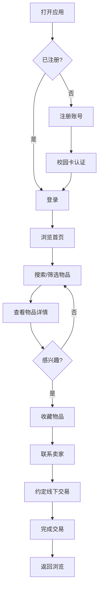

# 产品流程图 - 用户交易流程

```mermaid
flowchart TD
    A[打开应用] --> B{已注册?}
    B -->|否| C[注册账号]
    C --> D[校园卡认证]
    B -->|是| E[登录]
    D --> E
    E --> F[浏览首页]
    F --> G[搜索/筛选物品]
    G --> H[查看物品详情]
    H --> I{感兴趣?}
    I -->|是| J[收藏物品]
    J --> K[联系卖家]
    I -->|否| G
    K --> L[约定线下交易]
    L --> M[完成交易]
    M --> N[返回浏览]
```

## 流程说明

| 阶段 | 用户行为 | 系统响应 |
|------|----------|----------|
| 注册认证 | 提交校园卡信息 | 验证学生身份 |
| 浏览 | 搜索、筛选 | 返回物品列表 |
| 决策 | 查看详情、收藏 | 记录用户偏好 |
| 交易 | 线下联系卖家 | 不参与交易过程 |
