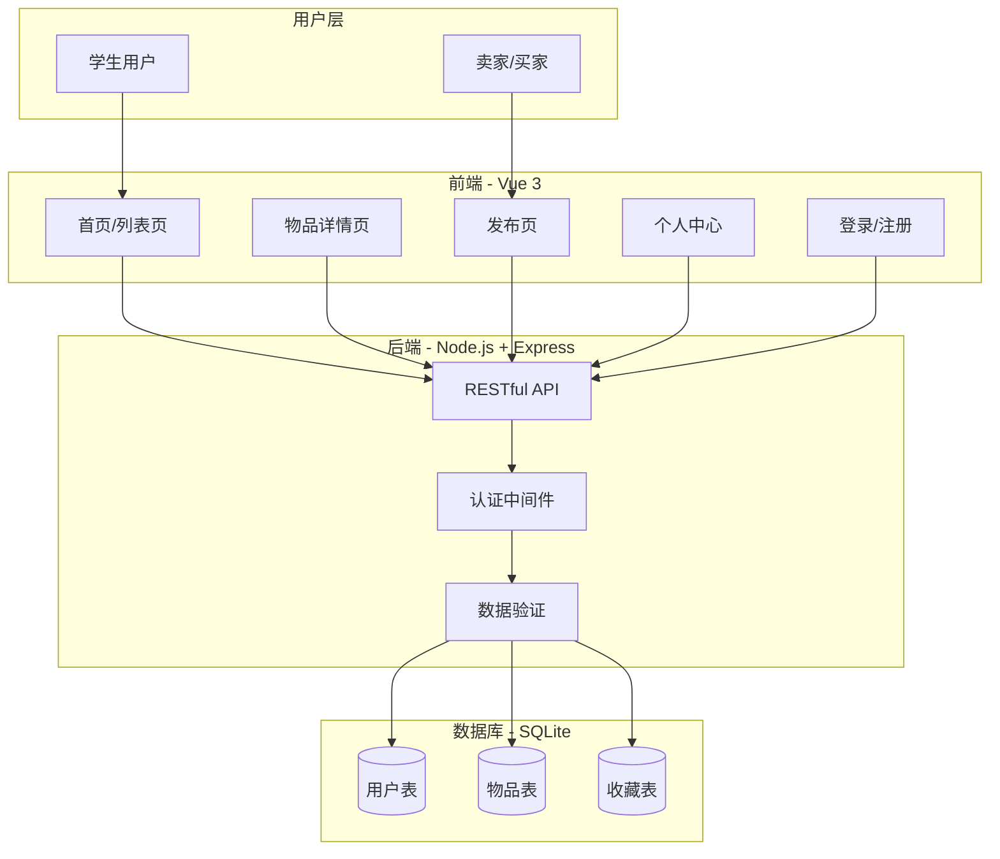

# 系统架构图



## 技术说明

| 层级 | 技术选型 | 职责 |
|------|----------|------|
| 前端 | Vue 3 + Vite | 页面渲染、用户交互 |
| 后端 | Node.js + Express | 业务逻辑、数据处理 |
| 数据库 | SQLite / MySQL | 数据持久化存储 |

## 数据流向

```
用户操作 → 前端组件 → API请求 → 后端处理 → 数据库存取 → 返回响应 → 前端渲染
```
