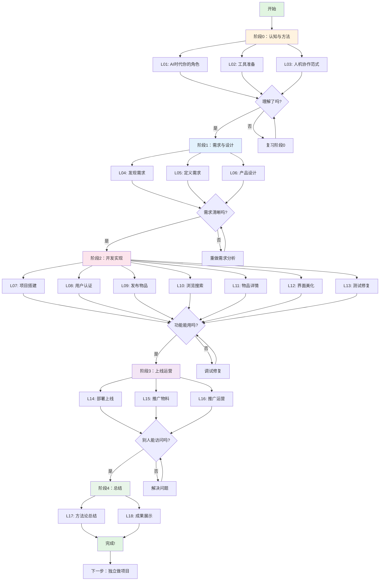

# 学习路线图

## 课程地图



---

## 64学时分配

### 总览

| 阶段 | 主题 | 学时 | 占比 |
|------|------|------|------|
| 阶段0 | 认知与方法 | 10 | 15.6% |
| 阶段1 | 需求与设计 | 12 | 18.8% |
| 阶段2 | 开发实现 | 34 | 53.1% |
| 阶段3 | 上线运营 | 6 | 9.4% |
| 阶段4 | 总结与就业 | 2 | 3.1% |

### 详细分配

#### 阶段0：认知与方法（10学时）

| 课时 | 主题 | 时间 | 重点 | 产出 |
|------|------|------|------|------|
| L01 | AI时代，你的角色变了 | 2学时 | 理解人机协作新模式 | 思维转变 |
| L02 | 工具准备 | 4学时 | 安装配置 opencode | 可用的开发环境 |
| L02.5 | 终端入门 | 2学时 | 掌握命令行基础操作 | 能用终端执行命令 |
| L03 | 人机协作范式 | 2学时 | 学会如何描述需求 | 第一次成功对话 |

**阶段目标**：建立正确的心态，工具能用，会基本对话。

---

#### 阶段1：需求与设计（12学时）

| 课时 | 主题 | 时间 | 重点 | 产出 |
|------|------|------|------|------|
| L04 | 发现需求 | 3学时 | 把模糊想法变清晰 | 需求文档 |
| L05 | 定义需求 | 4学时 | 功能清单和页面结构 | 功能列表、页面结构图 |
| L06 | 产品设计 | 5学时 | 界面设计和数据模型 | 原型图、数据库设计 |

**阶段目标**：知道自己要做什么，有清晰的计划。

---

#### 阶段2：开发实现（34学时）

| 课时 | 主题 | 时间 | 重点 | 产出 |
|------|------|------|------|------|
| L07 | 项目搭建 | 3学时 | 让AI初始化项目 | 能跑起来的空项目 |
| L07.5 | Vue基础知识 | 4学时 | 理解Vue核心概念，增加代码阅读练习 | 能看懂Vue代码 |
| L08 | 用户认证 | 4学时 | 注册登录功能 | 用户系统 |
| L09 | 发布物品 | 5学时 | 核心业务功能 | 发布功能 |
| L10 | 浏览搜索 | 4学时 | 列表和筛选 | 浏览功能 |
| L11 | 物品详情 | 4学时 | 详情页和交互 | 详情功能 |
| L12 | 界面美化 | 4学时 | UI优化 | 好看的界面 |
| L13 | 测试修复 | 2学时 | 发现和修复bug | 稳定的系统 |
| - | 开发buffer | 4学时 | 调试、答疑、进度补充 | - |

**阶段目标**：核心功能能正常使用，界面过得去。

---

#### 阶段3：上线运营（6学时）

| 课时 | 主题 | 时间 | 重点 | 产出 |
|------|------|------|------|------|
| L14 | 部署上线 | 2学时 | 公网可访问 | 上线的网站 |
| L15 | 推广物料 | 2学时 | 文案和海报 | 宣传材料 |
| L16 | 推广运营 | 2学时 | 获取真实用户 | 有用户在用 |

**阶段目标**：项目上线，有真实用户。

---

#### 阶段4：总结（2学时）

| 课时 | 主题 | 时间 | 重点 | 产出 |
|------|------|------|------|------|
| L17 | 方法论总结 | 1学时 | 提炼可复用流程 | 个人方法论 |
| L18 | 成果展示 | 1学时 | 演示和分享 | 项目展示 |

**阶段目标**：形成自己的方法论，能独立做项目。

---

## 前置要求

### 必备基础

| 要求 | 说明 | 自检方法 |
|------|------|----------|
| 电脑操作 | 会打字、上网、安装软件 | 能独立完成软件安装 |
| 逻辑思维 | 能理解因果关系 | 给朋友讲清楚一件事 |
| 中文表达 | 能把想法说清楚 | 写一段100字的说明 |
| 耐心 | 遇到问题不急躁 | 能静下心来调试 |

### 不需要的基础

- 不需要精通编程
- 不需要懂数据库
- 不需要懂服务器
- 不需要美术功底

### 需要准备的工具

| 工具 | 用途 | 获取方式 |
|------|------|----------|
| 电脑 | 开发环境 | Windows/Mac/Linux均可 |
| opencode | AI编程助手 | 官网下载 |
| 浏览器 | 测试和查阅资料 | Chrome/Edge/Firefox |
| 文本编辑器 | 写笔记和文档 | VS Code 或任意编辑器 |
| 账号 | AI服务（智谱/DeepSeek） | chatglm.cn 或 platform.deepseek.com 注册 |

---

## 学习建议

### 如何学最有效

```
┌─────────────────────────────────────────┐
│           学习效果金字塔                 │
├─────────────────────────────────────────┤
│                                         │
│   听讲     5%  ▓                         │
│   阅读     10% ▓▓                        │
│   视听     20% ▓▓▓▓                      │
│   演示     30% ▓▓▓▓▓▓                    │
│   讨论     50% ▓▓▓▓▓▓▓▓▓▓                │
│   实践     75% ▓▓▓▓▓▓▓▓▓▓▓▓▓▓▓           │
│   教别人   90% ▓▓▓▓▓▓▓▓▓▓▓▓▓▓▓▓▓▓▓      │
│                                         │
└─────────────────────────────────────────┘
```

**本课程的设计**：

1. **先动手，再理解**
   - 跟着教程做完一遍
   - 遇到不懂的先记下来
   - 做完后回头看，往往就懂了

2. **记录你的过程**
   - 每次对话都保存
   - 遇到的错误记下来
   - 解决方法也记下来

3. **及时验收**
   - 每个功能做完要测试
   - 不要累积问题
   - 验收通过再继续

4. **主动提问**
   - 不懂就问AI
   - 让AI用不同方式解释
   - 让AI举例子

### 遇到困难怎么办

| 困难类型 | 解决方法 |
|----------|----------|
| AI理解错了 | 换个说法再描述一遍 |
| 代码报错了 | 把错误信息给AI看 |
| 不知道下一步做什么 | 问AI"接下来应该做什么" |
| 功能不是想要的 | 明确说明期望的效果 |
| 完全卡住了 | 休息一下，重新理清思路 |

**黄金法则**：当你不知道怎么办时，把问题完整地描述给AI，让它帮你分析。

### 练习的重要性

```
看懂 ≠ 会做
会做 ≠ 熟练
熟练 ≠ 能教人
```

**建议的练习方式**：

1. **第一遍**：跟着教程做
2. **第二遍**：不看教程做
3. **第三遍**：改动一些需求做
4. **第四遍**：用这个方法做新项目

---

## 完成标志

### 阶段0完成标志

- [ ] 理解"指挥官"角色定位
- [ ] opencode 能正常运行
- [ ] 完成第一次与AI的对话
- [ ] AI按你的要求生成了一段代码

### 阶段1完成标志

- [ ] 有完整的需求文档
- [ ] 有功能清单（至少10个功能）
- [ ] 有页面结构图（至少5个页面）
- [ ] 有数据库设计（至少3张表）

### 阶段2完成标志

- [ ] 用户能注册登录
- [ ] 用户能发布物品
- [ ] 用户能浏览搜索物品
- [ ] 用户能查看物品详情
- [ ] 界面基本可用
- [ ] 没有明显bug

### 阶段3完成标志

- [ ] 网站在公网可访问
- [ ] 有推广文案和海报
- [ ] 至少5个真实用户注册
- [ ] 至少1笔真实交易发生

### 阶段4完成标志

- [ ] 写出了自己的方法论
- [ ] 能给别人演示项目
- [ ] 能回答"这个项目怎么做的"
- [ ] 有信心独立做新项目

---

## 最终目标

完成本课程后，你应该：

1. **能力上**
   - 能把想法变成AI能理解的需求
   - 能指挥AI完成软件项目
   - 能判断AI的输出是否正确
   - 能解决开发中遇到的问题

2. **成果上**
   - 一个能用的校园交易平台
   - 一套可复用的方法论
   - 一份项目经验

3. **心态上**
   - 不再害怕写代码
   - 知道遇到问题怎么办
   - 有信心做新项目

---

## 开始你的旅程

准备好了吗？

👉 [L01 - AI时代，你的角色变了](./L01-ai-era.md)
